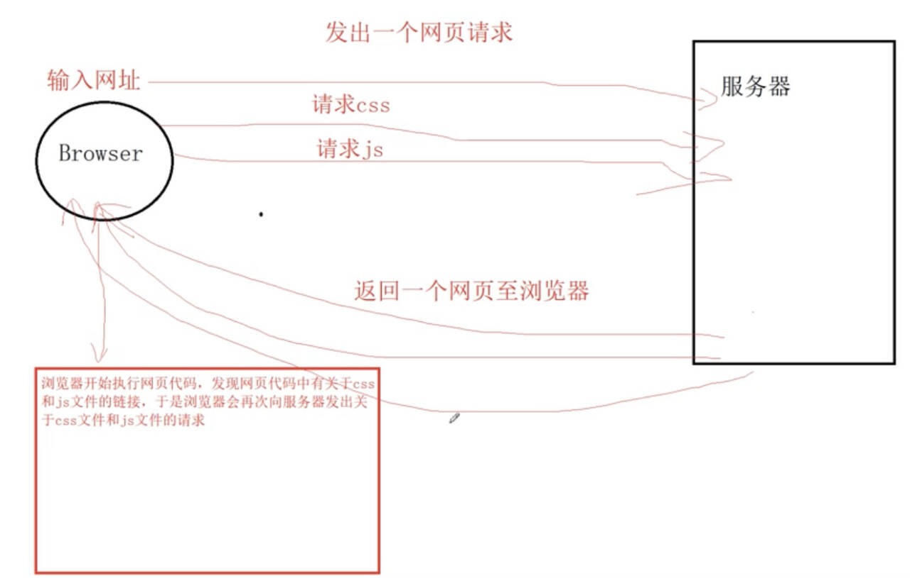

---
tags:
  - 前端
  - JavaScript
---

# 1 基础

## 1.1 简介

JavaScript 是一种**解释性脚本语言**（不用编译），主要用于向 HTML 添加交互行为，语法与 Java 语言类似。

JavaScript 由 **ECMAScript**（简称 ES）、**DOM** （Document Object Model） 和 **BOM** （Broswer Object Model） 三大部分组成。

### 1.1.1 BOM

#### 1 概念

BOM （Browser Object Model），即**浏览器对象模型**，BOM 提供了**独立于内容**的对象结构，可以与浏览器窗口进行互动。


#### 2 window 对象

##### 2 .1 history 对象

history 对象主要用于**控制页面的历史记录**的显示。

| 名称        | 说明                                                |
| --------- | ------------------------------------------------- |
| back()    | 页面展示前一个历史记录                                       |
| forward() | 页面展示后一个历史记录                                       |
| go(整数)    | 根据给定数量显示历史记录。若是正数，则使用前面的历史记录；<br>若是负数，则使用后面的历史记录。 |

##### 2.2 location 对象

|     | 名称        | 说明                   |
| --- | --------- | -------------------- |
| 属性  | host      | 设置或返回主机名和当前 URL 的端口号 |
|     | hostname  | 设置或返回当前 URL 的主机名     |
|     | href      | 设置或返回完整的 URL         |
| 函数  | reload()  | 重新加载当前文档             |
|     | replace() | 用新的文档替换当前文档          |

###### 2.2.1 举例

```JavaScript
<!--javascript:void(0)表示点击超链接时不做任何事情-->
<a href="javascript:void(0)" onclick="showAddress()">显示地址栏信息</a>
<a href="javascript:void(0)" onclick="refresh()">刷新页面</a>
<a href="javascript:void(0)" onclick="changePage()">替换新页面</a>

function showAddress() {
	console.log(location.host);
	console.log(location.hostname);
	console.log(location.href);
}

function refresh() {
	location.reload();
}

function changePage() {
	location.replace("page2.html");
}
```


##### 2.3 document 对象

document 对象主要用于操作页面元素。

| 名称                           | 说明            |
| ---------------------------- | ------------- |
| getElementById(”ID 值”)       | 获取给定 ID 值的元素  |
| getElementsByName(" 名称 ")      | 获取给定名称的元素的集合  |
| getElementsByClassName(" 类名 ") | 获取给定类名的元素的集合  |
| getElementsByTagName(" 标签名 ")  | 获取给定标签名的元素的集合 |

###### 2.3.1 举例

```HTML
<!DOCTYPE html>
<html lang="en">
<head>
    <meta charset="UTF-8">
    <title>Document</title>
</head>
<body>
    <div id="a">a</div>
    <div id="b" class="c">b</div>
    <div class="c">c</div>
    <div id="d">d</div>
</body>
<script type="text/javascript">
    let div = document.getElementById("a");
    console.log(div)
    console.log("===========================================")
    // 通过标签名获取元素
    let divArr = document.getElementsByTagName("div");
    console.log(divArr);
    console.log("===========================================")
    // 通过类名获取元素
    let arr = document.getElementsByClassName("c");
    console.log(arr);
</script>
</html>
```


```js
<!DOCTYPE html>  
<html lang="en">  
<head>  
    <meta charset="UTF-8">  
    <title>Document</title>  
</head>  
<body>  
    <div id="a">a</div>  
    <div id="b" class="c">b</div>  
    <div class="c">c</div>  
    <div id="d">d</div>  
</body>  
<script type="text/javascript">  
    let div = document.getElementById("a");  
    console.log(div)  
    div.innerText = "内容将改变为b"; // 内部文本标签  
    div.innerHTML = "<h1>内容支持标签</h1>"; // 内部HTML内容，支持标签
    // div.textContent = "文本内容"; // 与innerText作用一致
    console.log("===========================================")  
    // 通过标签名获取元素  
    let divArr = document.getElementsByTagName("div");  
    console.log(divArr);  
    console.log("===========================================")  
    // 通过类名获取元素  
    let arr = document.getElementsByClassName("c");  
    console.log(arr);  
</script>  
</html>
```


#### 3 Date 类

| 方法            | 说明                              |
| ------------- | ------------------------------- |
| getFullYear() | 获取当前对象表示的日期中的年份                 |
| getMonth()    | 获取当前对象表示的日期中的月份，取值范围是 `[0, 11]` |
| getDate()     | 获取当前对象表示的日期是一个月中的第几天            |
| getDay()      | 获取当前对象表示的日期是一周中的第几天，一周的开始是周日    |
| getHours()    | 获取当前对象表示的日期中的小时数                |
| getMinutes()  | 获取当前对象表示的日期中的分钟数                |
| getSeconds()  | 获取当前对象表示的日期中的秒数                 |
| getTime()     | 获取当前日期对象对应的毫秒数                  |

##### 3.1 举例

```js
<!DOCTYPE html>  
<html lang="en">  
<head>  
    <meta charset="UTF-8">  
    <title>Date</title>  
</head>  
<body>  
  
</body>  
<script type="text/javascript">  
    let now = new Date(); // 创建一个日期类，默认时间为系统当前时间  
    let year = now.getFullYear(); // 获取年份  
    let month = now.getMonth() + 1; // 获取月份  
    let day = now.getDate(); // 获取日期  
    console.log(year+"-"+month+"-"+day);  
  
    // 取当前月最大天数时，需要重新设置月份，并将日期设置为0  
    now.setMonth(month);  
    now.setDate(0);  
    console.log(now.getDate());  
</script>  
</html>
```


#### 4 周期函数和延迟函数

| 函数                    | 说明                                             |
| --------------------- | ---------------------------------------------- |
| setlnterval(函数, 间隔时间) | 按照给定的间隔时间重复执行给定的函数，若第一个参数传递的是字符串，则该字符串必须是函数的调用 |
| clearInterval(周期函数)   | 清除给定的周期函数                                      |
| setTimeout(函数, 延迟时间)  | 在给定的延迟事件后**执行一次**给定的函数                         |
| clearTimeout(延迟函数)    | 清除给定的延迟函数                                      |

##### 4.1 举例

```js
<!DOCTYPE html>  
<html lang="en">  
<head>  
    <meta charset="UTF-8">  
    <title>Date</title>  
</head>  
<body>  
    <div id="time"></div>  
</body>  
<script type="text/javascript">  
    let count = 0;  
    function zeroFill(data, num) {  
        let str = data + "";  
        while (str.length < num) {  
            str = "0" + str;  
        }  
        return str;  
    }  
    function showTime() {  
        let now = new Date(); // 创建一个日期类，默认时间为系统当前时间  
        let year = now.getFullYear(); // 获取年份  
        let month = now.getMonth() + 1; // 获取月份  
        let day = now.getDate(); // 获取日期  
        let hour = now.getHours(); // 获取小时数  
        let minute = now.getMinutes(); // 获取分钟数  
        let second = now.getSeconds(); // 获取秒数  
        let time = year + "-" + month + "-" + day + " " + zeroFill(hour, 2) + ":" + zeroFill(minute, 2) + ":" + zeroFill(second, 2);  
        console.log(time);  
        let div = document.getElementById("time");  
        div.textContent = time;  
        count++;  
        if (count === 10) {  
            clearInterval(t); // 清理给定的周期函数  
        }  
    }  
    let t = setInterval(showTime, 1000);  
</script>  
</html>
```


### 1.1.2 DOM

#### 1 概念

DOM（Document Object Model），即文档对象模型，DOM 主要提供了对于页面内容的一些操作。**在 DOM 中，所有的内容（标签和文本）都是 DOM 节点，所有的标签都是 DOM 元素。**

#### 2 节点关系


#### 3 节点属性

|属性名称|描述|
|---|---|
|parentNode|获取父节点|
|childNode|获取所有下一级子节点|
|firstNode|获取第一个子节点|
|lastNode|获取最后一个子节点|
|nextSibling|获取下一个同级节点|
|previousSibling|获取上一个同级节点|

##### 3.1 举例

```JavaScript
let box = document.getElementById("box");
console.log(box.parentNode) // 父节点

let childNodes = box.childNodes; // 文本内容包括enter键在内的换行、注释都属于节点
console.log(childNodes)
console.log(box.firstChild) // 第一个子节点
console.log(box.lastChild) // 最后一个子节点

let first = childNodes[0]; // 第一个子节点
console.log(first.nextSibling);

let last = box.lastChild; // 最后一个子节点
console.log(last.previousSibling)
```

p.s.文本内容包括enter键在内的换行、注释都属于节点

#### 4 元素属性

|属性名称|描述|
|---|---|
|parentElement|获取父元素|
|children|获取所有下一级子元素|
|firstElementChild|获取第一个子元素|
|lastElementChild|获取最后一个子元素|
|nextElementChild|获取下一个同级元素|
|previousElementChild|获取下一个同级元素|

##### 4.1 举例

```JavaScript
let box = document.getElementById("box");
// console.log(box.parentNode) //父节点
// let childNodes = box.childNodes; //文本内容包括enter键在内的换行、注释都属于节点
// console.log(childNodes)
// console.log(box.firstChild) //第一个子节点
// console.log(box.lastChild) //最后一个子节点
//
// let first = childNodes[0]; //第一个子节点
// console.log(first.nextSibling);
// let last = box.lastChild; //最后一个子节点
// console.log(last.previousSibling)
console.log(box.parentElement); //父元素，元素也就是标签
let children = box.children; //下一级子元素
console.log(children)

console.log(box.firstElementChild); //第一个子元素
console.log(box.lastElementChild); //最后一个子元素
console.log(box.firstElementChild.nextElementSibling);//第一个子元素的下一个同级元素
console.log(box.firstElementChild.previousElementSibling);//第一个子元素的上一个同级元素
```

#### 5 节点操作

|名称|描述|
|---|---|
|createElement(tagName)|根据给定的标签名创建元素节点|
|A.appendChild(B)|将节点 B 追加到节点 A 的末尾|
|A.remove()|将节点 A 从 DOM 树中移出|
|getAttribute(”属性名”)|获取给定属性名对应的属性值|
|setAttribute(”属性名”, “属性值”)|为给定的属性名设置给定的属性值|

##### 5.1 举例

```js

```

#### 6 节点样式

##### 6.1 style 样式

```js
节点.style.样式属性 ＝ "值"; 
```

##### 6.2 class 样式

```JavaScript
节点.className = "样式名称";
```

###### 6.2.1 举例

```HTML
<head>
	<meta charset="UTF-8">
	<title>节点样式</title>
	<style>
		.box{
			width: 200px;
			height: 200px;
			border: 1px solid \#ddd;
		}
		.active{
			background-color: red;
		}
	</style>
</head>
<body>
	<div id="a"  class="box active"></div>
</body>
<script type="text/javascript">
	let div = document.getElementById("a");
	// div.style.height = '50px';
	// div.style.backgroundColor = "red";
	// div.className = "box";
	div.className = "box";
</script>
```

#### 7 节点属性

|属性|描述|
|---|---|
|offsetLeft|返回当前元素左边界到它上级元素的左边界的距离，只读属性|
|offsetTop|返回当前元素上边界到它上级元素的左边界的距离，只读属性|
|offsetHeight|返回元素高度|
|offsetWidth|返回元素宽度|
|offsetParent|返回元素的便宜容器，即对最近的动态定位的包含元素的引用|
|scrollTop|返回匹配元素的滚动条的垂直位置|
|scrollLeft|返回匹配元素的滚动条的水平位置|
|clientWidth|返回元素的可见宽度|
|clientHeight|返回元素的可见高度|

##### 7.1 举例

```HTML
<head>
	<meta charset="UTF-8">
	<title>节点属性</title>
	<style>
		html,
		body{
			padding: 0;
			margin: 0;
			height: 100%;
			width: 100%;
			overflow: scroll; /*滚动条取值需要先设置此属性*/
		}
	</style>
</head>
<body id="body">
	<div style="height: 2000px;">
		<ul id="u">
			<li>测试</li>
		</ul>
	</div>
	<input type="button" value="按钮" id="btn">
</body>
<script type="text/javascript">
	let u = document.getElementById("u");
	console.log(u.offsetLeft)
	console.log(u.offsetTop)
	console.log(u.offsetHeight + " x " + u.offsetWidth);
	console.log(u.clientWidth + " x " + u.clientHeight);
	
	document.getElementById("btn").onclick = function () {
	let body = document.getElementById("body");
		console.log(body.scrollTop)
	}
</script>
```

#### 8 Promise 对象

##### 8.1 简介

Promise 对象代表了未来将要发生的事件，用来传递异步操作的消息，其状态不受外界影响。Promise 对象代表一个异步操作，有三种状态：

- pending: 初始状态，不是成功或失败状态。
- fulfilled: 意味着操作成功完成。
- rejected: 意味着操作失败。

只有异步操作的结果，可以决定当前是哪一种状态，任何其他操作都无法改变这个状态。这也是 Promise 这个名字的由来，它的英语意思就是**承诺**，表示其他手段无法改变。

一旦 Promise 对象从初始状态改变，就不会再变，任何时候都可以得到这个结果。Promise 对象的状态改变，只有两种可能：从 Pending 变为 Resolved 和从 Pending 变为 Rejected。只要这两种情况发生，状态就凝固了，不会再变了，会一直保持这个结果。

##### 8.2 应用

###### 8.2.1 语法

```JavaScript
let promise = new Promise(function(resolve, reject) {
	// 异步处理
	// 处理结束后、调用resolve 或 reject
});

promise.then(function(result){
	//result的值是上面调用resolve(...)方法传入的值.可以对该结果进行相应的处理
});

promise.catch(function(error){
	//error的值是上面调用reject(...)方法传入的值.可以对该结果进行相应的处理
});

//链式调用
let promise = new Promise(function(resolve, reject) {
	// 异步处理
	// 处理结束后、调用resolve 或 reject
}).then(function(result){
	//result的值是上面调用resolve(...)方法传入的值.可以对该结果进行相应的处理
}).catch(function(error){
	//error的值是上面调用reject(...)方法传入的值.可以对该结果进行相应的处理
});
```

Promise 构造函数包含一个参数和一个带有 resolve（解析）和 reject（拒绝）两个参数的回调。在回调中执行一些操作（例如异步），如果一切都正常，则调用 resolve，否则调用 reject。

###### 8.2.2 举例

```JavaScript
function calculate(a, b) {
	let promise = new Promise(function (resolve, reject) {
		if(b == 0){
			reject(new Error("除数不能为0"));
		} else {
			setTimeout(function () {
				resolve(a / b);
			}, 2000);
		}
	});
	promise.then(function (result) {
		console.log(result)
	});
	promise.catch(function (error) {
		console.log(error)
	})
}
calculate(2, 0);
```

#### 9 箭头函数

箭头函数相当于 Java 中的 lambda 表达式，传递的依然是实现过程。

##### 9.1 举例

```JavaScript
function calculate(a, b) {
	let promise = new Promise((resolve, reject) => {
		if(b === 0){ //异常情况处理使用reject函数进行拒绝
			reject(new Error("除数不能为0"))
		} else { //成功处理的情况使用resolve函数进行处理
			resolve(a / b);
		}
	});
	//这里resp接收的值就是resolve函数的参数值
	promise.then(resp => {
		console.log("处理成功" + resp);
	});
	//这里error接收的值就是reject函数的参数值
	promise.catch( error => {
		console.log("处理失败"+ error)
	})
}
calculate(2, 0)
```

## 1.2 基本结构

```HTML
<script type="text/javascript">
	// JavaScript 代码
</script>
```

该结构可以在 HTML 中的任意位置书写，但必须保证 JavaScript 脚本中使用到的元素必须在 JavaScript 脚本执行前完成加载。

```HTML
<!DOCTYPE html>
<html lang="en">

<head>
    <meta charset="UTF-8">
    <title>Javascript基础</title>
</head>

<body>
    <div id="a"></div>
    <script type="text/javascript">
        /*可以访问ID为a的元素，但不能访问ID为b的元素*/
    </script>
    <div id="b"></div>
</body>
</html>
```

## 1.3 执行过程

用户从**浏览器**发出页面请求，服务器接收请求并进行处理，处理完成后会将页面返回至浏览器，浏览器开始解释执行该页面，如果页面中包含有 JavaScript 脚本，那么浏览器会再次向服务器发出 JavaScript 脚本获取请求，服务器接收请求并进行处理，处理完成后会将 JavaScript 脚本返回至浏览器，浏览器开始解释执行 JavaScript 脚本。



## 1.4 引入方式

JavaScript 的引入方式与 CSS 样式引入方式是一致的，分为**行内脚本**、**内部脚本**和**外部脚本**。

### 行内脚本

```HTML
<input type="button" value="点击" onclick="alert('你点击了按钮');">
```

### 内部脚本

```HTML
<input type="button" value="点击" id="btn">
<script type="text/javascript">
	document.getElementById("btn").onclick=function(){
		alert('你点击了按钮');
	}
</script>
```

### 外部脚本

```JavaScript title:demo.js
document.getElementById("btn").onclick=function(){
	alert('你点击了按钮');
}
```

```HTML title:demo.html
<input type="button" value="点击" id="btn">
<script type="text/javascript" src="demo.js"></script>
```

# 2 语法

## 2.1 数据类型

|数据类型|说明|
|---|---|
|undefined|var msg; 变量 msg 没有赋初始值，默认为 undefined|
|null|空值，与 undefined 值相同，但类型不同|
|number|var num = 10|
|boolean|var valid = true|
|string|var name = “张三”; var sex = “男”’|
|object|var obj = new Object(); var stu = {name:’张三’, sex:’男’};|

## 2.2 变量

### 2.2.1 var 关键字定义变量

JavaScript 是一种**弱类型语言**（没有类型之分），因此，在定义的变量的时候统一使用 **var 关键字**来定义。在 JavaScript 中，变量也是**严格区分大小写**的。

```JavaScript
// variable
var msg = 20; // 赋值数字
msg = "字符串"; // 赋值字符串
msg = true; // 赋值布尔值
msg = new Object(); // 赋值对象
```

### 2.2.2 let 关键字定义变量

```JavaScript
let name = "张三";
let number = 10;
```

### 2.2.3 var 与 let 的区别

```JavaScript
{
	var innerVar = "代码块内定义的var变量";
	let innerLet = "代码块内定义的let变量";
}
// console表示控制台，log表示日志记录
console.log(innerVar);
console.log(innerLet);
```


由此可以得出：**let 声明的变量只在它所在的代码块有效。var 声明的变量属于*全局变量*。**

## 2.3 字符串

### 2.3.1 定义

在 JavaScript 中，凡事使用**单引号**或者**双引号**引起来的内容都属于**字符串**。

```JavaScript
let name = "张三"; // 双引号表示的字符串
let sex = '男'; // 单引号表示的字符串
```

### 2.3.2 常用方法

| 方法名称                    | 说明                                                     |
| ----------------------- | ------------------------------------------------------ |
| charAt(index)           | 返回在指定位置 index 的字符，返回值是一个**字符串**（不存在字符）                 |
| indexOf(str, index)     | 查找某个指定的字符串 str 在字符串中首次出现的位置，从 index 下标开始查找。若没有找到，则返回-1 |
| substring(start, end)   | 返回字符串中位于区间 [start, end) 内的字符串                          |
| split(str)              | 将字符串按照给定的字符串 str 分割为字符串数组                              |
| replace(oldStr, newStr) | 将字符串 str 中指定的子字符串 oleStr 使用新的字符串 newStr 进行替换，只能替换一次    |

```JavaScript
let str = "这是一个字符串";
console.log(str.length); // 打印字符串的长度
let c = str.charAt(1); // 获取下标为1的字符，在JS中没有字符，因此结果是一个字符串
console.log(c);
let index = str.indexOf("个"); // 获取字符串中第一次出现"个"的下标
console.log(index);
let sub = str.substring(3, 6);; // 获取字符串中位于区间[3, 6)之间的字符串
console.log(sub);
let arr = str.split(""); // 将字符串按照空白字符串进行分割，分割结果为字符串数组
console.log(arr);
let replaceStr = str.replace("一个", ""); // 将字符串中的"一个"使用空白字符串替换
console.log(replaceStr);
```


## 2.4 数组

### 2.4.1 创建

```JavaScript
let 数组名 = new Array(数组长度);
let 数组名 = new Array(数组元素1, 数组元素2, ..., 数组元素n);
let 数组名 = [数组元素1, 数组元素2, ..., 数组元素n];
```

```JavaScript
// 创建了一个长度为10的数组
let numbers = new Array(10); 
// 创建了一个数组，其元素包括"张三","李四","王五"
let names = new Array("张三","李四","王五");
// 在JavaScript中，中括号表示数组
let characters = ['A', 'B', 'C'];
```

### 2.4.2 数组元素赋值

与 Java 中一致。

```JavaScript
let numbers = new Array(10); // 创建了一个长度位10的数组
numbers[0] = 1; // 通过下标为数组元素赋值
numbers[1] = 2;

numbers[0] = 3; // 修改数组中的元素
```

### 2.4.3 数组常用方法

| 名称                                        | 描述                                                 |
| ----------------------------------------- | -------------------------------------------------- |
| push(元素 1, 元素 2, … , 元素 n)                | 将给定的元素添加到数组的**末尾**，并**返回**当前数组的长度                  |
| join(str)                                 | 将数组中的每个元素按照给定的字符串 str 组合起来                         |
| splice(index, count)                      | 从数组给定的下标位置 index 删除给定数量 count 的元素                  |
| splice(index, count, 元素 1, 元素 2, …, 元素 n) | 从数组给定的下标位置 index 删除给定数量 count 的元素，然后将给定的元素插入到删除的位置 |
| concat(数组 1, 数组 2, …, 数组 n)               | 将给定的数组与当前数组一次拼接起来，返回一个**新的数组**                     |

```JavaScript
let num1=  [1, 2, 3]
let length = num1.push(4, 5); // 一次放入多个元素至数组中
console.log("数组长度：" + length);
let num2 = [6, 7, 8];
let num3 = num1.concat(num2); // 将数组num2与num1进行在新数组中进行拼接，num2在num1之后
console.log("拼接后：" +num3);
num3.splice(2, 1); // 将数组num3从下标为2的位置删除1个元素
console.log("删除元素后：" + num3);
num3.splice(3, 2, 10, 20, 30); // 将数组num3从下标为3的位置删除2个元素，然后将10,20,30从删除位置添加到数组中
console.log("删除元素的同时增加元素：" + num3)
let str = num3.join(","); // 将数组num3中所有元素使用","拼接起来
console.log(str);
```


## 2.5 对象

### 2.5.1 语法

```JavaScript
let 对象名 = new Object(); // 创建对象
对象名.属性名1 = 属性值1; // 为对象添加属性
对象名.属性名2 = 属性值2;
...
对象名.属性名n = 属性值n;

//使用大括号创建对象
let 对象名 = { 
	属性名1: 属性值1, // 属性名和属性值的关系使用冒号表示，多个属性之间使用逗号分割开
	属性名2: 属性值2,
	...
	属性名n: 属性值n;
};
```

### 2.5.2 举例

```JavaScript
let stu = new Object();
stu.name = "张三";
stu.sex = "男";
stu.age = 20;
console.log(stu);

let teacher = {
	name : '李刚',
	level: '教授',
	salary: 18000
};
console.log(teacher);
```


# 3 运算符

| 类型    | 运算符                      |
| ----- | ------------------------ |
| 算术运算符 | + - * / % ++ —           |
| 赋值运算符 | = += -=                  |
| 比较运算符 | ` > < ≥ ≤ == ≠ === !== ` |
| 逻辑运算符 | && \| !                  |

```JavaScript
let a = 1, b = 2;
console.log(a++);
console.log(a);
console.log(++a);
console.log(a);
a += b;
console.log(a);
// 在Java中两个整数相除所得的结果一定是整数;
// 但是在JavaScript中，两个整数相除，得到的结果可能是浮点数
let result = a / b;
console.log(result);
console.log( a % b);
let c = "2";
console.log(b == c); // 两个等号进行比较,只比较内容是否相同
console.log(b === c); // 三个等号进行比较,比较内容是否相同的同时还要检查数据类型是否一致
console.log(b != c); // 只有一个等号的不等于
console.log(b !== c); // 有两个等号的不等于
let s1 = a > 1 && b === c; // 逻辑与
let s2 = a > 1 || b === c; // 逻辑或
let s3 = !a > 1; // 逻辑非
console.log(s1 + " " + s2 + " " + s3);
```

```
1
2
3
3
5
2.5
1
true
false
false
true
false true false
```

# 4 流程控制语句

## 4.1 if 语句

### 4.1.1 语法

```JavaScript
if (条件) {

} else {

}
```

### 4.1.2 举例

```JavaScript
let a = 10;
if(typeof a === "number"){
	console.log("变量a是一个数字")
} else {
	console.log("变量a不是一个数字")
}
```

## 4.2 switch 语句

### 4.2.1 语法

```JavaScript
switch(表达式){
	case 常量1: break;
	case 常量2: break;
	...
	case 常量n: break;
	default:
}
```

### 4.2.2 举例

```JavaScript
let a = 10;
switch (a % 3) {
	case 1:
		console.log("变量a与3求模的结果是1")
		break
	case 2:
		console.log("变量a与3求模的结果是2")
		break;
	default:
		console.log("变量a能够被3整除")
}
```

## 4.3 循环语句

### 4.3.1 语法

```JavaScript
for(循环变量初始化;循环条件;循环变量更新){
		//循环操作
}

while(循环条件){
		//循环操作      
}

do{
		//循环操作
} while(循环条件);

for(let 变量名 in 对象或数组){
		//循环操作
}

// 循环语句中的break和continue
```

### 4.3.2 举例

```JavaScript
for(let i=0; i<10; i++){
	console.log(i);
}
let num = 0;
while (num++ < 10){
	console.log(num);
}
do{
	console.log(num--);
} while (num>=0)
	console.log("=====================")
let arr = [1, 2, 3, 4, 5];
for(let prop in arr){ //对于数组来说,使用for-in循环就是遍历数组的下标
	console.log(prop + "=>" + arr[prop])
}
console.log("=====================")
let stu = {
	name: '李四',
	sex: '男',
	age : 20,
	score: 86
};
for(let prop in  stu){//对于对象来说,使用for-in循环就是遍历对象的属性
	//对象的属性取值除了使用'.'操作符外,还可以使用中括号来取值
	console.log(prop + "=>" + stu[prop]);
}
console.log("=====================")
console.log(stu.name);
console.log(stu['name']);
```

# 5 函数

## 5.1 概念

函数是用于完成特定功能的语句块，类似于 Java 语言中的方法。函数分为**系统函数**和**自定义函数**。

## 5.2 系统函数

### 5.2.1 窗体函数

|函数名|说明|
|---|---|
|alter(”提示信息”)|提示对话框|
|confirm(”提示信息”)|确认对话框|
|prompt(”提示信息”)|输入对话框|

```JavaScript
// alert("这是提示信息");

// 确认对话框会有一个返回值,该值表示用户是否进行了确认
// let result = confirm("确定要删除这些信息吗?");
// console.log(result);

// 输入对话框有一个返回值,该值即为输入的信息;如果用户没有进行输入而进行确认,那么结果为空字符串;如果用户进行取消操作,那么结果为null
let input = prompt("请输入一个数字:");
console.log(input)
```

### 5.2.2 数字相关函数

| 函数名          | 说明            |
| ------------ | ------------- |
| parseInt()   | 将给定的字符串转换成整数  |
| parseFloat() | 将给定的字符串转换为浮点数 |
| isNaN()      | 判断给定的值是否不是数字  |

```JavaScript
//在JavaScript中,parseInt函数能够将以数字开头的任意字符串转换为整数
let a = parseInt("12a3");
console.log(a)

//在JavaScript中,parseFloat函数能够将以数字以及'.'号开头的任意字符串转换为浮点数
let b = parseFloat(".123a")
console.log(b)

let result = isNaN("123");
console.log(result)
```

```
12
0.123
false
```

### 5.2.3 Math 类函数

| 方法         | 说明              | 示例                            |
| ---------- | --------------- | ----------------------------- |
| ceil(数值)   | 向上取整            | Math.ceil(2.1); 结果为 3         |
| floor(数值)  | 向下取整            | Math.floor(2.9); 结果为 2        |
| round(数值)  | 取距离该数最近的数       | Math.round(2.5); 结果为 3        |
| random(数值) | 取 [0, 1) 之间的随机数 | Math.random(); 结果为 0~1 之间的浮点数 |

```JavaScript
console.log(Math.ceil(0.2));
console.log(Math.floor(0.99999));
console.log(Math.abs(-1))
//返回与给定数值最近的一个整数
console.log(Math.round(-2.6))
console.log(Math.random());
```

```
1
0
1
-3
0.30480701389500253
```

## 5.3 自定义函数

### 5.3.1 语法

```JavaScript
function 函数名(参数1, 参数2, ... , 参数n){
	//JavaScript语句
	return 返回值; //需要返回值时使用return关键字返回；不需要时，不写return语句即可。
}

//函数调用
函数名(参数值1, 参数值2, ... , 参数值n);
```

### 5.3.2 举例

```JavaScript
// int sum(int a, int b){
//   return a + b;
// }
// void show(){
//  System.out.println("这是Java中的方法");
// }
function sum(a, b) {
	return a + b;
}

function show() {
	console.log("这是JavaScript中的方法")
}

show();
let result = sum(1, 2);
console.log(result);

/**
* 在JavaScript中，一个函数的返回值也可以是一个函数
* @param a
* @param b
* @param c
* @returns {function(*): number}
*/
function calculate(a, b, c) {
	let result = a * b;
	return function (d) {
		return result + c * d;
	}
}

//此时需要注意的是，calculate函数执行后得到的结果是一个函数，也就是说，在JavaScript中，变量可以存储一个函数，这种情况，我们把这个变量当作函数使用即可
let s = calculate(1, 2, 3);
let num = s(4); // 再次调用函数，得到计算结果
console.log(num);
// 闭包
let n = calculate(1, 2, 3)(4); // 函数调用
console.log(n);
```

## 5.4 元素事件与函数

| 名称         | 说明                                 |
| ---------- | ---------------------------------- |
| click      | 鼠标左键单击元素                           |
| focus      | 元素获取焦点                             |
| blur       | 元素失去焦点                             |
| keydown    | 键盘按键被按下                            |
| keyup      | 键盘按键被按下后释放                         |
| keypress   | 键盘按键按下不论释放与否都生效                    |
| mouseenter | 鼠标进入                               |
| mouseover  | 鼠标移动至元素上                           |
| mouseout   | 鼠标移动至元素外                           |
| change     | 元素的内容发生改变（按下 Enter 键 or 失去焦点时才会触发） |
| input      | 元素的内容发生改变（立即触发）                    |

p.s. 开启元素事件只需要在事件名前面加上“on”即可，关闭元素事件只需要在事件名前面加上“off”即可。