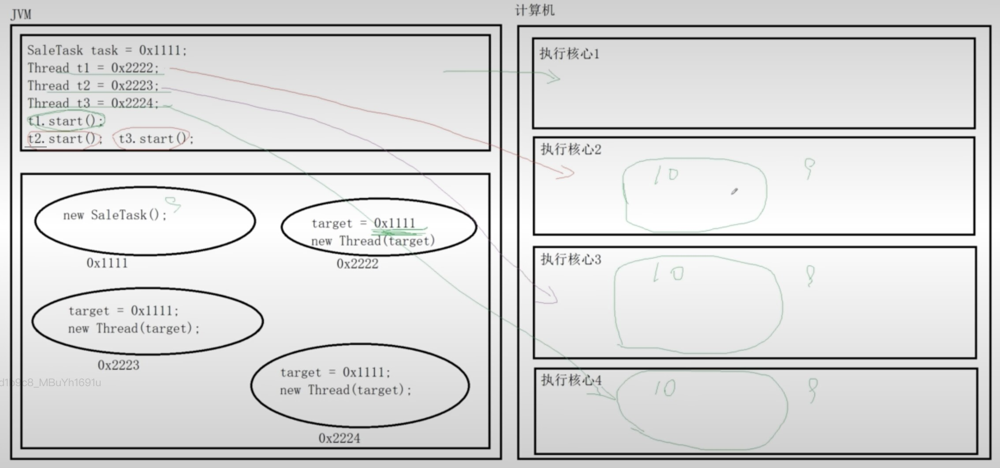
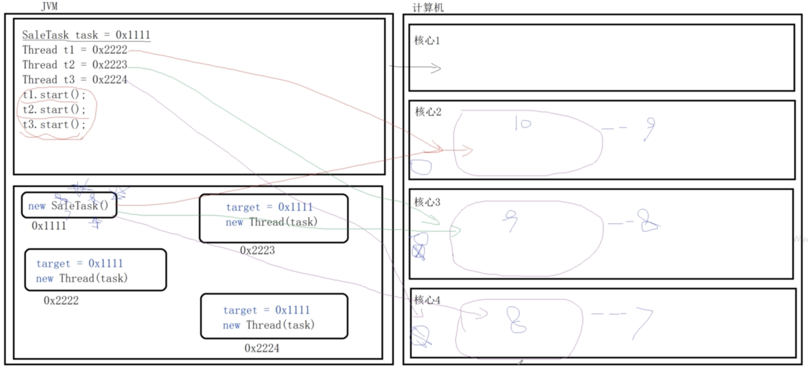

---
tags:
  - JAVA
  - 多线程
date: 2025-05-18
---
# 1 并发

官网：[[https://docs.oracle.com/javase/tutorial/essential/concurrency/index.html]]

> Computer users take it for granted that their systems can do more than one thing at a time. They assume that they can continue to work in a word processor, while other applications download files, manage the print queue, and stream audio. Even a single application is often expected to do more than one thing at a time. 
> 计算机用户认为他们的系统一次可以执行多项操作是理所当然的。他们假设自己可以继续在文字处理器中工作，而其他应用程序则可以下载文件，管理打印队列和流音频。通常甚至一个应用程序一次都可以完成多项任务。
> 
> The Java platform is designed from the ground up to support concurrent programming, with basic concurrency support in the Java programming language and the Java class libraries. Since version 5.0, the Java platform has also included high-level concurrency APIs. This lesson introduces the platform's basic concurrency support and summarizes some of the high-level APIs in the java.util.concurrent packages. 
> Java 平是从一开始就设计为支持并发编程，并在 Java 编程语言和 Java 类库中提供基本的并发支持。从 5.0 版开始，Java 平台还包含高级并发 API。本课介绍了平台的基本并发支持，并总结了 java.util.concurrent 包中的一些高级 API。

在**并发**的概念中还包含**并行**在其中。


# 2 进程和线程

## 2.1 进程和线程

官网：[[https://docs.oracle.com/javase/tutorial/essential/concurrency/procthread.html]]

> In concurrent programming, there are two basic units of execution: processes and threads. In the Java programming language, concurrent programming is mostly concerned with threads. However, processes are also important. 
> 在并发编程中，有两个基本的执行单元：**进程**和**线程**。在 Java 编程语言中，并发编程主要与线程有关。但是，进程也很重要。 
> 
> A computer system normally has many active processes and threads. This is true even in systems that only have a single execution core, and thus only have one thread actually executing at any given moment. Processing time for a single core is shared among processes and threads through an OS feature called time slicing. 
> 计算机系统通常具有许多活动的进程和线程。 即使在只有一个执行核心也是如此，因此在任何给定时刻只有一个线程实际执行。单个内核的处理时间通过 OS 被称作时间分片的功能在进程和线程之间共享。 
> 
> It's becoming more and more common for computer systems to have multiple processors or processors with multiple execution cores. This greatly enhances a system's capacity for concurrent execution of processes and threads — but concurrency is possible even on simple systems, without multiple processors or execution cores. 
> 计算机系统具有多个处理器或具有多个执行核心的处理器正变得越来越普遍。 这极大地增强了系统同时 执行进程和线程的能力 - 但即使在没有多个处理器或执行核心的简单系统上，并发也是可能的。

## 2.2 进程

> A process has a self-contained execution environment. A process generally has a complete, private set of basic run-time resources; in particular, each process has its own memory space. 
> 进程具有**独立的执行环境**。进程通常具有一套完整的私有基本运行时资源；特别是，每个进程都有其自己的内存空间。 
> 
> Processes are often seen as synonymous with programs or applications. However, what the user sees as a single application may in fact be a set of cooperating processes. To facilitate communication between processes, most operating systems support Inter Process Communication (IPC) resources, such as pipes and sockets. IPC is used not just for communication between processes on the same system, but processes on different systems. 
> 进程通常被视为程序或应用程序的同义词。 但是，用户视为单个应用程序实际上可能是一组协作进程。 为了促进进程之间的通信，大多数操作系统都支持进程间通信（IPC）资源，例如管道和套接字。 IPC 不仅用于同一系统上的进程之间的通信，而且还用于不同系统上的进程。 
> 
> Most implementations of the Java virtual machine run as a single process. 
> Java 虚拟机的大多数实现都是作为单个进程运行的。
 
## 2.3 线程

> Threads are sometimes called lightweight processes. Both processes and threads provide an execution environment, but creating a new thread requires fewer resources than creating a new process. 
> **线程**有时称为**轻量级进程**。进程和线程都提供执行环境，但是创建新线程比创建新进程需要更少的资源。 
> 
> Threads exist within a process — every process has at least one. Threads share the process's resources, including memory and open files. This makes for efficient, but potentially problematic, communication. 
> **线程**存在于一个**进程**中——每个进程至少有一个。线程共享进程的资源，包括内存和打开的文件。这样可以进行有效的通信，但可能会出现问题。 
> 
> Multithreaded execution is an essential feature of the Java platform. Every application has at least one thread — or several, if you count "system" threads that do things like memory management and signal handling. But from the application programmer's point of view, you start with just one thread, called the main thread. This thread has the ability to create additional threads, as we'll demonstrate in the next section. 
> 多线程执行是 Java 平台的基本功能。 每个应用程序都至少有一个线程或者几个，如果算上“系统”线程做的事情，如内存管理和信号处理。 但是从应用程序程序员的角度来看，您仅从一个线程（称为主线程） 开始。 该线程具有创建其他线程的能力，我们将在下一部分中进行演示。

## 2.4 总结

**进程**拥有自己独立的内存空间，换言之就是计算机分配内存的单位是**进程**。**线程**是在进程中，可以共享进程的资源比如内存。

**单个执行核心**是通过操作系统的**时间分片功能**来进行进程和线程之间的处理时间的分配。

# 3 线程 -Thread

## 3.1 线程的创建方式

> An application that creates an instance of Thread must provide the code that will run in that thread. There are two ways to do this: 
> 创建 `Thread` 实例的应用程序必须提供将在该线程中运行的代码。有两种方法可以做到这一点：
> 
> -Provide a Runnable object. The Runnable interface defines a single method, run, meant to contain the code executed in the thread. 
> - 提供可运行的对象。 `Runnable` 接口定义了一个方法 `run`，旨在包含在线程中执行的代码。
> 
> -Subclass Thread. The Thread class itself implements Runnable, though its run method does nothing. 
> - 子类线程。 `Thread` 类本身实现了 `Runnable`，尽管它的 `run` 方法不执行任何操作。

### 3.1.1 Thread 类常用构造方法

```JAVA
public Thread(); //创建一个线程 
public Thread(String name);//创建一个依据名称的线程 
public Thread(Runnable target);//根据给定的线程任务创建一个线程 
public Thread(Runnable target, String name);//根据给定的线程任务和名称创建一个线程
```

### 3.1.2 Thread 类常用成员方法

```JAVA
public synchronized void start(); // 启动线程但不一定会执行 
public final String getName();//获取线程名称
public final synchronized void setName(String name);//设置线程的名称 
public final void setPriority(int newPriority);//设置线程的优先级 
public final int getPriority();//获取线程的优先级 
public final void join() throws InterruptedException;//等待线程执行完成 
//等待线程执行给定的时间(单位毫秒) 
public final synchronized void join(long millis) throws InterruptedException; 
//等待线程执行给定的时间(单位毫秒、纳秒) 
public final synchronized void join(long millis, int nanos) throws InterruptedException; 
public long getId(); // 获取线程的ID 
public State getState(); // 获取线程的状态 
public boolean isInterrupted(); // 检测线程是否被打断 
public void interrupt(); // 打断线程
```

### 3.1.3 Thread 类常用静态方法

```JAVA
public static native Thread currentThread();//获取当前运行的线程 
public static boolean interrupted();//检测当前运行的线程是否被打断 
public static native void yield();//暂停当前运行的线程，然后再与其他线程争抢资源，称为线程礼让 
//使当前线程睡眠给定的时间（单位毫秒） 
public static native void sleep(long millis) throws InterruptedException; 
//使当前线程睡眠给定的时间（单位毫秒、纳秒） 
public static void sleep(long millis, int nanos) throws InterruptedException;
```

### 3.1.4 举例

```JAVA
package com.dh.thread;

public class CreateDemo {

    public static void main(String[] args) {
        Thread t1 = new SubThread("inherit"); // 通过继承创建的线程
        ThreadTask task = new ThreadTask();
        Thread t2 = new Thread(task, "interface"); // 通过实现Runnable接口实现的线程
        Thread t3 = new Thread(task, "t3");
        t1.start(); // start方法只是告诉JVM线程t1已经准备好了，随时可以调度执行
//        try {
//            t1.join(); // 等待线程t1执行完成
//            t1.join(1000); // 等待线程t1执行1s
//            t1.join(1000, 50000); // 等待线程t1执行1.5s
//        } catch (InterruptedException e) {
//            throw new RuntimeException(e);
//        }
        t2.start();
        t3.start();
    }

    static class SubThread extends Thread {

        public SubThread() {}
        public SubThread(String name) {
            super(name);
        }

        @Override
        public void run() {
            System.out.println(getName() + "=>This is SubThread");
        }
        
    }

    static class ThreadTask implements Runnable {
        @Override
        public void run() {
            Thread thread = Thread.currentThread();
            System.out.println(thread.getName() + "=>This is Implementation.");
        }
    }
}
```

### 3.1.5 总结

创建线程有两种方式：实现 `Runable` 接口和继承 ` Thread `。相较于继承 `Thread`，实现 `Runable` 接口更具有优势，在实现接口的同时还可以继承自其他的父类，避免了 Java 中类单继承的局限性；同时 `Runable` 接口的实现可以被多个线程重用，但继承 `Thread` 无法做到；后续学到的线程池中支持 `Runable` 接口但不支持 `Thread `。

## 3.2 线程内存模型


## 3.3 线程安全

### 3.3.1 案例

> 某火车站有 10 张火车票在 3 个窗口售卖。

#### 1.代码

```JAVA
package com.dh.thread;  
  
public class SaleThreadTest {  
  
    public static void main(String[] args) {  
        SaleTask saleTask = new SaleTask();  
        Thread t1 = new Thread(saleTask, "窗口1");  
        Thread t2 = new Thread(saleTask, "窗口2");  
        Thread t3 = new Thread(saleTask, "窗口3");  
        t1.start();  
        t2.start();  
        t3.start();  
    }  
  
    static class SaleTask implements Runnable {  
  
        private int totalTickets = 10; // 总共售卖10张火车票  
  
        @Override  
        public void run() {  
            while (totalTickets > 0) {  
                String name = Thread.currentThread().getName();  
                System.out.println(name + "售卖火车票"+totalTickets);  
                totalTickets--;  
                if (totalTickets <= 0) {  
                    break;  
                }  
                try {  
                    Thread.sleep(100);  
                } catch (InterruptedException e) {  
                    throw new RuntimeException(e);  
                }  
            }  
        }  
  
    }  
}
```

#### 2.结果

结果如下，可发现同一张火车票被卖了多次，这是由于线程之间获取信息不同步导致。


### 3.3.2 内存分析



## 3.4 线程同步 -synchronized

> The Java programming language provides two basic synchronization idioms: synchronized methods and synchronized statements. 
> Java 编程语言提供了两种基本的同步习惯用法：**同步方法**和**同步代码块**。

### 3.4.1 同步方法

#### 1.语法

```JAVA
访问修饰符 synchronized 返回值类型 方法名(参数列表) {
     
}
```

#### 2.举例

```JAVA
package com.dh.thread;  
  
public class SaleThreadTest {  
  
    public static void main(String[] args) {  
        SaleTask saleTask = new SaleTask(); // 一个成员  
        // 共用同一个成员  
        Thread t1 = new Thread(saleTask, "窗口1");  
        Thread t2 = new Thread(saleTask, "窗口2");  
        Thread t3 = new Thread(saleTask, "窗口3");  
        t1.start();  
        t2.start();  
        t3.start();  
    }  
  
    static class SaleTask implements Runnable {  
  
        private int totalTickets = 10; // 总共售卖10张火车票  
  
        // synchronized作用在成员方法上，因此synchronized与成员有关  
        private synchronized void saleTicket() {  
            if (totalTickets > 0) {  
                String name = Thread.currentThread().getName();  
                System.out.println(name + "售卖火车票" + totalTickets);  
                totalTickets--;  
            }  
        }  
  
        @Override  
        public void run() {  
            while (true) {  
                saleTicket();  
                if (totalTickets == 0) break;  
                try {  
                    Thread.sleep(100);  
                } catch (InterruptedException e) {  
                    throw new RuntimeException(e);  
                }  
            }  
        }  
  
    }  
}
```

#### 3.结果


#### 4.原理



### 3.4.2 同步代码块

#### 1.语法

```JAVA
synchronized(对象) {
     
}
```

#### 2.举例

```JAVA
package com.dh.thread;  
  
public class SaleThreadTest {  
  
    public static void main(String[] args) {  
        SaleTask saleTask = new SaleTask(); // 一个成员  
        // 共用同一个成员  
        Thread t1 = new Thread(saleTask, "窗口1");  
        Thread t2 = new Thread(saleTask, "窗口2");  
        Thread t3 = new Thread(saleTask, "窗口3");  
        t1.start();  
        t2.start();  
        t3.start();  
    }  
  
    static class SaleTask implements Runnable {  
  
        private int totalTickets = 10; // 总共售卖10张火车票  
  
        @Override  
        public void run() {  
            while (true) {  
                synchronized (this) {  
                    if (totalTickets > 0) {  
                        String name = Thread.currentThread().getName();  
                        System.out.println(name + "售卖火车票"+totalTickets);  
                        totalTickets--;  
                    }  
                }  
                if (totalTickets == 0) break;  
                try {  
                    Thread.sleep(100);  
                } catch (InterruptedException e) {  
                    throw new RuntimeException(e);  
                }  
            }  
        }  
  
    }  
}
```

#### 3.结果


### 3.4.3 synchronized 锁的实现原理

> Synchronization is built around an internal entity known as the intrinsic lock or monitor lock. (The API specification often refers to this entity simply as a "monitor.") Intrinsic locks play a role in both aspects of synchronization: enforcing exclusive access to an object's state and establishing happens-before relationships that are essential to visibility. 
> 同步是围绕称为内部锁或监视器锁的内部实体构建的。 （API 规范通常将此实体简称为“监视器”。）内在锁在同步的两个方面都起作用：强制对对象状态的独占访问并建立对可见性至关重要的事前关联。 
> 
> Every object has an intrinsic lock associated with it. By convention, a thread that needs exclusive and consistent access to an object's fields has to acquire the object's intrinsic lock before accessing them, and then release the intrinsic lock when it's done with them. A thread is said to own the intrinsic lock between the time it has acquired the lock and released the lock. As long as a thread owns an intrinsic lock, no other thread can acquire the same lock. The other thread will block when it attempts to acquire the lock. 
> 每个对象都有一个与之关联的固有锁。按照约定，需要对对象的字段进行独占且一致的访问的线程必须在访问对象之前先获取对象的内在锁，然后在完成对它们的使用后释放该内在锁。据说线程在获取锁和释放锁之间拥有内部锁。只要一个线程拥有一个内在锁，其他任何线程都无法获得相同的锁。另一个线程在尝试获取锁时将阻塞。 
> 
> When a thread releases an intrinsic lock, a happens-before relationship is established between that action and any subsequent acquisition of the same lock. 
> 当线程释放内在锁时，该动作与任何随后的相同锁获取之间将建立事前发生的关系。 
> 
> When a thread invokes a synchronized method, it automatically acquires the intrinsic lock for that method's object and releases it when the method returns. The lock release occurs even if the return was caused by an uncaught exception. 
> 当线程调用同步方法时，它会自动获取该方法对象的内在锁，并在方法返回时释放该内在锁。 即使返回是由未捕获的异常引起的，也会发生锁定释放。

## 3.5 线程同步 -Lock

### 3.5.1 定义

> Synchronized code relies on a simple kind of `reentrant` lock. This kind of lock is easy to use, but has many limitations. 
> 同步代码依赖于一种简单的可重入锁。这种锁易于使用，但有很多限制。 
> 
> Lock objects work very much like the implicit locks used by synchronized code. As with implicit locks, only one thread can own a `Lock` object at a time. 
> 锁对象的工作方式非常类似于同步代码所使用的隐式锁。与隐式锁一样，一次只能有一个线程拥有一个 `Lock` 对象。 
> 
> The biggest advantage of Lock objects over implicit locks is their ability to back out of an attempt to acquire a lock. The `tryLock` method backs out if the lock is not available immediately or before a timeout expires (if specified). The `lockInterruptibly` method backs out if another thread sends an interrupt before the lock is acquired. 
> 与隐式锁相比，`Lock` 对象的最大优点是它们能够回避获取锁的企图。如果该锁不能立即或在超时到期之前不可用，则 `tryLock` 方法将撤消（如果指定）。如果另一个线程在获取锁之前发送了中断，则 ` lockInterruptibly ` 方法将退出。

### 3.5.2 举例

优点：手动锁&轻量锁，不会阻塞

```JAVA
package com.dh.thread;  
  
import java.util.concurrent.locks.Lock;  
import java.util.concurrent.locks.ReentrantLock;  
  
public class LookDemo {  
  
    public static void main(String[] args) {  
        SaleThreadTest.SaleTask saleTask = new SaleThreadTest.SaleTask(); // 一个成员  
        // 共用同一个成员  
        Thread t1 = new Thread(saleTask, "窗口1");  
        Thread t2 = new Thread(saleTask, "窗口2");  
        Thread t3 = new Thread(saleTask, "窗口3");  
        t1.start();  
        t2.start();  
        t3.start();  
    }  
  
    static class SaleTask implements Runnable {  
  
        private int totalTickets = 10; // 总共售卖10张火车票  
  
        private Lock lock = new ReentrantLock(); // 创建了一个可重入锁  
  
        @Override  
        public void run() {  
            while (true) {  
                // 尝试获得锁  
                if (lock.tryLock()) {  
                    try {  
                        if (totalTickets > 0) {  
                            String name = Thread.currentThread().getName();  
                            System.out.println(name + "售卖火车票"+totalTickets);  
                            totalTickets--;  
                        }  
                    }finally {  
                        lock.unlock(); // 解锁  
                    }  
                }  
                if (totalTickets == 0) break;  
                try {  
                    Thread.sleep(100);  
                } catch (InterruptedException e) {  
                    throw new RuntimeException(e);  
                }  
            }  
        }  
  
    }  
  
}
```

## 3.6 线程通信

### 3.6.1 Object 类中的通信方法

```JAVA
public final native void notify(); // 唤醒一个在监视器上等待的线程 
public final native void notifyAll(); // 唤醒所有在监视器上等待的线程 
public final void wait() throws InterruptedException; // 等待 
public final native void wait(long timeout) throws InterruptedException; // 计时等待 
public final void wait(long timeout, int nanos) throws InterruptedException; // 计时等待
```

### 3.6.2 案例

> 小明每次没有生活费了就给他的爸爸打电话，他的爸爸知道了后就去银行存钱，钱存好了之后就通知小明去取。

#### 1.分析

a. 存钱和取钱都有一个共用的账户 

b. 存钱后需要通知取钱，然后等待下一次存钱 

c. 取钱后需要通知存钱，然后等待下一次取钱

#### 2.代码

```JAVA
package com.dh.thread.interact;  
  
/* 存钱任务 */  
public class StoreTask implements Runnable {  
  
    private Account account;  
    private double money;  
  
    public StoreTask(Account account, double money) {  
        this.account = account;  
        this.money = money;  
    }  
  
    @Override  
    public void run() {  
        while (true) {  
            account.store(money);  
            try {  
                Thread.sleep(500);  
            } catch (InterruptedException e) {  
                throw new RuntimeException(e);  
            }  
        }  
    }  
}
```

```JAVA
package com.dh.thread.interact;  
  
/* 取钱任务 */  
public class DrawTask implements Runnable {  
  
    private Account account;  
    private double money;  
  
    public DrawTask(Account account, double money) {  
        this.account = account;  
        this.money = money;  
    }  
  
    @Override  
    public void run() {  
        while (true) {  
            account.draw(money);  
            try {  
                Thread.sleep(500);  
            } catch (InterruptedException e) {  
                throw new RuntimeException(e);  
            }  
        }  
    }  
}
```

```JAVA
package com.dh.thread.interact;  
  
public class Account {  
  
    private String name;  
    private double balance;  
    private boolean hasMoney = false; // 存钱标志  
  
    public Account(String name) {  
        this.name = name;  
    }  
  
    /* 存钱 */    public synchronized void store(double money) {  
        if (hasMoney) { // 已经存钱  
            System.out.println(name + "的爸爸等待通知存钱");  
            try {  
                wait();  
            } catch (InterruptedException e) {  
                throw new RuntimeException(e);  
            }  
        } else {  
            balance += money;  
            System.out.println(name + "的爸爸存了" + money + "元钱");  
            hasMoney = true;  
            notifyAll(); // 通知取钱  
        }  
    }  
    /* 取钱 */    public synchronized void draw(double money) {  
        if (hasMoney) { // 已经存钱  
            if (money > balance) { // 余额不足  
                System.out.println(name + " don't have enough money");  
                hasMoney = false;  
                notify(); // 通知他爸爸存钱  
            } else {  
                balance -= money;  
                System.out.println(name + " has enough money:" + money);  
            }  
        } else { // 没有存钱  
            try {  
                System.out.println(name + "等待TA爸爸存钱");  
                wait(); // 等外存钱  
            } catch (InterruptedException e) {  
                throw new RuntimeException(e);  
            }  
        }  
    }  
  
}
```

```JAVA
package com.dh.thread.interact;  
  
public class AccountTest {  
  
    public static void main(String[] args) {  
        Account account = new Account("小明");  
        Thread t1 = new Thread(new StoreTask(account, 500));  
        Thread t2 = new Thread(new DrawTask(account, 1000));  
        t1.start();  
        t2.start();  
    }  
}
```

## 3.7 线程状态

```JAVA
public enum State {    
	/**     
	* Thread state for a thread which has not yet started.     
	*/
	NEW, 
	
	/** 
	* Thread state for a runnable thread. A thread in the runnable 
	* state is executing in the Java virtual machine but it may 
	* be waiting for other resources from the operating system 
	* such as processor. 
	*/ 
	RUNNABLE, 
	
	/** 
	* Thread state for a thread blocked waiting for a monitor lock. 
	*/ 
	BLOCKED, 
	
	/** 
	* Thread state for a waiting thread. 
	*/ 
	WAITING, 
	
	/** 
	* Thread state for a waiting thread with a specified waiting time. 
	*/ 
	TIMED_WAITING, 
	
	/** 
	* Thread state for a terminated thread. 
	* The thread has completed execution. 
	*/ 
	TERMINATED; 
}
```

### 3.7.1 线程状态转换图


# 4 死锁 -deadlock

## 4.1 概念

> Deadlock describes a situation where two or more threads are blocked forever, waiting for each other.
> 死锁描述了一种情况，其中两个或多个线程永远被阻塞，互相等待。

## 4.2 发生条件

### 4.2.1 互斥条件

> 线程要求对所分配的资源进行排他性控制，即在一段时间内某资源仅为一个线程所占有。此时若有其他线程请求该资源，则请求线程只能等待。

### 4.2.2 不可剥夺条件

> 线程所获得的资源在未使用完毕之前，不能被其他线程强行夺走，即只能由获得该资源的线程自己来释放（只能是主动释放）。

### 4.2.3 请求与保持条件

> 线程已经保持了至少一个资源，但又提出了新的资源请求，而该资源已被其他线程占有，此时请求线程被阻塞，但对自己已获得的资源保持不放。

### 4.2.4 循环等待

> 存在一种线程资源的循环等待链，链中每一个线程已获得的资源同时被链中下一个线程所请求。

## 4.3 案例

### 1.代码

代码没看出问题，但没锁住 TT

```JAVA
package com.dh.thread.deadlock;  
  
public class DeadLockTest {  
  
    public static void main(String[] args) {  
        Object o1 = new Object();  
        Object o2 = new Object();  
        DeadLockTask task1 = new DeadLockTask(o1, o2, 0);  
        DeadLockTask task2 = new DeadLockTask(o2, o1, 1);  
        Thread thread1 = new Thread(task1);  
        Thread thread2 = new Thread(task2);  
        thread1.start();  
        thread2.start();  
    }  
  
    static class DeadLockTask implements Runnable {  
  
        private Object o1, o2;  
        private int flag; // 锁使用的条件  
  
        public DeadLockTask(Object o1, Object o2, int flag) {  
            this.o1 = o1;  
            this.o2 = o2;  
            this.flag = flag;  
        }  
  
        @Override  
        public void run() {  
            String name = Thread.currentThread().getName();  
            if (flag == 0) {  
                synchronized (o1) {  
                    System.out.println(name + "锁定对象o1");  
                    try {  
                        Thread.sleep(500);  
                    } catch (InterruptedException e) {  
                        throw new RuntimeException(e);  
                    }  
                    synchronized (o2) {  
                        System.out.println(name + "锁定对象o2");  
                    }  
                }  
            } else {  
                synchronized (o2) {  
                    System.out.println(name + "锁定对象o2");  
                    try {  
                        Thread.sleep(500);  
                    } catch (InterruptedException e) {  
                        throw new RuntimeException(e);  
                    }  
                    synchronized (o1) {  
                        System.out.println(name + "锁定对象o1");  
                    }  
                }  
            }  
        }  
    }  
}
```

### 2.分析

线程 t1 开始执行，首先会将持有对象 o1 的锁，然后开始睡眠 0.5 秒，此时，线程 t2 开始执行，首先会持 有对象 o2 的锁，然后开始睡眠 0.5 秒。 

线程 t1 睡眠结束，尝试获得对象 o2 的锁，此时发现对象 o2 已经被其他线程 t2 锁住，此时 t1 被阻塞在外， 等待对象 o2 上的锁释放。 

线程 t2 睡眠结束，尝试获得对象 o1 的锁，此时发现对象 o1 已经被其他线程 t1 锁住，此时 t2 被阻塞在外， 等待对象 o1 上的锁释放。

# 5 线程池

## 5.1 执行器

> In all of the previous examples, there's a close connection between the task being done by a new thread, as defined by its Runnable object, and the thread itself, as defined by a Thread object. This works well for small applications, but in large-scale applications, it makes sense to separate thread management and creation from the rest of the application. Objects that encapsulate these functions are known as executors. 
> 在前面的所有示例中，由新线程（由其 `Runnable` 对象定义）执行的任务与由 `Thread` 对象定义的线程本身之间存在紧密的联系。这对于小型应用程序非常有效，但是在大型应用程序中，将线程管理和创建与其余应用程序分开是有意义的。封装这些功能的对象称为执行器。

### 5.1.1 Executor 接口方法

```JAVA
void execute(Runnable command); // 将任务添加到线程池中，等待线程池调度执行
```

### 5.1.2 ExecutorService 接口常用方法

```JAVA
void shutdown(); // 有序关闭线程池，不再接收新的线程任务，但池中已有任务会执行 
List shutdownNow(); // 关闭线程池，尝试停止所有正在执行的任务，并将池中等待执 行的任务返回 
boolean isShutdown(); // 检测线程池是否已经关闭 
boolean isTerminated(); // 检测线程池是否已经终止 
Future submit(Runnable task); // 提交一个任务至线程池中
```

## 5.2 线程池

### 5.2.1 定义

> Most of the executor implementations in java.util.concurrent use thread pools, which consist of worker threads. This kind of thread exists separately from the Runnable and Callable tasks it executes and is often used to execute multiple tasks. 
> `java.util.concurrent` 中的大多数执行程序实现都使用线程池，该线程池由工作线程组成。这种线程与它执行的 `Runnable` 和 `Callable` 任务分开存在，通常用于执行多个任务。 
> 
> Using worker threads minimizes the overhead due to thread creation. Thread objects use a significant amount of memory, and in a large-scale application, allocating and deallocating many thread objects creates a significant memory management overhead. 
> 使用工作线程可以**最大程度地减少线程创建所带来的开销**。线程对象占用大量内存，在大型应用程序中，分配和取消分配许多线程对象会产生大量内存管理开销。 
> 
> One common type of thread pool is the fixed thread pool. This type of pool always has a specified number of threads running; if a thread is somehow terminated while it is still in use, it is automatically replaced with a new thread. Tasks are submitted to the pool via an internal queue, which holds extra tasks whenever there are more active tasks than threads. 
> 线程池的一种常见类型是**固定线程池**。这种类型的池始终具有指定数量的正在运行的线程。如果某个线程在仍在使用时以某种方式终止，则它将自动替换为新线程。任务通过内部队列提交到池中，该内部队列在活动任务多于线程时容纳额外的任务。 
> 
> An important advantage of the fixed thread pool is that applications using it degrade gracefully. 
> 固定线程池的一个重要优点是**使用该线程池的应用程序可以正常降级**。

### 5.2.2 构造方法

#### 1.语法

```JAVA
public ThreadPoolExecutor(int corePoolSize, // 核心线程数
							int maximumPoolSize, // 最大线程数       
							long keepAliveTime, // 工作线程存活时间   
							TimeUnit unit, // 时间单位
							BlockingQueue workQueue, // 任务队列
							ThreadFactory threadFactory, // 线程工厂
							RejectedExecutionHandler handler) // 拒绝处理器
```

#### 2.举例

```JAVA
package com.dh.thread.pool;  
  
import java.util.LinkedList;  
import java.util.Queue;  
import java.util.concurrent.*;  
  
public class ThreadPoolTest {  
  
    public static void main(String[] args) {  
        LinkedBlockingQueue<Runnable> taskQueue = new LinkedBlockingQueue<>(10);  
        ThreadPoolExecutor pool = new ThreadPoolExecutor(  
                5, // 核心线程数  
                10, // 最大工作线程数  
                2, // 非核心线程的工作线程存活时间  
                TimeUnit.SECONDS, // 存活时间的单位  
                taskQueue, // 任务队列  
                Executors.defaultThreadFactory(), // 线程池中的线程创建工厂  
                new ThreadPoolExecutor.AbortPolicy()); // 拒绝新线程任务的策略  
  
        for(int i = 0; i < 30; i++) {  
            pool.submit(new ThreadPoolTask(i));  
            int corePoolSize = pool.getCorePoolSize(); // 获取核心线程数  
            int size = pool.getQueue().size(); // 获取队列中任务个数  
            long finish = pool.getCompletedTaskCount(); // 获取线程池执行完成任务的个数  
            System.out.printf("线程池中核心线程数：%d， 队列中任务个数：%d， 线程池完成任务个数：%d \n", corePoolSize, size, finish);  
            try {  
                Thread.sleep(250);  
            } catch (InterruptedException e) {  
                throw new RuntimeException(e);  
            }  
        }  
        pool.shutdown(); // 关闭线程池，等待线程池中的任务执行完成，但是不会接受新的线程任务  
    }  
  
    static class ThreadPoolTask implements Runnable {  
  
        private int num;  
  
        public ThreadPoolTask(int num) {  
            this.num = num;  
        }  
  
        @Override  
        public void run() {  
            System.out.println("正在执行线程任务" + num);  
            try {  
                Thread.sleep(500);  
            } catch (InterruptedException e) {  
                throw new RuntimeException(e);  
            }  
        }  
    }  
}
```


### 5.2.3 工作流程

> 线程池启动后，核心线程就已经启动，当一个新的任务提交到线程池时，首先会检测当前是否存在空闲的核心线程，如果存在，就将该任务交给这个空闲核心线程执行。如果不存在，那么就将该任务交给队列， 在队列中排队等候。如果队列满了，此时线程池会检测当前工作线程数是否达到最大线程数，如果没有达到最大线程数，那么将由线程工厂创建新的工作线程来执行队列中的任务，这样，队列中就有空间能够容纳这个新任务。如果创建的工作线程在执行完任务后，在给定的时间范围内没有新的任务执行，这些工作线程将死亡。如果已经达到最大线程数，那么线程池将采用提供的拒绝处理策略来拒绝这个新任务。

### 5.2.4 创建方式

```JAVA
package com.dh.thread.pool;  
  
import java.util.concurrent.ExecutorService;  
import java.util.concurrent.Executors;  
  
public class ExecutorTest {  
  
    public static void main(String[] args) {  
        // 创建一个固定核心线程数以及最大线程数的线程池，该线程池队列非常大  
        ExecutorService pool1 = Executors.newFixedThreadPool(5);  
        // 创建只有一个固定核心线程数以及最大线程数的线程池，该线程池队列非常大  
        ExecutorService pool2 = Executors.newSingleThreadExecutor();  
        // 创建一个核心线程为0，但最大线程数为整数的最大值的可缓存线程池  
        ExecutorService pool3 = Executors.newCachedThreadPool();  
        //创建一个给定核心线程数，最大线程数为整数的，可调度的线程池  
        ExecutorService pool4 = Executors.newScheduledThreadPool(5);  
    }  
}
```

## 5.3 线程池的使用

```JAVA
package com.dh.thread.pool;  
  
import java.util.concurrent.ExecutorService;  
import java.util.concurrent.Executors;  
  
public class ExecutorTaskTest {  
  
    public static void main(String[] args) {  
        ExecutorService service = Executors.newFixedThreadPool(5);  
        for (int i = 0; i < 50; i++) {  
            int order = i;  
            service.submit(()-> System.out.println("正在执行任务" + order));  
        }  
        service.shutdown(); // 关闭  
    }  
}
```

