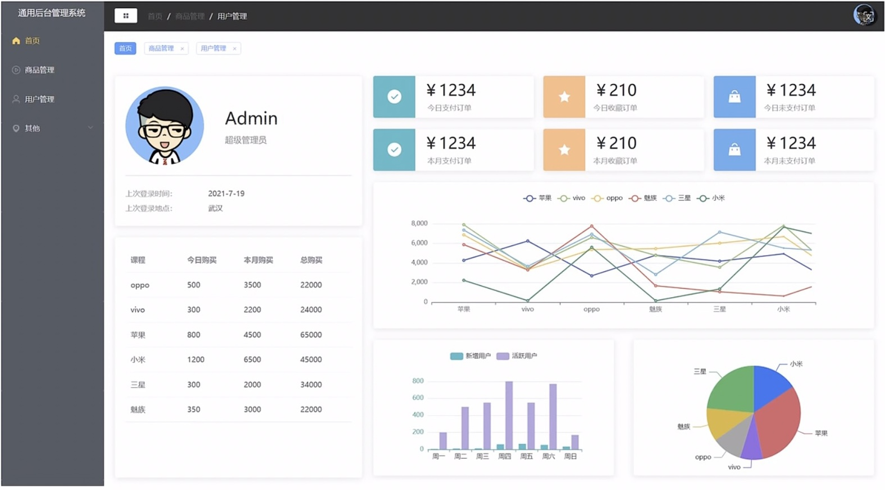
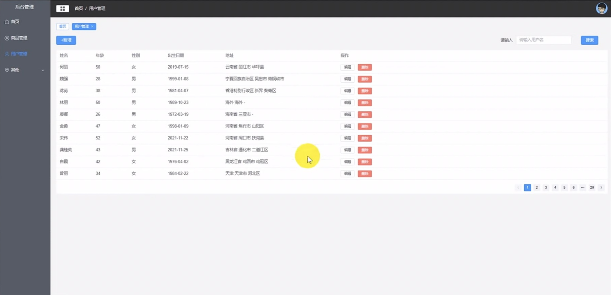

---
tags:
  - 项目
  - VUE3
beginDate: 2025-05-11
endDate: 2025-05-31
---
# 1 创建项目

## 1.1 `nvm` 管理 `node` 版本

### 1.1.1 `nvm`

`node` 的版本管理工具，在下载安装之前需要**先卸载 `node`。

### 1.1.2 安装地址

https://github.com/coreybutler/nvm-windows/releases

### 1.1.3 查看

版本号。

```shell
nvm -v
# 1.2.2
```

### 1.1.4 基本命令

```shell
# 禁用node.js版本管理（不卸载任何东西）
nvm off

# 启用node.js版本管理
nvm on

# 安装node.js的命令，其中<version>是版本号，如：nvm install 8.12.0
nvm install <version>

# 卸载node.js的命令，卸载指定版本的node.js，当安装失败时卸载使用
nvm uninstall <version>

# 显示所有安装的node.js的版本
nvm ls

# 显示可以安装的所有node.js的版本
nvm list available

# 切换到使用指定的node.js版本
nvm use <version>

# 显示nvm版本
nvm -v

# 安装最新稳定版
nvm install stable
```

## 1.2 `nrm` 管理镜像资源

```shell
# 安装nrm时，若使用npm无法安装，则可先下载cnpm镜像
npm install -g cnpm --registry=https://registry.npmmirror.com

# 然后再通过cnpm安装nrm
cnpm install -g nrm

# 若报错
Set-ExecutionPolicy Unrestricted

# 若成功安装nrm，第一次使用时报错：无法加载……路径……，因此在系统上禁止运行脚本
Set-ExecutionPolicy RemoteSigned
```

参考：[[[安装指定版本的npm和node - rachelch - 博客园](https://www.cnblogs.com/rachelch/p/14524431.html)]]

## 1.3 `vite` 创建

`vite` 官网地址：[[https://cn.vitejs.dev/guide/]]

要求：需要 `node.js` 版本 18+ / 20+ 及以上。

### 1.3.1 创建命令

```shell
# npm 7+，需要添加额外的 --：
npm create vite@latest my-vue-app -- --template vue

# pnpm
pnpm create vite my-vue-app --template vue
```

### 1.3.2 下载依赖 `npm`

```shell
# 先确保路径正确，即在创建的项目主目录中，再进行下载
# npm
npm i
# 或者是npm install
```

### 1.3.3 启动项目

```shell
npm run dev

# ctrl + C 终止项目
```

### 1.3.4 下载依赖

```shell
# 先删除项目中多余的代码
# 默认执行的是-s操作

npm install less

npm install vue-router

npm install element-plus

npm install @element-plus/icons-vue
```


### 1.3.5 别名

```JavaScript
// vite.config.js

import { defineConfig } from 'vite'
import vue from '@vitejs/plugin-vue'

// https://vite.dev/config/
export default defineConfig({
  plugins: [vue()],
  // 添加的别名
  resolve: {
    alias: [
      {
        find: "@",
        replacement: "/src"
      }
    ]
  }
});
```

测试：引入 `less`（先在 `assets` 文件夹下新建 `less` 文件夹和 `images` 文件夹）

```JavaScript
// main.js

import { createApp } from 'vue'
import App from './App.vue'
import "@/assets/less/index.less"; // 引入less中的index.less

createApp(App).mount('#app')
```

```less
// src\assets\less\index.less

@import './reset.less';
```

```less
// src\assets\less\reset.less

@color: #4D926F; 

html,
body {
    width: 100%;
    height: 100%;
    background-color: #f5f5f5;
}
 
#header {
  color: @color;
}
h2 {
  color: @color;
}
```


网页如图，别名配置成功。

# 2 `vue-router` 的使用

## 2.1 下载

详见 1.3.4

## 2.2 创建

在 `src` 文件夹下新建文件夹 `router` 并创建文件 `index.js`


```JavaScript
// src\router\index.js

import component from 'element-plus/es/components/tree-select/src/tree-select-option.mjs'
import { createRouter, createWebHashHistory } from 'vue-router'

// 制定路由规则

const routes = [
    {
        path: '/',
        name: 'main',
        component:()=>import('@/views/Main.vue'),
    },
];

const router = createRouter({
    // 设置路由的模式
    history:createWebHashHistory(),
    routes, 
});

export default router; // 不添加会报错
```

在 `main.js` 文件中引入 `router`

```Javascript
// src\main.js

import { createApp } from 'vue'
import App from './App.vue'
import "@/assets/less/index.less"; // 引入less中的index.less
import router from './router'

const app = createApp(App);
app.use(router).mount('#app');
```

修改 `App.vue` 的代码，显示如下，即 `router` 生效。

```vue
<!-- src\App.vue -->

<script setup>

</script>

<template>
  <router-view></router-view> <!-- 新增 -->
  <body>
    123
    <h2>hello</h2>
  </body>
</template>

<style scoped>

</style>
```


## 2.3 `views` 文件夹

在 src 文件夹下新建文件夹 `views` 并创建文件 `Main.vue`


# 3 `element-plus` 的使用

官网：[[https://element-plus.org/zh-CN/guide/quickstart.html]]

## 3.1 引入

### 3.1.1 完整引入

先下载，详情见 1.3.4，然后更新 `main.js`

```Javascript
// src\main.js

import { createApp } from 'vue'
import App from './App.vue'
import "@/assets/less/index.less"; // 引入less中的index.less
import router from './router'
import ElementPlus from 'element-plus' // 新增
import 'element-plus/dist/index.css' // 新增

const app = createApp(App);
app.use(ElementPlus); // 新增
app.use(router).mount('#app');
```

测试：在 `App.vue` 修改代码，添加按钮进行测试。

```vue
<!-- src\App.vue -->

<script setup>

</script>

<template>
  <router-view></router-view>
  <el-button>默认</el-button>  
  <el-button type="success">Success</el-button>
</template>

<!-- 若加上scoped，则表示样式只能在此处生效 -->
<style> 
#app {
  width: 100%;
  height: 100%;
  overflow: hidden; /* 隐藏超出部分，防止滚动条出现 */
}
</style>
```

结果如图。


### 3.1.2 按需导入：自动导入

首先你需要安装 `unplugin-vue-components` 和 `unplugin-auto-import` 这两款插件。

```shell
npm install -D unplugin-vue-components unplugin-auto-import
```

然后把下列代码插入到你的 `Vite` 或 `Webpack` 的配置文件中。

**`Vite`**

```ts
// vite.config.ts

import { defineConfig } from 'vite'
import AutoImport from 'unplugin-auto-import/vite'
import Components from 'unplugin-vue-components/vite'
import { ElementPlusResolver } from 'unplugin-vue-components/resolvers'

export default defineConfig({
  // ...
  plugins: [
    // ...
    AutoImport({
      resolvers: [ElementPlusResolver()],
    }),
    Components({
      resolvers: [ElementPlusResolver()],
    }),
  ],
})
```

**`Webpack`**

```js
// webpack.config.js

const AutoImport = require('unplugin-auto-import/webpack')
const Components = require('unplugin-vue-components/webpack')
const { ElementPlusResolver } = require('unplugin-vue-components/resolvers')

module.exports = {
  // ...
  plugins: [
    AutoImport({
      resolvers: [ElementPlusResolver()],
    }),
    Components({
      resolvers: [ElementPlusResolver()],
    }),
  ],
}
```

### 3.1.3 按需导入：手动导入

`Element Plus` 提供了基于 `ES Module` 的开箱即用的 [Tree Shaking](https://webpack.js.org/guides/tree-shaking/) 功能。

但需要安装 [unplugin-element-plus](https://github.com/element-plus/unplugin-element-plus) 来导入样式。

```shell
npm install unplugin-element-plus -D
```

```vue
<!-- src\App.vue -->

<template>
  <el-button>I am ElButton</el-button>
</template>

<script>
import { ElButton } from 'element-plus'
export default {
  components: { ElButton },
}
</script>
```

```ts
// vite.config.ts

import { defineConfig } from 'vite'
import ElementPlus from 'unplugin-element-plus/vite'

export default defineConfig({
  // ...
  plugins: [ElementPlus()],
})
```

## 3.2 注册所有图标

安装，详见 1.3.4

```shell
npm install @element-plus/icons-vue
```

从 `@element-plus/icons-vue` 中导入所有图标并进行全局注册。

```ts
// main.ts

// 如果您正在使用CDN引入，请删除下面一行。
import * as ElementPlusIconsVue from '@element-plus/icons-vue'

const app = createApp(App)
for (const [key, component] of Object.entries(ElementPlusIconsVue)) {
  app.component(key, component)
}
```

所得 `main.js` 如下。

```js
// src\main.js

import { createApp } from 'vue'
import App from './App.vue'
import "@/assets/less/index.less"; // 引入less中的index.less
import router from './router'
import ElementPlus from 'element-plus'
import 'element-plus/dist/index.css'
import * as ElementPlusIconsVue from '@element-plus/icons-vue'

const app = createApp(App);
app.use(ElementPlus);
app.use(router).mount('#app');
for (const [key, component] of Object.entries(ElementPlusIconsVue)) {
  app.component(key, component)
}
```

## 3.3 `main` 组件的实现

参考示意图如下。



### 3.3.1 初步搭建

```vue
<!-- src\views\Main.vue -->

<script setup>

</script>

<template>
<div class="common-layout">
    <el-container class="lay-container">
        <!-- 自定义左侧组件 -->
        <common-aside />
        <!-- 右侧 -->
        <el-container>
            <el-header class="el-header">
                <!-- 自定义 -->
                <common-header />
            </el-header>
            <el-main class="right-main">
                main
            </el-main>
        </el-container>
    </el-container>
</div>
</template>

<style scoped lang="less">
    .common-layout, .lay-container {
        height: 100%;
    }
    .el-header {
        background-color: rgb(189, 223, 212);
    }
</style>
```

效果展示。


### 3.3.2 菜单栏：`commonAside` 组件静态搭建

在 `components` 文件夹下新建 `CommonAside.vue` 文件。


```vue
<!-- src\components\CommonAside.vue -->

<template>
    <!-- 侧边栏容器 -->
    <el-aside width="180px">
        <el-menu
            background-color="#414640"
            text-color="#fff"
        >
            <h3>通用后台管理系统</h3>
            <!-- 一级菜单 -->
            <el-menu-item 
                v-for="item in noChildren"
                :index="item.path"
                :key="item.path"
            >
                <component class="icons" :is="item.icon"></component>
                <span>{{ item.label }}</span>
            </el-menu-item>
            <!-- 有子菜单的遍历 -->
            <el-sub-menu 
                v-for="item in hasChildren"
                :index="item.path"
                :key="item.path"
            >
            <template #title>
                <component class="icons" :is="item.icon"></component>
                <span>{{ item.label }}</span>
            </template>
            <!-- 三级菜单 -->
            <el-menu-item-group>
                <el-menu-item 
                    v-for="(subItem, subIndex) in item.children"
                    :index="subItem.path"
                    :key="subItem.path"
                >
                    <component class="icons" :is="subItem.icon"></component>
                    <span>{{ subItem.label }}</span>
                </el-menu-item>
            </el-menu-item-group>
            </el-sub-menu>
        </el-menu>
    </el-aside>
</template>


<script setup>
import { ref, computed } from 'vue'

const list = ref([
    {
        path: '/home',
        name: 'home',
        label: '首页',
        icon: 'house',
        url: 'Home',
    },
    {
        path: '/mall',
        name: 'mall',
        label: '商品管理',
        icon: 'video-play',
        url: 'Mall',
    },
    {
        path: '/user',
        name: 'user',
        label: '用户管理',
        icon: 'user',
        url: 'User',
    },
    {
        path: '/other',
        name: 'home',
        label: '其他',
        icon: 'location',
        children: [
            {
                path: '/page1',
                name: 'page1',
                label: '页面1',
                icon: 'setting',
                url: 'Page1',
            },
            {
                path: '/page2',
                name: 'page2',
                label: '页面2',
                icon: 'setting',
                url: 'Page2',
            },
        ],
    },
])
const noChildren = computed(() => list.value.filter(item => !item.children))
const hasChildren = computed(() => list.value.filter(item => item.children))
// VUE3的ref响应式数据的访问一般都需要带".value"，而reactive的响应式数据不需要

const chlickMenu=(item)=>{
    router.push(item.path)
}
</script>


<!-- 样式 -->
<style lang="less" scoped>
.icons {
    width: 18px;
    height: 18px;
    margin-right: 5px;
}
.el-menu {
    border-right: none;
    h3 {
        line-height: 48px;
        color: #fff;
        text-align: center;
    }
}
.el-aside {
    height: 100%;
    background-color: #414640;
}
</style>
```

在 `Main.vue` 中引入 `CommonAside.vue`

```vue
<!-- src\views\Main.vue -->

<script setup>
import CommonAside from '@/components/CommonAside.vue';
</script>

<template>
<div class="common-layout">
    <el-container class="lay-container">
        <!-- 自定义左侧组件 -->
        <common-aside />
        <!-- 右侧 -->
        <el-container>
            <el-header class="el-header">
                <!-- 自定义 -->
                <common-header />
            </el-header>
            <el-main class="right-main">
                main
            </el-main>
        </el-container>
    </el-container>
</div>
</template>

<style scoped lang="less">
.common-layout, .lay-container {
    height: 100%;
}
.el-header {
    background-color: rgb(162, 185, 178);
}
</style>
```

在 `App.vue` 中添加 `body` 的样式，以覆盖用户代理样式表。

```vue
<!-- src\App.vue -->

<script setup>

</script>


<template>
  <router-view></router-view>
</template>

<!-- 若加上scoped，则表示样式只能在此处生效 -->
<style> 
#app {
  width: 100%;
  height: 100%;
  overflow: hidden; /* 隐藏超出部分，防止滚动条出现 */
}
/* 覆盖用户代理样式表 */
body {
  margin: 0px;
}
</style>

```

效果如下。


### 3.3.3 `header` 组件的静态搭建

URL 参考文档：[[https://developer.mozilla.org/zh-CN/docs/Web/API/URL]]

在 `components` 文件夹下新建 `CommonHeader.vue` 文件。

```vue
<!-- src\components\CommonHeader.vue -->

<template>
    <div class="header">
        <div class="l-content">
            <el-button size="small">
                <component class="icons" :is="menu"></component>
            </el-button>
            <el-breadcrumb separator="/" class="bread">
                <el-breadcrumb-item :to="{ path: '/' }">首页</el-breadcrumb-item>
            </el-breadcrumb>
        </div>
        <div class="r-content">
			<el-dropdown>
				<span class="el-dropdown-link">
					
				</span>
				<template #dropdown>
				<el-dropdown-menu>
					<el-dropdown-item>个人中心</el-dropdown-item>
					<el-dropdown-item>退出</el-dropdown-item>
				</el-dropdown-menu>
				</template>
			</el-dropdown>
        </div>
    </div>
</template>


<script setup>
import { ref, computed } from 'vue'
const getImageUrl = (user) => {
    return new URL(`../assets/images/${user}.png`, import.meta.url).href
    // 是``，而不是单引号''
}

</script>


<!-- 样式 -->
<style lang="less" scoped>
.header {
    display: flex;
    justify-content: space-between;
    align-items: center;
    width: 100%;
    height: 100%;
    background-color: #333;
}
.icons {
    width: 20px;
    height: 20px;
    margin-right: 5px;
}
.l-content {
    display: flex;
    align-items: center;
    .el-button {
        margin: 20px;
    }
}
.r-content {
    .user {
        width: 40px;
        height: 40px;
        border-radius: 50%;
    }
}
:deep(.bread span) {
    color: #fff !important;
    cursor: pointer !important;
}
</style>
```

在 `Main.vue` 中引入 `CommonHeader.vue`

```vue
<!-- src\views\Main.vue -->

<script setup>
import CommonAside from '@/components/CommonAside.vue';
import CommonHeader from '@/components/CommonHeader.vue';
</script>

<template>
<div class="common-layout">
    <el-container class="lay-container">
        <!-- 自定义左侧组件 -->
        <common-aside />
        <!-- 右侧 -->
        <el-container>
            <el-header class="el-header">
                <!-- 自定义 -->
                <common-header />
            </el-header>
            <el-main class="right-main">
                main
            </el-main>
        </el-container>
    </el-container>
</div>
</template>

<style scoped lang="less">
.common-layout, .lay-container {
    height: 100%;
}
.el-header {
    padding: 0px;
    background-color: rgb(162, 185, 178);
}
</style>
```

效果如下。


# 4 使用 `pinia` 管理

实现组件之间数据的共享。

官网：[[https://pinia.vuejs.org/zh/introduction.html]]

## 4.1 `pinia` 引入

安装。

```shell
npm install pinia -D
```

在 `main.js` 中引入 `pinia`

```js
// src\main.js

import { createApp } from 'vue'
import App from './App.vue'
import "@/assets/less/index.less"; // 引入less中的index.less
import router from './router'
import ElementPlus from 'element-plus'
import 'element-plus/dist/index.css'
import * as ElementPlusIconsVue from '@element-plus/icons-vue'
import { createPinia } from 'pinia'

const pinia = createPinia()

const app = createApp(App);
app.use(ElementPlus);
app.use(pinia);
app.use(router).mount('#app');
for (const [key, component] of Object.entries(ElementPlusIconsVue)) {
  app.component(key, component)
}
```

在 `src` 下创建 `stores` 文件夹，在其中创建 `index.js`


```js
// src\stores\index.js

import { defineStore } from 'pinia'
import { ref } from 'vue'

function initState() {

}

export const useAllDataStore = defineStore('allData', () => {
  // ref state属性
  // computed getters
  // function actions
  const state = ref(initState())

  return { 
    state,
  }
})
```

## 4.2 `pinia` 实现菜单收缩功能

修改 `CommonAside.vue` 的宽度和标题

```vue
<!-- src\components\CommonAside.vue -->

<template>
    <!-- 侧边栏容器 -->
    <el-aside :width="width">
        <el-menu
            background-color="#414640"
            text-color="#fff"
            :collapse="isCollapse"            
            :collapse-transition="false"
        >
            <h3 v-show="!isCollapse">通用后台管理系统</h3>
            <h3 v-show="isCollapse">后台</h3>
            <!-- 一级菜单 -->
            <el-menu-item 
                v-for="item in noChildren"
                :index="item.path"
                :key="item.path"
            >
                <component class="icons" :is="item.icon"></component>
                <span>{{ item.label }}</span>
            </el-menu-item>
            <!-- 有子菜单的遍历 -->
            <el-sub-menu 
                v-for="item in hasChildren"
                :index="item.path"
                :key="item.path"
            >
            <template #title>
                <component class="icons" :is="item.icon"></component>
                <span>{{ item.label }}</span>
            </template>
            <!-- 三级菜单 -->
            <el-menu-item-group>
                <el-menu-item 
                    v-for="(subItem, subIndex) in item.children"
                    :index="subItem.path"
                    :key="subItem.path"
                >
                    <component class="icons" :is="subItem.icon"></component>
                    <span>{{ subItem.label }}</span>
                </el-menu-item>
            </el-menu-item-group>
            </el-sub-menu>
        </el-menu>
    </el-aside>
</template>


<script setup>
import { ref, computed } from 'vue'
import { useAllDataStore } from '@/stores'

const list = ref([
    {
        path: '/home',
        name: 'home',
        label: '首页',
        icon: 'house',
        url: 'Home',
    },
    {
        path: '/mall',
        name: 'mall',
        label: '商品管理',
        icon: 'video-play',
        url: 'Mall',
    },
    {
        path: '/user',
        name: 'user',
        label: '用户管理',
        icon: 'user',
        url: 'User',
    },
    {
        path: '/other',
        name: 'home',
        label: '其他',
        icon: 'location',
        children: [
            {
                path: '/page1',
                name: 'page1',
                label: '页面1',
                icon: 'setting',
                url: 'Page1',
            },
            {
                path: '/page2',
                name: 'page2',
                label: '页面2',
                icon: 'setting',
                url: 'Page2',
            },
        ],
    },
])
const noChildren = computed(() => list.value.filter(item => !item.children))
const hasChildren = computed(() => list.value.filter(item => item.children))
// VUE3的ref响应式数据的访问一般都需要带".value"，而reactive的响应式数据不需要

// 是否收缩
const store = useAllDataStore()
const isCollapse = computed(()=>store.state.isCollapse)
// width
const width = computed(()=>store.state.isCollapse ? '64px' : '180px')

const chlickMenu=(item)=>{
    router.push(item.path)
}
</script>


<!-- 样式 -->
<style lang="less" scoped>
.icons {
    width: 18px;
    height: 18px;
    margin-right: 5px;
}
.el-menu {
    border-right: none;
    h3 {
        line-height: 48px;
        color: #fff;
        text-align: center;
    }
}
.el-aside {
    height: 100%;
    background-color: #414640;
}
</style>
```

修改 `stores` 文件夹下的 `index.js`

```js
// src\stores\index.js

import { defineStore } from 'pinia'
import { ref } from 'vue'

function initState() {
  return {
    isCollapse: false,
  }
}

export const useAllDataStore = defineStore('allData', () => {
  // ref state属性
  // computed getters
  // function actions
  const state = ref(initState())

  return { 
    state,
  }
})
```

修改 `CommonHeader.vue` 中的按钮

```vue
<!-- src\components\CommonHeader.vue -->

<template>
    <div class="header">
        <div class="l-content">
            <el-button size="small" @click="handleCollapse">
                <component class="icons" :is="menu"></component>
            </el-button>
            <el-breadcrumb separator="/" class="bread">
                <el-breadcrumb-item :to="{ path: '/' }">首页</el-breadcrumb-item>
            </el-breadcrumb>
        </div>
        <div class="r-content">
            <el-dropdown>
                <span class="el-dropdown-link">
                    
                </span>
                <template #dropdown>
                <el-dropdown-menu>
                    <el-dropdown-item>个人中心</el-dropdown-item>
                    <el-dropdown-item>退出</el-dropdown-item>
                </el-dropdown-menu>
                </template>
            </el-dropdown>
        </div>
    </div>
</template>


<script setup>
import { ref, computed } from 'vue'
import { useAllDataStore } from '@/stores'

const getImageUrl = (user) => {
    return new URL(`../assets/images/${user}.png`, import.meta.url).href
    // 是``，而不是单引号''
}

const store = useAllDataStore()
const handleCollapse = ()=> {
    store.state.isCollapse = !store.state.isCollapse
}

</script>


<!-- 样式 -->
<style lang="less" scoped>
.header {
    display: flex;
    justify-content: space-between;
    align-items: center;
    width: 100%;
    height: 100%;
    background-color: #333;
}
.icons {
    width: 20px;
    height: 20px;
    margin-right: 5px;
}
.l-content {
    display: flex;
    align-items: center;
    .el-button {
        margin: 20px;
    }
}
.r-content {
    .user {
        width: 40px;
        height: 40px;
        border-radius: 50%;
    }
}
:deep(.bread span) {
    color: #fff !important;
    cursor: pointer !important;
}
</style>
```

效果如下（折叠状态）。


## 4.3 首页左上方的卡片的实现

修改 `router` 文件夹下的 `index.js`，添加 `home` 界面

```JS
// src\router\index.js

import { createRouter, createWebHashHistory } from 'vue-router'

// 制定路由规则
const routes = [
    {
        path: '/',
        name: 'main',
        component:()=>import('@/views/Main.vue'),
        redirect: "/home",
        children: [
            {
                path: 'home',
                name: 'home',
                component:()=>import('@/views/Home.vue'),
            },
        ],
    },
];

const router = createRouter({
    // 设置路由的模式
    history:createWebHashHistory(),
    routes, 
});

export default router; // 不添加会报错
```

修改 `Main.vue`，添加 `<router-view></router-view>`

```vue
<!-- src\views\Main.vue -->

<script setup>
import CommonAside from '@/components/CommonAside.vue';
import CommonHeader from '@/components/CommonHeader.vue';
</script>

<template>
<div class="common-layout">
    <el-container class="lay-container">
        <!-- 自定义左侧组件 -->
        <common-aside />
        <!-- 右侧 -->
        <el-container>
            <el-header class="el-header">
                <!-- 自定义 -->
                <common-header />
            </el-header>
            <el-main class="right-main">
                <router-view></router-view>
            </el-main>
        </el-container>
    </el-container>
</div>
</template>

<style scoped lang="less">
.common-layout, .lay-container {
    height: 100%;
}
.el-header {
    padding: 0px;
    background-color: rgb(162, 185, 178);
}
</style>
```

在 `views` 文件夹下新建 `Home.vue` 文件

```vue
<!-- src\views\Home.vue -->

<script setup>
const getImageUrl = (user)  => {
    return new URL(`../assets/images/${user}.png`, import.meta.url).href
}
</script>

<template>
    <el-row class="home" :gutter="20">
        <!-- 左侧 -->
        <el-col span="8" style="margin-top: 20px;">
            <el-card shadow="hover">
                <div class="user">
                    
                    <div class="user-info">
                        <p class="user-info-admin">Admin</p>
                        <p class="user-info-p">原初管理员</p>
                    </div>
                </div>
                <div class="login-info">
                    <p>上次登录时间：<span>2025-05-19</span></p>
                    <p>上次登录地点：<span>浙江</span></p>
                </div>
            </el-card>
        </el-col>
        <!-- 右侧 -->
        <el-col span="12">

        </el-col>
    </el-row>
</template>

<style scoped lang="less">
.home {
    height: 100%;
    overflow: hidden;
    .user {
        display: flex;
        align-items: center;
        border-bottom: 1px solid #ccc;
        margin-bottom: 20px;
        img {
            width: 150px;
            height: 150px;
            border-radius: 50%;
            margin-right: 40px;
        }
        .user-info {
            p {
                line-height: 40px;
            }
            .user-info-admin {
                font-size: 24px;
            }
            .user-info-p {
                color: #999;
            }
        }
    }
    .login-info {
        p {
            line-height: 30px;
            font-size: 14px;
            color: #999;
            span {
                color: #666;
                margin-left: 60px;
            }
        }
    }
}
</style>
```

效果如下。


## 4.4 首页左下方 table 的静态实现

修改 `Home.vue`

```vue
<!-- src\views\Home.vue -->

<script setup>
import { ref } from 'vue';

const getImageUrl = (user)  => {
    return new URL(`../assets/images/${user}.png`, import.meta.url).href
}

const tableData = ref([
    {
        name: "Java",
        todayBuy: 100, 
        monthBuy: 200, 
        totalBuy: 300,
    },
    {
        name: "Python",
        todayBuy: 100, 
        monthBuy: 200, 
        totalBuy: 300,
    }
])
const tableLabel = ref(
    {
        name: "课程",
        todayBuy: "今日购买", 
        monthBuy: "本月购买", 
        totalBuy: "总购买",
    }
)
</script>

<template>
    <el-row class="home" :gutter="20">
        <!-- 左侧 -->
        <el-col span="8" style="margin-top: 20px;">
            <!-- 左上 -->
            <el-card shadow="hover">
                <div class="user">
                    
                    <div class="user-info">
                        <p class="user-info-admin">Admin</p>
                        <p class="user-info-p">原初管理员</p>
                    </div>
                </div>
                <div class="login-info">
                    <p>上次登录时间：<span>2025-05-19</span></p>
                    <p>上次登录地点：<span>浙江</span></p>
                </div>
            </el-card>
            <!-- 左下 -->
            <el-card shadow="hover" class="user-table">
                <el-table :data="tableData">
                    <el-table-column
                        v-for="(val, key) in tableLabel"
                        :key="key"
                        :prop="key"
                        :label="val"
                    >
                    </el-table-column>
                </el-table>
            </el-card>
        </el-col>
        <!-- 右侧 -->
        <el-col span="12">
        </el-col>
    </el-row>
</template>

<style scoped lang="less">
.home {
    height: 100%;
    overflow: hidden;
    .user {
        display: flex;
        align-items: center;
        border-bottom: 1px solid #ccc;
        margin-bottom: 20px;
        img {
            width: 150px;
            height: 150px;
            border-radius: 50%;
            margin-right: 40px;
        }
        .user-info {
            p {
                line-height: 40px;
            }
            .user-info-admin {
                font-size: 24px;
            }
            .user-info-p {
                color: #999;
            }
        }
    }
    .login-info {
        p {
            line-height: 30px;
            font-size: 14px;
            color: #999;
            span {
                color: #666;
                margin-left: 60px;
            }
        }
    }
    .user-table {
        margin-top: 20px;
    }
}
</style>
```

效果如下。


# 5 封装 `axios`

Axios 是一个基于 _ [promise](https://javascript.info/promise-basics) _ 网络请求库，作用于 [`node.js`](https://nodejs.org/) 和浏览器中。它是 _ [isomorphic](https://www.lullabot.com/articles/what-is-an-isomorphic-application) _ 的 (即同一套代码可以运行在浏览器和 `node.js` 中)。在服务端它使用原生 `node.js` `http` 模块, 而在客户端 (浏览端) 则使用 ` XMLHttpRequests `。

## 5.1 `axios` 普通使用

官网：[[https://www.axios-http.cn/docs/intro]]

### 5.1.1 下载

```shell
npm install axios -D
```

### 5.1.2 接口文档

实际开发中会根据接口文档获取数据。

真实的接口：http://xxxx:5000/api/home/getTableData

类型：get

### 5.1.3 引入

在 `Home.vue` 的 `<script>` 中引入 `axios`

```vue
<!-- src\views\Home.vue -->

<script setup>
import { ref } from 'vue';
import axios from 'axios';

const getImageUrl = (user)  => {
    return new URL(`../assets/images/${user}.png`, import.meta.url).href
}

const tableData = ref([
    <!-- 同上，省略 -->
])
const tableLabel = ref(
    <!-- 同上，省略 -->
)

axios({
    url: '/api/home/getTableData',
    method: 'get'
}).then (res=>{
    console.log(res)
    // 学会制造假数据，把交互的请求的流程，根据接口文档跑通，还要制造出数据
    // 需要一种能够拦截住请求，还能根据接口文档制造数据的工具：mock.js
})
</script>

<!-- 后略 -->
```

## 5.2 `mock` 引入

官网：[[http://mockjs.com/]]

```shell
# 安装
npm install mockjs -D
```

在 `main.js` 中引入 `"@/api/mock.js"`

```js
// src\main.js

import { createApp } from 'vue'
import App from './App.vue'
import "@/assets/less/index.less"; // 引入less中的index.less
import router from './router'
import ElementPlus from 'element-plus'
import 'element-plus/dist/index.css'
import * as ElementPlusIconsVue from '@element-plus/icons-vue'
import { createPinia } from 'pinia'
import "@/api/mock.js"

const pinia = createPinia()

const app = createApp(App);
app.use(ElementPlus);
app.use(pinia);
app.use(router).mount('#app');
for (const [key, component] of Object.entries(ElementPlusIconsVue)) {
  app.component(key, component)
}
```

## 5.3 两种 `mock` 使用方式

在 `src` 文件夹下新建文件夹 `api`，再新建文件 `mock.js`


在 `api` 文件夹下新建文件夹 `mockData`，再新建文件 `home.js`，存档编造的假数据。


```js
// src\api\mockData\home.js

export default {
    getTableData: () => {
        return {
            code: 200,
            data: {
                tableData: [
                    {
                        name: "oppo",
                        todayBuy: 500, 
                        monthBuy: 3500, 
                        totalBuy: 22000,
                    },
                    {
                        name: "vivo",
                        todayBuy: 300, 
                        monthBuy: 2200, 
                        totalBuy: 24000,
                    },
                    {
                        name: "Apple",
                        todayBuy: 800, 
                        monthBuy: 4500, 
                        totalBuy: 65000,
                    },
                    {
                        name: "小米",
                        todayBuy: 1200, 
                        monthBuy: 6500, 
                        totalBuy: 45000,
                    },
                    {
                        name: "三星",
                        todayBuy: 300, 
                        monthBuy: 2000, 
                        totalBuy: 34000,
                    },
                    {
                        name: "魅族",
                        todayBuy: 350, 
                        monthBuy: 3000, 
                        totalBuy: 22000,
                    },
                ]
            }
        }
    }
}
```

```js
// src\api\mock.js

import Mock from "mockjs"
import homeApi from "./mockData/home"

// 1.拦截的路径（采用正则表达式的写法）
// 2.方法
// 3.制造出的假数据
Mock.mock(/api\/home\/getTableData/, "get", homeApi.getTableData)
```

修改 `Home.vue` 中的 `axios` 部分

```vue
<!-- src\views\Home.vue -->

<script setup>
import { ref } from 'vue';
import axios from 'axios';

const getImageUrl = (user)  => {
    return new URL(`../assets/images/${user}.png`, import.meta.url).href
}

const tableData = ref([
    {
        name: "Java",
        todayBuy: 100, 
        monthBuy: 200, 
        totalBuy: 300,
    },
    {
        name: "Python",
        todayBuy: 100, 
        monthBuy: 200, 
        totalBuy: 300,
    }
])
const tableLabel = ref(
    {
        name: "课程",
        todayBuy: "今日购买", 
        monthBuy: "本月购买", 
        totalBuy: "总购买",
    }
)

axios({
    url: '/api/home/getTableData',
    method: 'get'
}).then (res=>{
    // 学会制造假数据，把交互的请求的流程，根据接口文档跑通，还要制造出数据
    // 需要一种能够拦截住请求，还能根据接口文档制造数据的工具：mock.js

    if (res.data.code === 200) {
        console.log(res.data.data.tableData)
        tableData.value = res.data.data.tableData
    }
})
</script>

<template>
    <el-row class="home" :gutter="20">
        <!-- 左侧 -->
        <el-col span="8" style="margin-top: 20px;">
            <!-- 左上 -->
            <el-card shadow="hover">
                <div class="user">
                    
                    <div class="user-info">
                        <p class="user-info-admin">Admin</p>
                        <p class="user-info-p">原初管理员</p>
                    </div>
                </div>
                <div class="login-info">
                    <p>上次登录时间：<span>2025-05-19</span></p>
                    <p>上次登录地点：<span>浙江</span></p>
                </div>
            </el-card>
            <!-- 左下 -->
            <el-card shadow="hover" class="user-table">
                <el-table :data="tableData">
                    <el-table-column
                        v-for="(val, key) in tableLabel"
                        :key="key"
                        :prop="key"
                        :label="val"
                    >
                    </el-table-column>
                </el-table>
            </el-card>
        </el-col>
        <!-- 右侧 -->
        <el-col span="12">
        </el-col>
    </el-row>
</template>

<style scoped lang="less">
.home {
    height: 100%;
    overflow: hidden;
    .user {
        display: flex;
        align-items: center;
        border-bottom: 1px solid #ccc;
        margin-bottom: 20px;
        img {
            width: 150px;
            height: 150px;
            border-radius: 50%;
            margin-right: 40px;
        }
        .user-info {
            p {
                line-height: 40px;
            }
            .user-info-admin {
                font-size: 24px;
            }
            .user-info-p {
                color: #999;
            }
        }
    }
    .login-info {
        p {
            line-height: 30px;
            font-size: 14px;
            color: #999;
            span {
                color: #666;
                margin-left: 60px;
            }
        }
    }
    .user-table {
        margin-top: 20px;
    }
}
</style>
```

效果如下。


## 5.4 引出拦截器

### 5.4.1 概念

在请求或响应被 `then` 或 `catch` 处理前拦截它们。

```js
// 添加请求拦截器
axios.interceptors.request.use(function (config) {
    // 在发送请求之前做些什么
    return config;
  }, function (error) {
    // 对请求错误做些什么
    return Promise.reject(error);
  });

// 添加响应拦截器
axios.interceptors.response.use(function (response) {
    // 2xx 范围内的状态码都会触发该函数。
    // 对响应数据做点什么
    return response;
  }, function (error) {
    // 超出 2xx 范围的状态码都会触发该函数。
    // 对响应错误做点什么
    return Promise.reject(error);
  });
```

### 5.4.2 实例：二次封装 `axios` 的引入

在 `api` 文件夹下新建文件 `request.js`


```js
// src\api\request.js

import axios from "axios";
import { ElMessage } from "element-plus";

const service = axios.create();

// 添加请求拦截器
service.interceptors.request.use(function (config) {
    // 在发送请求之前做些什么
    return config;
}, function (error) {
    // 对请求错误做些什么
    return Promise.reject(error);
});

// 添加响应拦截器
service.interceptors.response.use((res) => {
    const {code, data, msg} = res.data;
    if (code === 200) {
        return data;
    } else {
        const NETWORK_ERROR = "网络错误..."
        ElMessage.error(msg || NETWORK_ERROR);
        return Promise.reject(msg || NETWORK_ERROR);
    }
});

function request(options) {
    options.method = options.method || "get";
    return service(options);
}

// 导出
export default request;
```

在 `api` 文件夹下新建文件 `api.js`


```js
// src\api\api.js
// 整个项目api的统一管理

import request from "./request";

// 请求首页左侧表格的数据
export default {
    getTableData() {
        return request({
            url: '/api/home/getTableData',
            method: "get",
        });
    }
}
```

并在 `main.js` 进行全局设定

```js
// src\main.js

import { createApp } from 'vue'
import App from './App.vue'
import "@/assets/less/index.less"; // 引入less中的index.less
import router from './router'
import ElementPlus from 'element-plus'
import 'element-plus/dist/index.css'
import * as ElementPlusIconsVue from '@element-plus/icons-vue'
import { createPinia } from 'pinia'
import "@/api/mock.js"
import api from '@/api/api'; // 新增

const pinia = createPinia()

const app = createApp(App);
app.config.globalProperties.$api = api; // 新增
app.use(ElementPlus);
app.use(pinia);
app.use(router).mount('#app');
for (const [key, component] of Object.entries(ElementPlusIconsVue)) {
  app.component(key, component)
}
```

修改 `Home.vue`

```vue
<!-- src\views\Home.vue -->

<script setup>
import { ref, getCurrentInstance, onMounted } from 'vue';

const { proxy } = getCurrentInstance()

const getImageUrl = (user)  => {
    return new URL(`../assets/images/${user}.png`, import.meta.url).href
}

const tableData = ref([
    {
        name: "Java",
        todayBuy: 100, 
        monthBuy: 200, 
        totalBuy: 300,
    },
    {
        name: "Python",
        todayBuy: 100, 
        monthBuy: 200, 
        totalBuy: 300,
    }
])
const tableLabel = ref(
    {
        name: "课程",
        todayBuy: "今日购买", 
        monthBuy: "本月购买", 
        totalBuy: "总购买",
    }
)

const getTableData =async ()=>{
    const data = await proxy.$api.getTableData()
    tableData.value = data.tableData
}
onMounted(()=>{
    getTableData()
})
</script>

<template>
    <el-row class="home" :gutter="20">
        <!-- 左侧 -->
        <el-col span="8" style="margin-top: 20px;">
            <!-- 左上 -->
            <el-card shadow="hover">
                <div class="user">
                    
                    <div class="user-info">
                        <p class="user-info-admin">Admin</p>
                        <p class="user-info-p">原初管理员</p>
                    </div>
                </div>
                <div class="login-info">
                    <p>上次登录时间：<span>2025-05-19</span></p>
                    <p>上次登录地点：<span>浙江</span></p>
                </div>
            </el-card>
            <!-- 左下 -->
            <el-card shadow="hover" class="user-table">
                <el-table :data="tableData">
                    <el-table-column
                        v-for="(val, key) in tableLabel"
                        :key="key"
                        :prop="key"
                        :label="val"
                    >
                    </el-table-column>
                </el-table>
            </el-card>
        </el-col>
        <!-- 右侧 -->
        <el-col span="12">
        </el-col>
    </el-row>
</template>

<style scoped lang="less">
.home {
    height: 100%;
    overflow: hidden;
    .user {
        display: flex;
        align-items: center;
        border-bottom: 1px solid #ccc;
        margin-bottom: 20px;
        img {
            width: 150px;
            height: 150px;
            border-radius: 50%;
            margin-right: 40px;
        }
        .user-info {
            p {
                line-height: 40px;
            }
            .user-info-admin {
                font-size: 24px;
            }
            .user-info-p {
                color: #999;
            }
        }
    }
    .login-info {
        p {
            line-height: 30px;
            font-size: 14px;
            color: #999;
            span {
                color: #666;
                margin-left: 60px;
            }
        }
    }
    .user-table {
        margin-top: 20px;
    }
}
</style>
```

效果如图。


## 5.5 引入三种环境

### 5.5.1 数据交互升级引入配置文件

在 `src` 文件夹下新建文件夹 `config`，再新建文件 `index.js


```js
// src\config\index.js

const env = import.meta.env.MODE || "prod";

const EnvConfig = {
    // 开发
    development: {
        baseApi: "/api",
        mockApi: "https://apifoxmock.com/m1/4068509-0-default/api", 
    },
    // 测试
    test: {
        baseApi: "//test.future.com/api",
        mockApi: "https://apifoxmock.com/m1/4068509-0-default/api", 
    },
    // 线上
    development: {
        baseApi: "//future.com/api",
        mockApi: "https://apifoxmock.com/m1/4068509-0-default/api", 
    },
};

export default {
    env,
    ...EnvConfig[env],
    // mock
    mock: false,
};
```

修改 `request.js`

```js
// src\api\request.js

import axios from "axios";
import { ElMessage } from "element-plus";
import config from "@/config";

const service = axios.create({
    baseURL: config.baseApi,
});

// 添加请求拦截器
service.interceptors.request.use(function (config) {
    // 在发送请求之前做些什么
    return config;
}, function (error) {
    // 对请求错误做些什么
    return Promise.reject(error);
});

// 添加响应拦截器
service.interceptors.response.use((res) => {
    const {code, data, msg} = res.data;
    if (code === 200) {
        return data;
    } else {
        const NETWORK_ERROR = "网络错误..."
        ElMessage.error(msg || NETWORK_ERROR);
        return Promise.reject(msg || NETWORK_ERROR);
    }
});

function request(options) {
    options.method = options.method || "get";
    // 关于get请求参数的调整
    if (options.method.toLowerCase() === "get") {
        options.params = options.data;
    }
    // 对mock的开关做处理
    let isMock = config.mock;
    if (typeof options.mock !== "undefined") {
        isMock = options.mock;
    }
    // 针对环境做处理：如果是线上环境
    if (config.env === "prod") {
        // 不能用mock
        service.defaults.baseURL = config.baseApi;
    } else {
        service.defaults.baseURL = isMock ? config.mockApi : config.baseApi;
    }
    return service(options);
}

// 导出
export default request;
```

修改 `api.js`，测试结果：数据能否被引用

```js
// src\api\api.js
// 整个项目api的统一管理

import { mock } from "mockjs";
import request from "./request";

// 请求首页左侧表格的数据
export default {
    getTableData() {
        return request({
            url: '/home/getTableData',
            method: "get",
            mock: false,
        });
    }
}
```

### 5.5.2 首页 count 数据获取

在 `mockData` 中的 `home.js` 中添加 `getCountData` 函数。

```js
// src\api\mockData\home.js

export default {
    getTableData: () => {
        return {
            code: 200,
            data: {
                tableData: [
                    {
                        name: "oppo",
                        todayBuy: 500, 
                        monthBuy: 3500, 
                        totalBuy: 22000,
                    },
                    {
                        name: "vivo",
                        todayBuy: 300, 
                        monthBuy: 2200, 
                        totalBuy: 24000,
                    },
                    {
                        name: "Apple",
                        todayBuy: 800, 
                        monthBuy: 4500, 
                        totalBuy: 65000,
                    },
                    {
                        name: "小米",
                        todayBuy: 1200, 
                        monthBuy: 6500, 
                        totalBuy: 45000,
                    },
                    {
                        name: "三星",
                        todayBuy: 300, 
                        monthBuy: 2000, 
                        totalBuy: 34000,
                    },
                    {
                        name: "魅族",
                        todayBuy: 350, 
                        monthBuy: 3000, 
                        totalBuy: 22000,
                    },
                ]
            }
        }
    },
    getCountData: () => {
        return {
            code: 200,
            data: [
                {
                    name: "今日支付订单",
                    value: 1234, 
                    icon: "SuccessFilled",
                    color: "#2ec7c9",
                },
                {
                    name: "今日收藏订单",
                    value: 210, 
                    icon: "StarFilled",
                    color: "#ffb980",
                },
                {
                    name: "今日未支付订单",
                    value: 1234, 
                    icon: "GoodsFilled",
                    color: "#5ab1ef",
                },
                {
                    name: "本月支付订单",
                    value: 1234, 
                    icon: "SuccessFilled",
                    color: "#2ec7c9",
                },
                {
                    name: "本月收藏订单",
                    value: 210, 
                    icon: "StarFilled",
                    color: "#ffb980",
                },
                {
                    name: "本月未支付订单",
                    value: 1234, 
                    icon: "GoodsFilled",
                    color: "#5ab1ef",
                },
            ],
        };
    },
};
```

修改 `api.js` 和 `mock.js`

```js
// src\api\api.js
// 整个项目api的统一管理

import { mock } from "mockjs";
import request from "./request";

// 请求首页左侧表格的数据
export default {
    getTableData() {
        return request({
            url: '/home/getTableData',
            method: "get",
        });
    },
    getCountData() {
        return request({
            url: '/home/getCountData',
            method: "get",
        });
    }
}
```

```js
// src\api\mock.js

import Mock from "mockjs"
import homeApi from "./mockData/home"

// 1.拦截的路径（采用正则表达式的写法）
// 2.方法
// 3.制造出的假数据
Mock.mock(/api\/home\/getTableData/, "get", homeApi.getTableData)
Mock.mock(/api\/home\/getCountData/, "get", homeApi.getCountData)
```

修改 `Home.vue`

```vue
<!-- src\views\Home.vue -->

<script setup>
import { ref, getCurrentInstance, onMounted } from 'vue';

const { proxy } = getCurrentInstance()

const getImageUrl = (user)  => {
    return new URL(`../assets/images/${user}.png`, import.meta.url).href
}

const tableData = ref([])
const countData = ref([])

const tableLabel = ref(
    {
        name: "课程",
        todayBuy: "今日购买", 
        monthBuy: "本月购买", 
        totalBuy: "总购买",
    }
)

const getTableData =async ()=>{
    const data = await proxy.$api.getTableData()
    tableData.value = data.tableData
}
const getCountData =async ()=>{
    const data = await proxy.$api.getCountData()
    countData.value = data
}
onMounted(()=>{
    getTableData()
    getCountData()
})
</script>

<template>
    <el-row class="home" :gutter="20">
        <!-- 左侧 -->
        <el-col span="8" style="margin-top: 20px;">
            <!-- 左上 -->
            <el-card shadow="hover">
                <div class="user">
                    
                    <div class="user-info">
                        <p class="user-info-admin">Admin</p>
                        <p class="user-info-p">原初管理员</p>
                    </div>
                </div>
                <div class="login-info">
                    <p>上次登录时间：<span>2025-05-19</span></p>
                    <p>上次登录地点：<span>浙江</span></p>
                </div>
            </el-card>
            <!-- 左下 -->
            <el-card shadow="hover" class="user-table">
                <el-table :data="tableData">
                    <el-table-column
                        v-for="(val, key) in tableLabel"
                        :key="key"
                        :prop="key"
                        :label="val"
                    >
                    </el-table-column>
                </el-table>
            </el-card>
        </el-col>
        <!-- 右侧 -->
        <el-col span="12">
        </el-col>
    </el-row>
</template>

<style scoped lang="less">
.home {
    height: 100%;
    overflow: hidden;
    .user {
        display: flex;
        align-items: center;
        border-bottom: 1px solid #ccc;
        margin-bottom: 20px;
        img {
            width: 150px;
            height: 150px;
            border-radius: 50%;
            margin-right: 40px;
        }
        .user-info {
            p {
                line-height: 40px;
            }
            .user-info-admin {
                font-size: 24px;
            }
            .user-info-p {
                color: #999;
            }
        }
    }
    .login-info {
        p {
            line-height: 30px;
            font-size: 14px;
            color: #999;
            span {
                color: #666;
                margin-left: 60px;
            }
        }
    }
    .user-table {
        margin-top: 20px;
    }
}
</style>
```

### 5.5.3 首页 count 部分渲染

修改 `Home.vue` 中的样式

```vue
<!-- src\views\Home.vue -->

<script setup>
import { ref, getCurrentInstance, onMounted } from 'vue';

const { proxy } = getCurrentInstance()

const getImageUrl = (user)  => {
    return new URL(`../assets/images/${user}.png`, import.meta.url).href
}

const tableData = ref([])
const countData = ref([])

const tableLabel = ref(
    {
        name: "课程",
        todayBuy: "今日购买", 
        monthBuy: "本月购买", 
        totalBuy: "总购买",
    }
)

const getTableData =async ()=>{
    const data = await proxy.$api.getTableData()
    tableData.value = data.tableData
}
const getCountData =async ()=>{
    const data = await proxy.$api.getCountData()
    countData.value = data
}
onMounted(()=>{
    getTableData(),
    getCountData()
})
</script>

<template>
    <el-row class="home" :gutter="20">
        <!-- 左侧 -->
        <el-col :span="8" style="margin-top: 20px;">
            <!-- 左上 -->
            <el-card shadow="hover">
                <div class="user">
                    
                    <div class="user-info">
                        <p class="user-info-admin">Admin</p>
                        <p class="user-info-p">原初管理员</p>
                    </div>
                </div>
                <div class="login-info">
                    <p>上次登录时间：<span>2025-05-19</span></p>
                    <p>上次登录地点：<span>浙江</span></p>
                </div>
            </el-card>
            <!-- 左下 -->
            <el-card shadow="hover" class="user-table">
                <el-table :data="tableData">
                    <el-table-column
                        v-for="(val, key) in tableLabel"
                        :key="key"
                        :prop="key"
                        :label="val"
                    >
                    </el-table-column>
                </el-table>
            </el-card>
        </el-col>
        <!-- 右侧 -->
        <el-col :span="16" style="margin-top: 20px;">
            <!-- 右上 -->
            <div class="count">
                <el-card
                    :body-style="{display: 'flex', padding: 0}"
                    v-for="item in countData"
                    :key="item.name"
                >
                    <component :is="item.icon" class="icons" :style="{background: item.color}"></component>
                    <div class="detail">
                        <p class="num">￥{{ item.value }}</p>
                        <p class="txt">{{ item.name }}</p>
                    </div>
                </el-card>
            </div>
        </el-col>
    </el-row>
</template>

<style scoped lang="less">
.home {
    height: 100%;
    overflow: hidden;
    .user {
        display: flex;
        align-items: center;
        border-bottom: 1px solid #ccc;
        margin-bottom: 20px;
        img {
            width: 150px;
            height: 150px;
            border-radius: 50%;
            margin-right: 40px;
        }
        .user-info {
            p {
                line-height: 40px;
            }
            .user-info-admin {
                font-size: 24px;
            }
            .user-info-p {
                color: #999;
            }
        }
    }
    .login-info {
        p {
            line-height: 30px;
            font-size: 14px;
            color: #999;
            span {
                color: #666;
                margin-left: 60px;
            }
        }
    }
    .user-table {
        margin-top: 20px;
    }
    .count {
        display: flex;
        flex-wrap: wrap;
        justify-content: space-between;
        .el-card {
            width: 32%;
            height: 80px;
            margin-bottom: 20px;
        }
        .icons {
            width: 80px;
            height: 80px;
            font-size: 30px;
            text-align: center;
            line-height: 80px;
            color: #fff;
        }
        .detail {
            margin-left: 15px;
            display: flex;
            flex-direction: column;
            justify-content: center;
            .num {
                font-size: 20px;
                font-weight: bold;
                margin-top: 4px;
                margin-bottom: 4px;
            }
            .txt {
                margin-top: 4px;
                margin-bottom: 4px;
                font-size: 15px;
                text-align: center;
                color: #999;
            }
        }
    }
}
</style>
```

# 6 `echarts`

官网：[[https://echarts.apache.org/zh/index.html]]

###  6.1 下载

```shell
npm install echarts -D
```

## 6.2 `echarts` 数据的获取

在 `home.js` 中添加对应数据

```js
// src\api\mockData\home.js

import { oppositeOrderMap } from "element-plus/es/components/table-v2/src/constants.mjs";

export default {
    getTableData: () => {
        return {
            code: 200,
            data: {
                tableData: [
                    {
                        name: "oppo",
                        todayBuy: 500, 
                        monthBuy: 3500, 
                        totalBuy: 22000,
                    },
                    {
                        name: "vivo",
                        todayBuy: 300, 
                        monthBuy: 2200, 
                        totalBuy: 24000,
                    },
                    {
                        name: "Apple",
                        todayBuy: 800, 
                        monthBuy: 4500, 
                        totalBuy: 65000,
                    },
                    {
                        name: "小米",
                        todayBuy: 1200, 
                        monthBuy: 6500, 
                        totalBuy: 45000,
                    },
                    {
                        name: "三星",
                        todayBuy: 300, 
                        monthBuy: 2000, 
                        totalBuy: 34000,
                    },
                    {
                        name: "魅族",
                        todayBuy: 350, 
                        monthBuy: 3000, 
                        totalBuy: 22000,
                    },
                ]
            }
        }
    },
    getCountData: () => {
        return {
            code: 200,
            data: [
                {
                    name: "今日支付订单",
                    value: 1234, 
                    icon: "SuccessFilled",
                    color: "#2ec7c9",
                },
                {
                    name: "今日收藏订单",
                    value: 210, 
                    icon: "StarFilled",
                    color: "#ffb980",
                },
                {
                    name: "今日未支付订单",
                    value: 1234, 
                    icon: "GoodsFilled",
                    color: "#5ab1ef",
                },
                {
                    name: "本月支付订单",
                    value: 1234, 
                    icon: "SuccessFilled",
                    color: "#2ec7c9",
                },
                {
                    name: "本月收藏订单",
                    value: 210, 
                    icon: "StarFilled",
                    color: "#ffb980",
                },
                {
                    name: "本月未支付订单",
                    value: 1234, 
                    icon: "GoodsFilled",
                    color: "#5ab1ef",
                },
            ],
        };
    },
    getChartData: () => {
        return {
            code: 200,
            data: {
                orderData: {
                    date: [
                        "2019-10-01",
                        "2019-10-02",
                        "2019-10-03",
                        "2019-10-04",
                        "2019-10-05",
                        "2019-10-06",
                        "2019-10-07",
                    ],
                    data: [
                        {
                            苹果: 3839,
                            小米: 1423,
                            华为: 4965,
                            oppo: 3334,
                            vivo: 2820,
                            一加: 4751,
                        },
                        {
                            苹果: 3560,
                            小米: 2099,
                            华为: 3192,
                            oppo: 4210,
                            vivo: 1283,
                            一加: 1613,
                        },
                        {
                            苹果: 1864,
                            小米: 4598,
                            华为: 4202,
                            oppo: 4377,
                            vivo: 4123,
                            一加: 4750,
                        },
                        {
                            苹果: 2634,
                            小米: 1458,
                            华为: 4155,
                            oppo: 2847,
                            vivo: 2551,
                            一加: 1733,
                        },
                        {
                            苹果: 3622,
                            小米: 3990,
                            华为: 2860,
                            oppo: 3870,
                            vivo: 1852,
                            一加: 1712,
                        },
                        {
                            苹果: 2004,
                            小米: 1864,
                            华为: 1395,
                            oppo: 1315,
                            vivo: 4051,
                            一加: 2293,
                        },
                        {
                            苹果: 3797,
                            小米: 3936,
                            华为: 3642,
                            oppo: 4408,
                            vivo: 3374,
                            一加: 3874,
                        },
                    ],
                },
                videoData: [
                    { name: "小米", value: 2999 },
                    { name: "苹果", value: 5999 },
                    { name: "vivo", value: 1500 },
                    { name: "oppo", value: 1999 },
                    { name: "魅族", value: 2200 },
                    { name: "三星", value: 4500 },
                ],
                userData: [
                    { name: "周一", new: 5, active: 200 },
                    { name: "周二", new: 10, active: 500 },
                    { name: "周三", new: 12, active: 550 },
                    { name: "周四", new: 60, active: 800 },
                    { name: "周五", new: 65, active: 550 },
                    { name: "周六", new: 53, active: 770 },
                    { name: "周七", new: 33, active: 170 },
                ],
            },
        };
    },
};
```

修改 `api.js` 和 `mock.js`

```js
// src\api\api.js
// 整个项目api的统一管理

import { mock } from "mockjs";
import request from "./request";

// 请求首页左侧表格的数据
export default {
    getTableData() {
        return request({
            url: '/home/getTableData',
            method: "get",
        });
    },
    getCountData() {
        return request({
            url: '/home/getCountData',
            method: "get",
        });
    },
    getChartData() {
        return request({
            url: '/home/getChartData',
            method: "get",
        });
    }
}
```

```js
// src\api\mock.js

import Mock from "mockjs"
import homeApi from "./mockData/home"

// 1.拦截的路径（采用正则表达式的写法）
// 2.方法
// 3.制造出的假数据
Mock.mock(/api\/home\/getTableData/, "get", homeApi.getTableData)
Mock.mock(/api\/home\/getCountData/, "get", homeApi.getCountData)
Mock.mock(/api\/home\/getChartData/, "get", homeApi.getChartData)
```

## 6.3 折线图的渲染

修改 `Home.vue`

```vue
<!-- src\views\Home.vue -->

<script setup>
import { ref, getCurrentInstance, onMounted, reactive } from 'vue';
import * as echarts from "echarts";

const { proxy } = getCurrentInstance()

const getImageUrl = (user)  => {
    return new URL(`../assets/images/${user}.png`, import.meta.url).href
}

// 数据

const tableData = ref([])
const countData = ref([])
const chartData = ref([])

const tableLabel = ref(
    {
        name: "课程",
        todayBuy: "今日购买", 
        monthBuy: "本月购买", 
        totalBuy: "总购买",
    }
)

const getTableData =async ()=>{
    const data = await proxy.$api.getTableData()
    tableData.value = data.tableData
}
const getCountData =async ()=>{
    const data = await proxy.$api.getCountData()
    countData.value = data
}
const getChartData =async ()=>{
    const { orderData } = await proxy.$api.getChartData()
    // 对第一个图表进行x轴和series赋值
    xOptions.xAxis.data = orderData.date; // 日期
    xOptions.series = Object.keys(orderData.data[0]).map(val=>{
        return {
            name: val,
            data: orderData.data.map(item => item[val]),
            type: 'line'
        }
    })
    const oneEchart = echarts.init(proxy.$refs['echart'])
    oneEchart.setOption(xOptions)
}
onMounted(()=>{
    getTableData(),
    getCountData(),
    getChartData()
})

// echart

// observe接收观察器实例对象
const observe = ref(null)

// 折线图和柱状图共用的公共配置
const xOptions = reactive({
    // 图例文字颜色
    textStyle: {
        color: "#333",
    },
    legend: {},
    grid: {
        left: "20%",
    },
    // 提示框
    tooltip: {
        trigger: "axis",
    },
    xAxis: {
        type: "category", // 类目轴
        data: [],
        axisLine: {
            lineStyle: {
                color: "#17b3a3",
            },
        },
        axissLabel: {
            interval: 0,
            color: "#333",
        },
    },
    yAxis: [
        {
            type: "value",
            axisLine: {
                lineStyle: {
                    color: "#17b3a3",
                },
            },
        },
    ],
    color: ["#2ec7c9", "#b6a2de", "#5ab1ef", "#ffb980", "#d87a80", "#8d98b3"],
    series: [],
})

// 饼图的公共配置
const pieOptions = reactive({
    tooltip: {
        trigger: "item",
    },
    legend: {},
    color: [
        "#0f78f4", 
        "#dd536b", 
        "#9462e5", 
        "#a6a6a6", 
        "#e1bb22", 
        "#39c362", 
        "#3ed1cf"
    ],
    series: []
})

</script>

<template>
    <el-row class="home" :gutter="20">
        <!-- 左侧 -->
        <el-col :span="8" style="margin-top: 20px;">
            <!-- 左上 -->
            <el-card shadow="hover">
                <div class="user">
                    
                    <div class="user-info">
                        <p class="user-info-admin">Admin</p>
                        <p class="user-info-p">原初管理员</p>
                    </div>
                </div>
                <div class="login-info">
                    <p>上次登录时间：<span>2025-05-19</span></p>
                    <p>上次登录地点：<span>浙江</span></p>
                </div>
            </el-card>
            <!-- 左下 -->
            <el-card shadow="hover" class="user-table">
                <el-table :data="tableData">
                    <el-table-column
                        v-for="(val, key) in tableLabel"
                        :key="key"
                        :prop="key"
                        :label="val"
                    >
                    </el-table-column>
                </el-table>
            </el-card>
        </el-col>
        <!-- 右侧 -->
        <el-col :span="16" style="margin-top: 20px;">
            <!-- 右上 -->
            <div class="count">
                <el-card
                    :body-style="{display: 'flex', padding: 0}"
                    v-for="item in countData"
                    :key="item.name"
                >
                    <component :is="item.icon" class="icons" :style="{background: item.color}"></component>
                    <div class="detail">
                        <p class="num">￥{{ item.value }}</p>
                        <p class="txt">{{ item.name }}</p>
                    </div>
                </el-card>
            </div>
            <!-- 右下 -->
            <el-card class="top-echart">
                <div ref="echart" style="height: 280px;">

                </div>
            </el-card>
        </el-col>
    </el-row>
</template>

<style scoped lang="less">
.home {
    height: 100%;
    overflow: hidden;
    .user {
        display: flex;
        align-items: center;
        border-bottom: 1px solid #ccc;
        margin-bottom: 20px;
        img {
            width: 150px;
            height: 150px;
            border-radius: 50%;
            margin-right: 40px;
        }
        .user-info {
            p {
                line-height: 40px;
            }
            .user-info-admin {
                font-size: 24px;
            }
            .user-info-p {
                color: #999;
            }
        }
    }
    .login-info {
        p {
            line-height: 30px;
            font-size: 14px;
            color: #999;
            span {
                color: #666;
                margin-left: 60px;
            }
        }
    }
    .user-table {
        margin-top: 20px;
    }
    .count {
        display: flex;
        flex-wrap: wrap;
        justify-content: space-between;
        .el-card {
            width: 32%;
            height: 80px;
            margin-bottom: 20px;
        }
        .icons {
            width: 80px;
            height: 80px;
            font-size: 30px;
            text-align: center;
            line-height: 80px;
            color: #fff;
        }
        .detail {
            margin-left: 15px;
            display: flex;
            flex-direction: column;
            justify-content: center;
            .num {
                font-size: 20px;
                font-weight: bold;
                margin-top: 4px;
                margin-bottom: 4px;
            }
            .txt {
                margin-top: 4px;
                margin-bottom: 4px;
                font-size: 15px;
                text-align: center;
                color: #999;
            }
        }
    }
}
</style>
```

## 6.4 柱状图和饼状图以及监听视口变化的实现

修改 `Home.vue`

```vue
<!-- src\views\Home.vue -->

<script setup>
import { ref, getCurrentInstance, onMounted, reactive } from 'vue';
import * as echarts from "echarts";

const { proxy } = getCurrentInstance()

const getImageUrl = (user)  => {
    return new URL(`../assets/images/${user}.png`, import.meta.url).href
}

// 数据

const tableData = ref([])
const countData = ref([])
const chartData = ref([])
const observer = ref(null)

const tableLabel = ref(
    {
        name: "课程",
        todayBuy: "今日购买", 
        monthBuy: "本月购买", 
        totalBuy: "总购买",
    }
)

const getTableData =async ()=>{
    const data = await proxy.$api.getTableData()
    tableData.value = data.tableData
}
const getCountData =async ()=>{
    const data = await proxy.$api.getCountData()
    countData.value = data
}
const getChartData =async ()=>{
    const { orderData, userData, videoData } = await proxy.$api.getChartData()

    // 对第一个图表进行x轴和series赋值：折线图
    xOptions.xAxis.data = orderData.date; // 日期
    xOptions.series = Object.keys(orderData.data[0]).map(val=>{
        return {
            name: val,
            data: orderData.data.map(item => item[val]),
            type: 'line'
        }
    })
    const oneEchart = echarts.init(proxy.$refs['echart'])
    oneEchart.setOption(xOptions)

    // 对第二个表格进行渲染：柱状图
    xOptions.xAxis.data = userData.map(item => item.name)
    xOptions.series = [
        {
            name: "新增用户",
            data: userData.map(item => item.new),
            type: 'bar'
        },
        {
            name: "活跃用户",
            data: userData.map(item => item.active),
            type: 'bar'
        },
    ]
    const twoEchart = echarts.init(proxy.$refs['userEchart'])
    twoEchart.setOption(xOptions)

    // 对第三个表格进行渲染：饼状图
    pieOptions.series = [
        {
            data: videoData,
            type: 'pie'
        }
    ]
    const threeEchart = echarts.init(proxy.$refs['videoEchart'])
    threeEchart.setOption(pieOptions)

    // 监听页面的变化
    observer.value = new ResizeObserver(() => {
        oneEchart.resize()
        twoEchart.resize()
        threeEchart.resize()
    })


    // 判断：容器存在
    if (proxy.$refs['echart']) {
        observer.value.observe(proxy.$refs['echart'])
    }

}
onMounted(()=>{
    getTableData(),
    getCountData(),
    getChartData()
})

// echart

// observe接收观察器实例对象
const observe = ref(null)

// 折线图和柱状图共用的公共配置
const xOptions = reactive({
    // 图例文字颜色
    textStyle: {
        color: "#333",
    },
    legend: {},
    grid: {
        left: "20%",
    },
    // 提示框
    tooltip: {
        trigger: "axis",
    },
    xAxis: {
        type: "category", // 类目轴
        data: [],
        axisLine: {
            lineStyle: {
                color: "#17b3a3",
            },
        },
        axissLabel: {
            interval: 0,
            color: "#333",
        },
    },
    yAxis: [
        {
            type: "value",
            axisLine: {
                lineStyle: {
                    color: "#17b3a3",
                },
            },
        },
    ],
    color: ["#2ec7c9", "#b6a2de", "#5ab1ef", "#ffb980", "#d87a80", "#8d98b3"],
    series: [],
})

// 饼图的公共配置
const pieOptions = reactive({
    tooltip: {
        trigger: "item",
    },
    legend: {},
    color: [
        "#0f78f4", 
        "#dd536b", 
        "#9462e5", 
        "#a6a6a6", 
        "#e1bb22", 
        "#39c362", 
        "#3ed1cf"
    ],
    series: []
})

</script>

<template>
    <el-row class="home" :gutter="20">
        <!-- 左侧 -->
        <el-col :span="8" style="margin-top: 10px;">
            <!-- 左上 -->
            <el-card shadow="hover">
                <div class="user">
                    
                    <div class="user-info">
                        <p class="user-info-admin">Admin</p>
                        <p class="user-info-p">原初管理员</p>
                    </div>
                </div>
                <div class="login-info">
                    <p>上次登录时间：<span>2025-05-19</span></p>
                    <p>上次登录地点：<span>浙江</span></p>
                </div>
            </el-card>
            <!-- 左下 -->
            <el-card shadow="hover" class="user-table">
                <el-table :data="tableData">
                    <el-table-column
                        v-for="(val, key) in tableLabel"
                        :key="key"
                        :prop="key"
                        :label="val"
                    >
                    </el-table-column>
                </el-table>
            </el-card>
        </el-col>
        <!-- 右侧 -->
        <el-col :span="16" style="margin-top: 10px;">
            <!-- 右上 -->
            <div class="count">
                <el-card
                    :body-style="{display: 'flex', padding: 0}"
                    v-for="item in countData"
                    :key="item.name"
                >
                    <component :is="item.icon" class="icons" :style="{background: item.color}"></component>
                    <div class="detail">
                        <p class="num">￥{{ item.value }}</p>
                        <p class="txt">{{ item.name }}</p>
                    </div>
                </el-card>
            </div>
            <!-- 右下 -->
            <!-- 表一：上 -->
            <el-card class="top-echart">
                <div ref="echart" style="height: 200px;"></div>
            </el-card>
            <!-- 表二 + 表三 -->
            <div class="graph">
                <el-card>
                    <div ref="userEchart" style="height: 220px;"></div>
                </el-card>
                <el-card>
                    <div ref="videoEchart" style="height: 220px;"></div>
                </el-card>
            </div>
        </el-col>
    </el-row>
</template>

<style scoped lang="less">
.home {
    height: 100%;
    overflow: hidden;
    .user {
        display: flex;
        align-items: center;
        border-bottom: 1px solid #ccc;
        margin-bottom: 20px;
        img {
            width: 150px;
            height: 150px;
            border-radius: 50%;
            margin-right: 40px;
        }
        .user-info {
            p {
                line-height: 40px;
            }
            .user-info-admin {
                font-size: 24px;
            }
            .user-info-p {
                color: #999;
            }
        }
    }
    .login-info {
        p {
            line-height: 30px;
            font-size: 14px;
            color: #999;
            span {
                color: #666;
                margin-left: 60px;
            }
        }
    }
    .user-table {
        margin-top: 20px;
    }
    .count {
        display: flex;
        flex-wrap: wrap;
        justify-content: space-between;
        .el-card {
            width: 32%;
            height: 70px;
            margin-bottom: 20px;
        }
        .icons {
            width: 70px;
            height: 70px;
            font-size: 25px;
            text-align: center;
            line-height: 70px;
            color: #fff;
        }
        .detail {
            margin-left: 15px;
            display: flex;
            flex-direction: column;
            justify-content: center;
            .num {
                font-size: 20px;
                font-weight: bold;
                margin-top: 4px;
                margin-bottom: 3px;
            }
            .txt {
                margin-top: 3px;
                margin-bottom: 4px;
                font-size: 15px;
                text-align: center;
                color: #999;
            }
        }
    }
    .top-echart {
        margin-bottom: 10px;
    }
    .graph {
        display: flex;
        justify-content: space-between;
        .el-card {
            width: 49%;
            height: 220px;
        }
    }
}
</style>
```

效果如下所示。


# 7 用户管理

用户界面样式如下。



## 7.1 表格渲染

### 7.1.1 用户组件搜索和表格的静态搭建

修改路径。

```js
// src\router\index.js

import { createRouter, createWebHashHistory } from 'vue-router'

// 制定路由规则
const routes = [
    {
        path: '/',
        name: 'main',
        component:()=>import('@/views/Main.vue'),
        redirect: "/home",
        children: [
            {
                path: 'home',
                name: 'home',
                component:()=>import('@/views/Home.vue'),
            },
            {
                path: 'user',
                name: 'user',
                component:()=>import('@/views/User.vue'),
            },
        ],
    },
];

const router = createRouter({
    // 设置路由的模式
    history:createWebHashHistory(),
    routes, 
});

export default router; // 不添加会报错
```

新建 `User.vue`

```vue
<!-- src\views\User.vue -->

<script setup>

const handleClick = () => {
  console.log('click')
}

const tableData = [
  {
    date: '2016-05-03',
    name: 'Tom',
    state: 'California',
    city: 'Los Angeles',
    address: 'No. 189, Grove St, Los Angeles',
    zip: 'CA 90036',
    tag: 'Home',
  },
  {
    date: '2016-05-02',
    name: 'Tom',
    state: 'California',
    city: 'Los Angeles',
    address: 'No. 189, Grove St, Los Angeles',
    zip: 'CA 90036',
    tag: 'Office',
  },
  {
    date: '2016-05-04',
    name: 'Tom',
    state: 'California',
    city: 'Los Angeles',
    address: 'No. 189, Grove St, Los Angeles',
    zip: 'CA 90036',
    tag: 'Home',
  },
  {
    date: '2016-05-01',
    name: 'Tom',
    state: 'California',
    city: 'Los Angeles',
    address: 'No. 189, Grove St, Los Angeles',
    zip: 'CA 90036',
    tag: 'Office',
  },
]

</script>

<template>
    <!-- 上侧 -->
    <div class="user-header">
        <el-button type="primary">新增</el-button>
        <el-form :inline="true">
            <el-form-item label="请输入">
                <el-input placeholder="请输入用户名"></el-input>
            </el-form-item>
            <el-form-item>
                <el-button type="primary">搜索</el-button>
            </el-form-item>
        </el-form>
    </div>
    <!-- 下侧：表格+分页 -->
    <div class="table">
        <el-table :data="tableData" style="width: 100%">
            <el-table-column fixed prop="date" label="Date" width="150" />
            <el-table-column prop="name" label="Name" width="120" />
            <el-table-column prop="state" label="State" width="120" />
            <el-table-column prop="city" label="City" width="120" />
            <el-table-column prop="address" label="Address" width="600" />
            <el-table-column prop="zip" label="Zip" width="120" />
            <el-table-column fixed="right" label="Operations" min-width="120">
            <template #default>
                <el-button type="primary" size="small" @click="handleClick">
                编辑
                </el-button>
                <el-button type="danger" size="small">删除</el-button>
            </template>
            </el-table-column>
        </el-table>
    </div>
</template>

<style scoped lang="less">
.user-header {
    display: flex;
    justify-content: space-between;
    margin: 10px;
}
</style>
```

效果如下。


### 7.1.2 用户表格的数获取渲染

修改 `api.js`

```js
// src\api\api.js
// 整个项目api的统一管理

import { mock } from "mockjs";
import request from "./request";

// 请求首页左侧表格的数据
export default {
    getTableData() {
        return request({
            url: '/home/getTableData',
            method: "get",
        });
    },
    getCountData() {
        return request({
            url: '/home/getCountData',
            method: "get",
        });
    },
    getChartData() {
        return request({
            url: '/home/getChartData',
            method: "get",
        });
    },
    getUserData() {
        return request({
            url: '/user/getUserData',
            method: "get",
        });
    }
}
```

在 `mockData` 文件夹中新建 `user.js`

```js
// src\api\mockData\user.js

import Mock from 'mockjs';

function param2Obj(url) {
    const search = url.split('?')[1];
    if (!search) 
        return {};
    const params = new URLSearchParams(search);
    const result = {};
    for (const [key, value] of params.entries()) {
        result[key] = value;
    }
    return result;
}

const List = [];
const count = 200;

for (let i = 0; i < count; i++) {
    List.push(
        Mock.mock({
            id: Mock.Random.guid(),
            name: Mock.Random.cname(),
            addr: Mock.mock('@county(true)'),
            'age|18-60': 1,
            birth: Mock.Random.date(),
            sex: Mock.Random.integer(0, 1),
        }),
    );
}

export default {
    //
    // 获取用户列表
    // @param {Object} config - 请求配置
    // @param {string} config.url - 请求URL（含参数）
    // @return {{code: number, data: {list: Array, count: number}}}
    // 
    getUserList: (config) => {
        const { name, page = 1, limit = 10 } = param2Obj(config.url);

        const pageNum = Number(page); // 确保是数字
        const limitNum = Number(limit); // 确保是数字

        const mockList = name
            ? List.filter((user) => user.name.indexOf(name) !== -1)
            : [...List];

        const start = (pageNum - 1) * limitNum;
        const end = pageNum * limitNum;
        const pageList = mockList.slice(start, end);

        return {
            code: 200,
            data: {
                list: pageList,
                count: mockList.length,
            },
        };
    },
};
```

修改 `mock.js`

```js
// src\api\mock.js

import Mock from "mockjs"
import homeApi from "./mockData/home"
import userApi from "./mockData/user"

// 1.拦截的路径（采用正则表达式的写法）
// 2.方法
// 3.制造出的假数据
Mock.mock(/api?\/home\/getTableData/, "get", homeApi.getTableData)
Mock.mock(/api?\/home\/getCountData/, "get", homeApi.getCountData)
Mock.mock(/api?\/home\/getChartData/, "get", homeApi.getChartData)
Mock.mock(/api?\/user\/getUserData/, "get", userApi.getUserList)
```

修改 `User.vue`

```vue
<!-- src\views\User.vue -->

<script setup>

import { ref, getCurrentInstance, onMounted, reactive } from 'vue'

const handleClick = () => {
  console.log('click')
}

const tableData = ref([])

const { proxy } = getCurrentInstance()
const getUserData = async ()=>{
  let data = await proxy.$api.getUserData()
  tableData.value = data.list.map(item => ({
    ...item,
    sexLabel: item.sex === 1 ? '男' : '女'
  }))
}
const tableLabel = reactive([
  {
    prop: 'name',
    label: '姓名'
  },
  {
    prop: 'age',
    label: '年龄'
  },
  {
    prop: 'sexLabel',
    label: '性别'
  },
  {
    prop: 'birth',
    label: '出生日期',
    width: 200
  },
  {
    prop: 'addr',
    label: '地址',
    width: 400
  },
])

onMounted(() => {
  getUserData()
})

</script>

<template>
    <!-- 上侧 -->
    <div class="user-header">
        <el-button type="primary">新增</el-button>
        <el-form :inline="true">
            <el-form-item label="请输入">
                <el-input placeholder="请输入用户名"></el-input>
            </el-form-item>
            <el-form-item>
                <el-button type="primary">搜索</el-button>
            </el-form-item>
        </el-form>
    </div>
    <!-- 下侧：表格+分页 -->
    <div class="table">
        <el-table :data="tableData" style="width: 100%">
            <el-table-column 
              v-for="item in tableLabel"
              :key="item.prop"
              :width="item.width ? item.width : 125"
              :prop="item.prop"
              :label="item.label"
            />
            <el-table-column fixed="right" label="Operations" min-width="120">
            <template #default>
                <el-button type="primary" size="small" @click="handleClick">
                编辑
                </el-button>
                <el-button type="danger" size="small">删除</el-button>
            </template>
            </el-table-column>
        </el-table>
    </div>
</template>

<style scoped lang="less">
.user-header {
    display: flex;
    justify-content: space-between;
    margin: 10px;
}
</style>
```

## 7.2 用户搜索

修改 `User.vue`

```vue
<!-- src\views\User.vue -->

<script setup>

import { ref, getCurrentInstance, onMounted, reactive } from 'vue'

const handleClick = () => {
  console.log('click')
}

const tableData = ref([])

const { proxy } = getCurrentInstance()
const getUserData = async ()=>{
  let data = await proxy.$api.getUserData(config)
  tableData.value = data.list.map(item => ({
    ...item,
    sexLabel: item.sex === 1 ? '男' : '女'
  }))
}
const tableLabel = reactive([
  {
    prop: 'name',
    label: '姓名'
  },
  {
    prop: 'age',
    label: '年龄'
  },
  {
    prop: 'sexLabel',
    label: '性别'
  },
  {
    prop: 'birth',
    label: '出生日期',
    width: 200
  },
  {
    prop: 'addr',
    label: '地址',
    width: 400
  },
])

const formInline = reactive({
  keyWord: ''
})
const config = reactive({
  name: ''
})

const handleSearch = () => {
  config.name = formInline.keyWord
  getUserData()
}

onMounted(() => {
  getUserData()
})

</script>

<template>
    <!-- 上侧 -->
    <div class="user-header">
        <el-button type="primary">新增</el-button>
        <el-form :inline="true" :model="formInline">
            <el-form-item label="请输入">
                <el-input placeholder="请输入用户名" v-model="formInline.keyWord"></el-input>
            </el-form-item>
            <el-form-item>
                <el-button type="primary" @click="handleSearch">搜索</el-button>
            </el-form-item>
        </el-form>
    </div>
    <!-- 下侧：表格+分页 -->
    <div class="table">
        <el-table :data="tableData" style="width: 100%">
            <el-table-column 
              v-for="item in tableLabel"
              :key="item.prop"
              :width="item.width ? item.width : 125"
              :prop="item.prop"
              :label="item.label"
            />
            <el-table-column fixed="right" label="Operations" min-width="120">
            <template #default>
                <el-button type="primary" size="small" @click="handleClick">
                编辑
                </el-button>
                <el-button type="danger" size="small">删除</el-button>
            </template>
            </el-table-column>
        </el-table>
    </div>
</template>

<style scoped lang="less">
.user-header {
    display: flex;
    justify-content: space-between;
    margin: 10px;
}
</style>
```

修改 `api.js` 中的 `getUserData()` 函数

```js
// src\api\api.js
// 整个项目api的统一管理

import { mock } from "mockjs";
import request from "./request";

// 请求首页左侧表格的数据
export default {
    getTableData() {
        return request({
            url: '/home/getTableData',
            method: "get",
        });
    },
    getCountData() {
        return request({
            url: '/home/getCountData',
            method: "get",
        });
    },
    getChartData() {
        return request({
            url: '/home/getChartData',
            method: "get",
        });
    },
    getUserData(data) {
        return request({
            url: '/user/getUserData',
            method: "get",
            data,
        });
    }
}
```

## 7.3 用户分页

修改 `User.vue`

```vue
<!-- src\views\User.vue -->

<script setup>

import { ref, getCurrentInstance, onMounted, reactive } from 'vue'

const handleClick = () => {
  console.log('click')
}

const tableData = ref([])

const { proxy } = getCurrentInstance()
const getUserData = async ()=>{
  let data = await proxy.$api.getUserData(config)
  tableData.value = data.list.map(item => ({
    ...item,
    sexLabel: item.sex === 1 ? '男' : '女'
  }))
  config.total = data.count
}
const tableLabel = reactive([
  {
    prop: 'name',
    label: '姓名'
  },
  {
    prop: 'age',
    label: '年龄'
  },
  {
    prop: 'sexLabel',
    label: '性别'
  },
  {
    prop: 'birth',
    label: '出生日期',
    width: 200
  },
  {
    prop: 'addr',
    label: '地址',
    width: 400
  },
])

const formInline = reactive({
  keyWord: ''
})
const config = reactive({
  name: '',
  total: 0,
  page: 1
})

const handleSearch = () => {
  config.name = formInline.keyWord
  getUserData()
}
const handleChange = (page) => {
  config.page = page
  getUserData()
}

onMounted(() => {
  getUserData()
})

</script>

<template>
    <!-- 上侧 -->
    <div class="user-header">
        <el-button type="primary">新增</el-button>
        <el-form :inline="true" :model="formInline">
            <el-form-item label="请输入">
                <el-input placeholder="请输入用户名" v-model="formInline.keyWord"></el-input>
            </el-form-item>
            <el-form-item>
                <el-button type="primary" @click="handleSearch">搜索</el-button>
            </el-form-item>
        </el-form>
    </div>
    <!-- 下侧：表格+分页 -->
    <div class="table">
        <el-table :data="tableData" style="width: 100%">
            <el-table-column 
              v-for="item in tableLabel"
              :key="item.prop"
              :width="item.width ? item.width : 125"
              :prop="item.prop"
              :label="item.label"
            />
            <el-table-column fixed="right" label="Operations" min-width="120">
            <template #default>
                <el-button type="primary" size="small" @click="handleClick">
                编辑
                </el-button>
                <el-button type="danger" size="small">删除</el-button>
            </template>
            </el-table-column>
        </el-table>
        <el-pagination 
          class="pager"
          background 
          layout="prev, pager, next" 
          size="small"
          :total="config.total" 
          @current-change="handleChange"
        />
    </div>
</template>

<style scoped lang="less">
.user-header {
    display: flex;
    justify-content: space-between;
    margin: 10px;
}
.table {
  position: relative;
  height: 525px;
  .el-table {
    width: 100%;
    height: 500px;
  }
  .pager {
    position: absolute;
    right: 10px;
    bottom: 30px;
  }
}
</style>
```

效果如图。


## 7.4 增删改查

### 7.4.1 删除

修改 `user.js`，在 `export default` 中新增 `deleteUser`

```js
// src\api\mockData\user.js

import Mock from 'mockjs';

function param2Obj(url) {
    const search = url.split('?')[1];
    if (!search) 
        return {};
    const params = new URLSearchParams(search);
    const result = {};
    for (const [key, value] of params.entries()) {
        result[key] = value;
    }
    return result;
}

const List = [];
const count = 200;

for (let i = 0; i < count; i++) {
    List.push(
        Mock.mock({
            id: Mock.Random.guid(),
            name: Mock.Random.cname(),
            addr: Mock.mock('@county(true)'),
            'age|18-60': 1,
            birth: Mock.Random.date(),
            sex: Mock.Random.integer(0, 1),
        }),
    );
}

export default {
    //
    // 获取用户列表
    // @param {Object} config - 请求配置
    // @param {string} config.url - 请求URL（含参数）
    // @return {{code: number, data: {list: Array, count: number}}}
    // 
    getUserList: (config) => {
        const { name, page = 1, limit = 10 } = param2Obj(config.url);

        const pageNum = Number(page); // 确保是数字
        const limitNum = Number(limit); // 确保是数字

        const mockList = name
            ? List.filter((user) => user.name.indexOf(name) !== -1)
            : [...List];

        const start = (pageNum - 1) * limitNum;
        const end = pageNum * limitNum;
        const pageList = mockList.slice(start, end);

        return {
            code: 200,
            data: {
                list: pageList,
                count: mockList.length,
            },
        };
    },

    //
    // 删除用户
    // @param id
    // @return {*}
    // 
    deleteUser: config => {
        const { id } = param2Obj(config.url)

        if (!id) {
            return {
                code: -999,
                message: "参数不正确"
            }
        } else {
            List = list.filter(u => u.id !== id)
            return {
                code: 200,
                message: "删除成功"
            }
        }
    }
};
```


修改 `api.js`

```js
// src\api\api.js
// 整个项目api的统一管理

import { mock } from "mockjs";
import request from "./request";

// 请求首页左侧表格的数据
export default {
    getTableData() {
        return request({
            url: '/home/getTableData',
            method: "get",
        });
    },
    getCountData() {
        return request({
            url: '/home/getCountData',
            method: "get",
        });
    },
    getChartData() {
        return request({
            url: '/home/getChartData',
            method: "get",
        });
    },
    getUserData(data) {
        return request({
            url: '/user/getUserData',
            method: "get",
            data,
        });
    },
    deleteUser(data) {
        return request({
            url: '/user/deleteUser',
            method: "get",
            data,
        });
    },
}
```

修改 `mock.js`

```js
// src\api\mock.js

import Mock from "mockjs"
import homeApi from "./mockData/home"
import userApi from "./mockData/user"

// 1.拦截的路径（采用正则表达式的写法）
// 2.方法
// 3.制造出的假数据
Mock.mock(/api?\/home\/getTableData/, "get", homeApi.getTableData)
Mock.mock(/api?\/home\/getCountData/, "get", homeApi.getCountData)
Mock.mock(/api?\/home\/getChartData/, "get", homeApi.getChartData)
Mock.mock(/api?\/user\/getUserData/, "get", userApi.getUserList)
Mock.mock(/api?\/user\/deleteUser/, "get", userApi.deleteUser)
```

> 注意：在 Vue 3 中，作用域插槽（Scoped Slots）的语法已更新，`#="scope"` 这种写法不再被推荐，而是需要使用更明确的命名插槽或 `v-slot` 语法。

解决一：使用 `v-slot` 显式声明作用域

```html
<el-table-column fixed="right" label="Operations" min-width="120">
  <template v-slot="scope">
    <el-button type="primary" size="small" @click="handleClick">
    	编辑
    </el-button>
    <el-button type="danger" size="small" @click="handleDelete(scope.row)">
    	删除	
    </el-button>
  </template>
</el-table-column>
```

解决二：使用简写的 `#default`（推荐）

```html
<el-table-column fixed="right" label="Operations" min-width="120">
  <template #default="scope">
    <el-button type="primary" size="small" @click="handleClick">
    	编辑
    </el-button>
    <el-button type="danger" size="small" @click="handleDelete(scope.row)">
    	删除
    </el-button>
  </template>
</el-table-column>
```

修改 `User.vue`

```vue
<!-- src\views\User.vue -->

<script setup>

import { ElMessageBox, ElMessage } from 'element-plus'
import { ref, getCurrentInstance, onMounted, reactive } from 'vue'

const handleClick = () => {
  console.log('click')
}

const tableData = ref([])

const { proxy } = getCurrentInstance()
const getUserData = async ()=>{
  let data = await proxy.$api.getUserData(config)
  tableData.value = data.list.map(item => ({
    ...item,
    sexLabel: item.sex === 1 ? '男' : '女'
  }))
  config.total = data.count
}
const tableLabel = reactive([
  {
    prop: 'name',
    label: '姓名'
  },
  {
    prop: 'age',
    label: '年龄'
  },
  {
    prop: 'sexLabel',
    label: '性别'
  },
  {
    prop: 'birth',
    label: '出生日期',
    width: 200
  },
  {
    prop: 'addr',
    label: '地址',
    width: 400
  },
])

const formInline = reactive({
  keyWord: ''
})
const config = reactive({
  name: '',
  total: 0,
  page: 1
})

const handleSearch = () => {
  config.name = formInline.keyWord
  getUserData()
}
const handleChange = (page) => {
  config.page = page
  getUserData()
}
const handleDelete = (val) => {
  ElMessageBox.confirm("您确定要删除吗？").then(async () => {
    try {
      await proxy.$api.deleteUser({ id: val.id });
      ElMessage({
        showClose: true,
        message: "删除成功",
        type: 'success',
      });
      getUserData(); // 刷新数据
    } catch (error) {
      ElMessage({
        showClose: true,
        message: "删除失败：" + error.message,
        type: 'error',
      });
    }
  });
};

onMounted(() => {
  getUserData()
})

</script>

<template>
    <!-- 上侧 -->
    <div class="user-header">
        <el-button type="primary">新增</el-button>
        <el-form :inline="true" :model="formInline">
            <el-form-item label="请输入">
                <el-input placeholder="请输入用户名" v-model="formInline.keyWord"></el-input>
            </el-form-item>
            <el-form-item>
                <el-button type="primary" @click="handleSearch">搜索</el-button>
            </el-form-item>
        </el-form>
    </div>
    <!-- 下侧 -->
    <div class="table">
      <!-- 表格 -->
      <el-table :data="tableData" style="width: 100%">
          <el-table-column 
            v-for="item in tableLabel"
            :key="item.prop"
            :width="item.width ? item.width : 125"
            :prop="item.prop"
            :label="item.label"
          />
          <el-table-column fixed="right" label="Operations" min-width="120">
	          <template #default="scope">
	              <el-button type="primary" size="small" @click="handleClick">
	              编辑
	              </el-button>
	              <el-button type="danger" size="small" @click="handleDelete(scope.row)">删除</el-button>
	          </template>
          </el-table-column>
      </el-table>
      <!-- 分页 -->
      <el-pagination 
        class="pager"
        background 
        layout="prev, pager, next" 
        size="small"
        :total="config.total" 
        @current-change="handleChange"
      />
    </div>
</template>

<style scoped lang="less">
.user-header {
    display: flex;
    justify-content: space-between;
    margin: 10px;
}
.table {
  position: relative;
  height: 525px;
  .el-table {
    width: 100%;
    height: 500px;
  }
  .pager {
    position: absolute;
    right: 10px;
    bottom: 30px;
  }
}
</style>
```

### 7.4.2 新增

修改 `user.js`

```js
// src\api\mockData\user.js

import { messageConfig } from 'element-plus';
import Mock from 'mockjs';

function param2Obj(url) {
    const search = url.split('?')[1];
    if (!search) 
        return {};
    const params = new URLSearchParams(search);
    const result = {};
    for (const [key, value] of params.entries()) {
        result[key] = value;
    }
    return result;
}

const List = [];
const count = 200;

for (let i = 0; i < count; i++) {
    List.push(
        Mock.mock({
            id: Mock.Random.guid(),
            name: Mock.Random.cname(),
            addr: Mock.mock('@county(true)'),
            'age|18-60': 1,
            birth: Mock.Random.date(),
            sex: Mock.Random.integer(0, 1),
        }),
    );
}

export default {
    //
    // 获取用户列表
    // @param {Object} config - 请求配置
    // @param {string} config.url - 请求URL（含参数）
    // @return {{code: number, data: {list: Array, count: number}}}
    // 
    getUserList: (config) => {
        const { name, page = 1, limit = 10 } = param2Obj(config.url);

        const pageNum = Number(page); // 确保是数字
        const limitNum = Number(limit); // 确保是数字

        const mockList = name
            ? List.filter((user) => user.name.indexOf(name) !== -1)
            : [...List];

        const start = (pageNum - 1) * limitNum;
        const end = pageNum * limitNum;
        const pageList = mockList.slice(start, end);

        return {
            code: 200,
            data: {
                list: pageList,
                count: mockList.length,
            },
        };
    },

    //
    // 删除用户
    // @param id
    // @return {*}
    // 
    deleteUser: config => {
        const { id } = JSON.parse(config.body); // 改为从请求体获取 id（更符合 RESTful 规范）
        if (!id) {
            return {
                code: -999,
                message: "参数不正确"
            };
        }
        
        // 找到要删除的项的索引
        const index = List.findIndex(item => item.id === id);
        if (index !== -1) {
            List.splice(index, 1); // 直接修改原数组（避免重新赋值）
            return {
                code: 200,
                message: "删除成功"
            };
        } else {
            return {
                code: -404,
                message: "用户不存在"
            };
        }
    },

    // 
    // 新增用户
    // @param name, addr, age, birth, sex
    // @return {{ code: number, data: { message: string } }}
    // 
    createUser: config => {
        const { name, addr, age, birth, sex } = JSON.parse(config.body)
        List.unshift({
            id: Mock.Random.guid(),
            name: name,
            addr: addr,
            age: age,
            birth: birth,
            sex:sex
        })
        return {
            code: 200,
            data: {
                message: "添加成功"
            }
        }
    }
};
```

修改 `api.js`

```js
// src\api\api.js
// 整个项目api的统一管理

import { mock } from "mockjs";
import request from "./request";

// 请求首页左侧表格的数据
export default {
    getTableData() {
        return request({
            url: '/home/getTableData',
            method: "get",
        });
    },
    getCountData() {
        return request({
            url: '/home/getCountData',
            method: "get",
        });
    },
    getChartData() {
        return request({
            url: '/home/getChartData',
            method: "get",
        });
    },
    getUserData(data) {
        return request({
            url: '/user/getUserData',
            method: "get",
            data,
        });
    },
    deleteUser(data) {
        return request({
            url: '/user/deleteUser',
            method: "post",
            data,
        });
    },
    addUser(data) {
        return request({
            url: '/user/addUser',
            method: "post",
            data,
        });
    },
}
```

修改 `mock.js`

```js
// src\api\mock.js

import Mock from "mockjs"
import homeApi from "./mockData/home"
import userApi from "./mockData/user"

// 1.拦截的路径（采用正则表达式的写法）
// 2.方法
// 3.制造出的假数据
Mock.mock(/api?\/home\/getTableData/, "get", homeApi.getTableData)
Mock.mock(/api?\/home\/getCountData/, "get", homeApi.getCountData)
Mock.mock(/api?\/home\/getChartData/, "get", homeApi.getChartData)
Mock.mock(/api?\/user\/getUserData/, "get", userApi.getUserList)
Mock.mock(/api?\/user\/deleteUser/, "post", userApi.deleteUser)
Mock.mock(/api?\/user\/addUser/, "post", userApi.createUser)
```

修改 `User.vue`

```vue
<!-- src\views\User.vue -->

<script setup>

import { ElMessageBox, ElMessage } from 'element-plus'
import { ref, getCurrentInstance, onMounted, reactive } from 'vue'

const handleClick = () => {
  console.log('click')
}

const tableData = ref([])

const { proxy } = getCurrentInstance()
const getUserData = async ()=>{
  let data = await proxy.$api.getUserData(config)
  tableData.value = data.list.map(item => ({
    ...item,
    sexLabel: item.sex === 1 ? '男' : '女'
  }))
  config.total = data.count
}
const tableLabel = reactive([
  {
    prop: 'name',
    label: '姓名'
  },
  {
    prop: 'age',
    label: '年龄'
  },
  {
    prop: 'sexLabel',
    label: '性别'
  },
  {
    prop: 'birth',
    label: '出生日期',
    width: 200
  },
  {
    prop: 'addr',
    label: '地址',
    width: 400
  },
])

const formInline = reactive({
  keyWord: ''
})
const config = reactive({
  name: '',
  total: 0,
  page: 1
})

const handleSearch = () => {
  config.name = formInline.keyWord
  getUserData()
}
const handleChange = (page) => {
  config.page = page
  getUserData()
}
const handleDelete = (val) => {
  ElMessageBox.confirm("您确定要删除吗？").then(async () => {
    try {
      await proxy.$api.deleteUser({ id: val.id });
      ElMessage({
        showClose: true,
        message: "删除成功",
        type: 'success',
      });
      getUserData(); // 刷新数据
    } catch (error) {
      ElMessage({
        showClose: true,
        message: "删除失败：" + error.message,
        type: 'error',
      });
    }
  });
};

// 新增弹窗界面相关
const action = ref('add')
const dialogVisible = ref(false)
const formUser = reactive({
  // 设置默认值
  sex: '0'
})
// 表单校验规则
const rules = reactive({
  name: [{ required: true, message: "姓名是必选项", trigger: "blur" }],
  age: [
    { required: true, message: "年龄是必选项", trigger: "blur" },
    { type: "number", message: "年龄必须是数字" },
  ],
  sex: [{ required: true, message: "性别是必选项", trigger: "change" }],
  birth: [{ required: true, message: "出生日期是必选项" }],
  addr: [{ required: true, message: "地址是必选项" }],
})
const handleClose = () => {
  // 获取表单，重置表单
  dialogVisible.value = false;
  proxy.$refs['userForm'].resetFields()
}
// 取消
const handleCancel = () => {
  dialogVisible.value = false;
  proxy.$refs['userForm'].resetFields()
}
// 新增
const handleAdd = () => {
  dialogVisible.value = true
  action.value = 'add'
}
// 确认
const onSubmit = () => {
  // 执行时先校验
  proxy.$refs['userForm'].validate(async (valid) => {
    if (valid) {
      let res = null;
      if (action.value === 'add') { 
        res = await proxy.$api.addUser(formUser)
      }
      if (res) {
        dialogVisible.value = false;
        proxy.$refs['userForm'].resetFields()
        getUserData()
      }
    } else {
      ElMessage({
        showClose: true,
        message: "请输入正确的内容",
        type: error,
      })
    }
  })
}

onMounted(() => {
  getUserData()
})

</script>

<template>
    <!-- 上侧 -->
    <div class="user-header">
        <el-button type="primary" @click="handleAdd">新增</el-button>
        <el-form :inline="true" :model="formInline">
            <el-form-item label="请输入">
                <el-input placeholder="请输入用户名" v-model="formInline.keyWord"></el-input>
            </el-form-item>
            <el-form-item>
                <el-button type="primary" @click="handleSearch">搜索</el-button>
            </el-form-item>
        </el-form>
    </div>
    <!-- 下侧 -->
    <div class="table">
      <!-- 表格 -->
      <el-table :data="tableData" style="width: 100%">
          <el-table-column 
            v-for="item in tableLabel"
            :key="item.prop"
            :width="item.width ? item.width : 125"
            :prop="item.prop"
            :label="item.label"
          />
          <el-table-column fixed="right" label="Operations" min-width="120">
          <template #default="scope">
              <el-button type="primary" size="small" @click="handleClick">
              编辑
              </el-button>
              <el-button type="danger" size="small" @click="handleDelete(scope.row)">删除</el-button>
          </template>
          </el-table-column>
      </el-table>
      <!-- 分页 -->
      <el-pagination 
        class="pager"
        background 
        layout="prev, pager, next" 
        size="small"
        :total="config.total" 
        @current-change="handleChange"
      />
    </div>
    <!-- 新增弹窗界面 -->
    <el-dialog
      v-model="dialogVisible"
      :title="action === 'add' ? '新增用户' : '编辑用户'"
      width="35%"
      :before-close="handleClose"
    >
      <!-- 注意！设置了:inline="true"，会对el-select的样式造成影响，需要设置一个class=select-clearn在css进行处理 -->
      <el-form :inline="true" :model="formUser" :rules="rules" ref="userForm">
        <!-- 姓名 -->
        <el-row>
          <el-col :span="12">
            <el-form-item label="姓名" prop="name">
              <el-input v-model="formUser.name" placeholder="请输入姓名" />
            </el-form-item>
          </el-col>
        </el-row>
        <!-- 年龄 -->
        <el-row>
          <el-col :span="12">
            <el-form-item label="年龄" prop="age">
              <el-input v-model.number="formUser.age" placeholder="请输入年龄" />
            </el-form-item>
          </el-col>
        </el-row>
        <!-- ? -->
        <el-row>
          <!-- 性别 -->
          <el-col :span="12">
            <el-form-item class="select-clearn" label="性别" prop="sex">
              <el-select v-model.number="formUser.sex" placeholder="请选择">
                <el-option label="男" value="1"/>
                <el-option label="女" value="0"/>
              </el-select>
            </el-form-item>
          </el-col>
          <!-- 出生日期 -->
          <el-col :span="12">
            <el-form-item label="出生日期" prop="birth">
              <el-date-picker
                v-model="formUser.birth"
                type="date"
                placeholder="请输入"
                style="width: 100%;"
                format="YYYY-MM-DD"
                value-format="YYYY-MM-DD"
              />
            </el-form-item>
          </el-col>
        </el-row>
        <!-- 地址 -->
        <el-row>
          <el-form-item
            label="地址"
            prop="addr"
          >
            <el-input v-model="formUser.addr" placeholder="请输入地址" />
          </el-form-item>
        </el-row>
        <!-- 按钮 -->
        <el-row style="justify-content: flex-end;">
          <el-form-item>
            <el-button type="primary" @click="handleCancel">取消</el-button>
            <el-button type="primary" @click="onSubmit">确定</el-button>
          </el-form-item>
        </el-row>
      </el-form>
    </el-dialog>
</template>

<style scoped lang="less">
.user-header {
    display: flex;
    justify-content: space-between;
    margin: 10px;
}
.table {
  position: relative;
  height: 525px;
  .el-table {
    width: 100%;
    height: 500px;
  }
  .pager {
    position: absolute;
    right: 10px;
    bottom: 30px;
  }
}
.select-clearn {
  display: flex;
}
</style>
```

效果如下。


### 7.4.3 修改

修改 `user.js`，并且修改了性别的生成逻辑（从数字到字符串）

```js
// src\api\mockData\user.js

import { messageConfig } from 'element-plus';
import Mock from 'mockjs';

function param2Obj(url) {
    const search = url.split('?')[1];
    if (!search) 
        return {};
    const params = new URLSearchParams(search);
    const result = {};
    for (const [key, value] of params.entries()) {
        result[key] = value;
    }
    return result;
}

const List = [];
const count = 200;

for (let i = 0; i < count; i++) {
    List.push(
        Mock.mock({
            id: Mock.Random.guid(),
            name: Mock.Random.cname(),
            addr: Mock.mock('@county(true)'),
            'age|18-60': 1,
            birth: Mock.Random.date(),
            sex: Mock.Random.pick(['0', '1']) // 随机选择 "0" 或 "1"
        }),
    );
}

export default {
    //
    // 获取用户列表
    // @param {Object} config - 请求配置
    // @param {string} config.url - 请求URL（含参数）
    // @return {{code: number, data: {list: Array, count: number}}}
    // 
    getUserList: (config) => {
        const { name, page = 1, limit = 10 } = param2Obj(config.url);

        const pageNum = Number(page); // 确保是数字
        const limitNum = Number(limit); // 确保是数字

        const mockList = name
            ? List.filter((user) => user.name.indexOf(name) !== -1)
            : [...List];

        const start = (pageNum - 1) * limitNum;
        const end = pageNum * limitNum;
        const pageList = mockList.slice(start, end);

        return {
            code: 200,
            data: {
                list: pageList,
                count: mockList.length,
            },
        };
    },

    //
    // 删除用户
    // @param id
    // @return {*}
    // 
    deleteUser: config => {
        const { id } = JSON.parse(config.body); // 改为从请求体获取 id（更符合 RESTful 规范）
        if (!id) {
            return {
                code: -999,
                message: "参数不正确"
            };
        }
        
        // 找到要删除的项的索引
        const index = List.findIndex(item => item.id === id);
        if (index !== -1) {
            List.splice(index, 1); // 直接修改原数组（避免重新赋值）
            return {
                code: 200,
                message: "删除成功"
            };
        } else {
            return {
                code: -404,
                message: "用户不存在"
            };
        }
    },

    // 
    // 新增用户
    // @param name, addr, age, birth, sex
    // @return {{ code: number, data: { message: string } }}
    // 
    createUser: config => {
        const { name, addr, age, birth, sex } = JSON.parse(config.body)
        List.unshift({
            id: Mock.Random.guid(),
            name: name,
            addr: addr,
            age: age,
            birth: birth,
            sex:sex
        })
        return {
            code: 200,
            data: {
                message: "添加成功"
            }
        }
    },

    // 
    // 修改用户
    // @param id, name, addr, age, birth, sex
    // @return {{ code: number, data: { message: string } }}
    // 
    updateUser: config => {
        const { id, name, addr, age, birth, sex } = JSON.parse(config.body)
        const sex_num = parseInt(sex)
        List.some(u  => {
            if (u.id === id) {
                u.name = name
                u.addr = addr
                u.age = age
                u.birth = birth
                u.sex = sex_num
                return true
            }
        })
        return {
            code: 200,
            data: {
                message: "编辑成功",
            }
        }
    }
};
```

修改 `api.js`

```js
// src\api\api.js
// 整个项目api的统一管理

import request from "./request";

// 请求首页左侧表格的数据
export default {
    getTableData() {
        return request({
            url: '/home/getTableData',
            method: "get",
        });
    },
    getCountData() {
        return request({
            url: '/home/getCountData',
            method: "get",
        });
    },
    getChartData() {
        return request({
            url: '/home/getChartData',
            method: "get",
        });
    },
    getUserData(data) {
        return request({
            url: '/user/getUserData',
            method: "get",
            data,
        });
    },
    deleteUser(data) {
        return request({
            url: '/user/deleteUser',
            method: "post",
            data,
        });
    },
    addUser(data) {
        return request({
            url: '/user/addUser',
            method: "post",
            data,
        });
    },
    editUser(data) {
        return request({
            url: '/user/editUser',
            method: "post",
            data,
        });
    },
}
```

修改 `mock.js`

```js
// src\api\mock.js

import Mock from "mockjs"
import homeApi from "./mockData/home"
import userApi from "./mockData/user"

// 1.拦截的路径（采用正则表达式的写法）
// 2.方法
// 3.制造出的假数据
Mock.mock(/api?\/home\/getTableData/, "get", homeApi.getTableData)
Mock.mock(/api?\/home\/getCountData/, "get", homeApi.getCountData)
Mock.mock(/api?\/home\/getChartData/, "get", homeApi.getChartData)
Mock.mock(/api?\/user\/getUserData/, "get", userApi.getUserList)
Mock.mock(/api?\/user\/deleteUser/, "post", userApi.deleteUser)
Mock.mock(/api?\/user\/addUser/, "post", userApi.createUser)
Mock.mock(/api?\/user\/editUser/, "post", userApi.updateUser)
```

修改 `User.vue`，并修改了性别的显示逻辑

```vue
<!-- src\views\User.vue -->

<script setup>

import { ElMessageBox, ElMessage } from 'element-plus'
import { ref, getCurrentInstance, onMounted, reactive, nextTick } from 'vue'

const tableData = ref([])

const { proxy } = getCurrentInstance()
const getUserData = async ()=>{
  let data = await proxy.$api.getUserData(config)
  tableData.value = data.list.map(item => ({
    ...item,
    sexLabel: item.sex === '1' ? '男' : '女'
  }))
  config.total = data.count
}
const tableLabel = reactive([
  {
    prop: 'name',
    label: '姓名'
  },
  {
    prop: 'age',
    label: '年龄'
  },
  {
    prop: 'sexLabel',
    label: '性别'
  },
  {
    prop: 'birth',
    label: '出生日期',
    width: 200
  },
  {
    prop: 'addr',
    label: '地址',
    width: 400
  },
])

const formInline = reactive({
  keyWord: ''
})
const config = reactive({
  name: '',
  total: 0,
  page: 1
})

const handleSearch = () => {
  config.name = formInline.keyWord
  getUserData()
}
const handleChange = (page) => {
  config.page = page
  getUserData()
}
const handleDelete = (val) => {
  ElMessageBox.confirm("您确定要删除吗？").then(async () => {
    try {
      await proxy.$api.deleteUser({ id: val.id });
      ElMessage({
        showClose: true,
        message: "删除成功",
        type: 'success',
      });
      getUserData(); // 刷新数据
    } catch (error) {
      ElMessage({
        showClose: true,
        message: "删除失败：" + error.message,
        type: 'error',
      });
    }
  });
};

// 新增弹窗界面相关
const action = ref('add')
const dialogVisible = ref(false)
const formUser = reactive({
  // 设置默认值
  sex: '0'
})
// 表单校验规则
const rules = reactive({
  name: [{ required: true, message: "姓名是必选项", trigger: "blur" }],
  age: [
    { required: true, message: "年龄是必选项", trigger: "blur" },
    { type: "number", message: "年龄必须是数字" },
  ],
  sex: [{ required: true, message: "性别是必选项", trigger: "change" }],
  birth: [{ required: true, message: "出生日期是必选项" }],
  addr: [{ required: true, message: "地址是必选项" }],
})
const handleClose = () => {
  // 获取表单，重置表单
  dialogVisible.value = false;
  proxy.$refs['userForm'].resetFields()
}
// 取消
const handleCancel = () => {
  dialogVisible.value = false;
  proxy.$refs['userForm'].resetFields()
}
// 新增
const handleAdd = () => {
  dialogVisible.value = true
  action.value = 'add'
}
// 编辑
const handleEdit = (val) => {
  action.value = 'edit'
  dialogVisible.value = true
  console.log('编辑行数据:', val)
  nextTick(() => {
    Object.assign(formUser, {
      ...val,
      sex: String(val.sex),  // 强制转为字符串（与 el-option 的 value 类型一致）
      birth: val.birth || '', // 确保日期字段有值
      age: Number(val.age)    // 确保年龄是数字
    })
  })
}
// 确认
const onSubmit = () => {
  // 执行时先校验
  proxy.$refs['userForm'].validate(async (valid, fields) => {
    if (valid) {
      let res = null;
      if (action.value === 'add') { 
        res = await proxy.$api.addUser(formUser)
      } else {
        res = await proxy.$api.editUser(formUser)
      }
      if (res) {
        dialogVisible.value = false;
        proxy.$refs['userForm'].resetFields()
        getUserData()
        console.log('提交数据:', formUser);
      }
    } else {
      console.log('验证失败字段:', fields)
      ElMessage({
        showClose: true,
        message: "请输入正确的内容",
        type: 'error',
      })
    }
  })
}

onMounted(() => {
  getUserData()
})

</script>

<template>
    <!-- 上侧 -->
    <div class="user-header">
        <el-button type="primary" @click="handleAdd">新增</el-button>
        <el-form :inline="true" :model="formInline">
            <el-form-item label="请输入">
                <el-input placeholder="请输入用户名" v-model="formInline.keyWord"></el-input>
            </el-form-item>
            <el-form-item>
                <el-button type="primary" @click="handleSearch">搜索</el-button>
            </el-form-item>
        </el-form>
    </div>
    <!-- 下侧 -->
    <div class="table">
      <!-- 表格 -->
      <el-table :data="tableData" style="width: 100%">
          <el-table-column 
            v-for="item in tableLabel"
            :key="item.prop"
            :width="item.width ? item.width : 125"
            :prop="item.prop"
            :label="item.label"
          />
          <el-table-column fixed="right" label="操作" min-width="120">
            <template #default="scope">
                <el-button type="primary" size="small" @click="handleEdit(scope.row)">
                  编辑
                </el-button>
                <el-button type="danger" size="small" @click="handleDelete(scope.row)">
                  删除
                </el-button>
            </template>
          </el-table-column>
      </el-table>
      <!-- 分页 -->
      <el-pagination 
        class="pager"
        background 
        layout="prev, pager, next" 
        size="small"
        :total="config.total" 
        @current-change="handleChange"
      />
    </div>
    <!-- 新增弹窗界面 -->
    <el-dialog
      v-model="dialogVisible"
      :title="action === 'add' ? '新增用户' : '编辑用户'"
      width="35%"
      :before-close="handleClose"
    >
      <!-- 注意！设置了:inline="true"，会对el-select的样式造成影响，需要设置一个class=select-clearn在css进行处理 -->
      <el-form :inline="true" :model="formUser" :rules="rules" ref="userForm">
        <!-- 姓名 -->
        <el-row>
          <el-col :span="12">
            <el-form-item label="姓名" prop="name">
              <el-input v-model="formUser.name" placeholder="请输入姓名" />
            </el-form-item>
          </el-col>
        </el-row>
        <!-- 年龄 -->
        <el-row>
          <el-col :span="12">
            <el-form-item label="年龄" prop="age">
              <el-input v-model.number="formUser.age" placeholder="请输入年龄" />
            </el-form-item>
          </el-col>
        </el-row>
        <!-- ? -->
        <el-row>
          <!-- 性别 -->
          <el-col :span="12">
            <el-form-item class="select-clearn" label="性别" prop="sex">
              <el-select v-model="formUser.sex" placeholder="请选择">
                <el-option label="男" value="1"/>
                <el-option label="女" value="0"/>
              </el-select>
            </el-form-item>
          </el-col>
          <!-- 出生日期 -->
          <el-col :span="12">
            <el-form-item label="出生日期" prop="birth">
              <el-date-picker
                v-model="formUser.birth"
                type="date"
                placeholder="请输入"
                style="width: 100%;"
                format="YYYY-MM-DD"
                value-format="YYYY-MM-DD"
              />
            </el-form-item>
          </el-col>
        </el-row>
        <!-- 地址 -->
        <el-row>
          <el-form-item
            label="地址"
            prop="addr"
          >
            <el-input v-model="formUser.addr" placeholder="请输入地址" />
          </el-form-item>
        </el-row>
        <!-- 按钮 -->
        <el-row style="justify-content: flex-end;">
          <el-form-item>
            <el-button type="primary" @click="handleCancel">取消</el-button>
            <el-button type="primary" @click="onSubmit">确定</el-button>
          </el-form-item>
        </el-row>
      </el-form>
    </el-dialog>
</template>

<style scoped lang="less">
.user-header {
    display: flex;
    justify-content: space-between;
    margin: 10px;
}
.table {
  position: relative;
  height: 525px;
  .el-table {
    width: 100%;
    height: 500px;
  }
  .pager {
    position: absolute;
    right: 10px;
    bottom: 30px;
  }
}
.select-clearn {
  display: flex;
}
</style>
```

# 8 `tag` 标签

参考效果。


在 `Main.vue` 里添加 `CommonTag.vue` 相关的代码

```vue
<!-- src\views\Main.vue -->

<script setup>
import CommonAside from '@/components/CommonAside.vue';
import CommonHeader from '@/components/CommonHeader.vue';
import CommonTag from '../components/CommonTag.vue';
</script>

<template>
<div class="common-layout">
    <el-container class="lay-container">
        <!-- 自定义左侧组件 -->
        <common-aside />
        <!-- 右侧 -->
        <el-container>
            <el-header class="el-header">
                <!-- 自定义 -->
                <common-header />
            </el-header>
            <common-tag/>
            <el-main class="right-main">
                <router-view></router-view>
            </el-main>
        </el-container>
    </el-container>
</div>
</template>

<style scoped lang="less">
.common-layout, .lay-container {
    height: 100%;
}
.el-header {
    padding: 0px;
    background-color: rgb(162, 185, 178);
}
.el-main {
    padding: 5px;
}
</style>
```

新建 `CommonTag.vue` 文件


```vue
<!-- src\components\CommonTag.vue -->

<template>
    <div class="tags">
        <el-tag
            v-for="( tag, index ) in tags"
            :key="tag.name"
            :closable="tag.name !== 'home'"
            :effect="route.name === tag.name ? 'dark' : 'plain'"
            @click="handleMenu(tag)"
            @close="handleClose(tag, index)"
        >
            {{ tag.label }}
        </el-tag>
    </div>
    
</template>


<script setup>

import { computed, ref } from 'vue'
import { useRoute, useRouter } from 'vue-router'
import { useAllDataStore } from '@/stores'

const store = useAllDataStore()
const tags = computed(() => store.state.tags)
const route = useRoute()
const router = useRouter()

const handleMenu = (tag) => {
    router.push(tag.name)
    store.selectMenu(tag)
}
const handleClose = (tag, index) => {
    // 通过pinia管理
    store.updateTags(tag)
    // 若关闭非当前页，则删除
    if (tag.name !== route.name) return
    // 若关闭最后一页，则跳转到前一页
    if (index === store.state.tags.length) {
        store.selectMenu(tags.value[index - 1])
        router.push(tags.value[index - 1].name)
    } else {
        store.selectMenu(tags.value[index])
        router.push(tags.value[index].name)
    }
}

</script>


<style lang="less" scoped>
.tags {
    margin: 5px 0 0 5px;
    .el-tag {
        margin-right: 10px;
    }
}
</style>
```

新建 `Mall.vue`

```vue
<!-- src\views\Mall.vue -->

<script setup>

</script>

<template>
    <div>
        商品
    </div>
</template>

<style scoped lang="less">

</style>
```

并且修改 `index.js`

```js
// src\router\index.js

import { createRouter, createWebHashHistory } from 'vue-router'

// 制定路由规则
const routes = [
    {
        path: '/',
        name: 'main',
        component:()=>import('@/views/Main.vue'),
        redirect: "/home",
        children: [
            {
                path: 'home',
                name: 'home',
                component:()=>import('@/views/Home.vue'),
            },
            {
                path: 'user',
                name: 'user',
                component:()=>import('@/views/User.vue'),
            },
            {
                path: 'mall',
                name: 'mall',
                component:()=>import('@/views/Mall.vue'),
            },
        ],
    },
];

const router = createRouter({
    // 设置路由的模式
    history:createWebHashHistory(),
    routes, 
});

export default router; // 不添加会报错
```

修改 `CommonAside.vue`

```vue
<!-- src\components\CommonAside.vue -->

<template>
    <!-- 侧边栏容器 -->
    <el-aside :width="width">
        <el-menu
            background-color="#414640"
            text-color="#fff"
            :collapse="isCollapse"
            :collapse-transition="false"
            :default-active="activeMenu"
        >
            <h3 v-show="!isCollapse">通用后台管理系统</h3>
            <h3 v-show="isCollapse">后台</h3>
            <!-- 一级菜单 -->
            <el-menu-item 
                v-for="item in noChildren"
                :index="item.path"
                :key="item.path"
                @click="handleMenu(item)"
            >
                <component class="icons" :is="item.icon"></component>
                <span>{{ item.label }}</span>
            </el-menu-item>
            <!-- 有子菜单的遍历 -->
            <el-sub-menu 
                v-for="item in hasChildren"
                :index="item.path"
                :key="item.path"
            >
            <template #title>
                <component class="icons" :is="item.icon"></component>
                <span>{{ item.label }}</span>
            </template>
            <!-- 三级菜单 -->
            <el-menu-item-group>
                <el-menu-item 
                    v-for="(subItem, subIndex) in item.children"
                    :index="subItem.path"
                    :key="subItem.path"
                    @click="handleMenu(subItem)"
                >
                    <component class="icons" :is="subItem.icon"></component>
                    <span>{{ subItem.label }}</span>
                </el-menu-item>
            </el-menu-item-group>
            </el-sub-menu>
        </el-menu>
    </el-aside>
</template>


<script setup>
import { ref, computed } from 'vue'
import { useAllDataStore } from '@/stores'
import { useRoute, useRouter } from 'vue-router'

const list = ref([
    {
        path: '/home',
        name: 'home',
        label: '首页',
        icon: 'house',
        url: 'Home',
    },
    {
        path: '/mall',
        name: 'mall',
        label: '商品管理',
        icon: 'video-play',
        url: 'Mall',
    },
    {
        path: '/user',
        name: 'user',
        label: '用户管理',
        icon: 'user',
        url: 'User',
    },
    {
        path: '/other',
        name: 'home',
        label: '其他',
        icon: 'location',
        children: [
            {
                path: '/page1',
                name: 'page1',
                label: '页面1',
                icon: 'setting',
                url: 'Page1',
            },
            {
                path: '/page2',
                name: 'page2',
                label: '页面2',
                icon: 'setting',
                url: 'Page2',
            },
        ],
    },
])
const noChildren = computed(() => list.value.filter(item => !item.children))
const hasChildren = computed(() => list.value.filter(item => item.children))
// VUE3的ref响应式数据的访问一般都需要带".value"，而reactive的响应式数据不需要

// 是否收缩
const store = useAllDataStore()
const isCollapse = computed(()=>store.state.isCollapse)
// width
const width = computed(()=>store.state.isCollapse ? '64px' : '180px')

const route = useRoute()
const router = useRouter()
const activeMenu = computed(() => route.path)
const handleMenu = (item) => {
    router.push(item.path)
    store.selectMenu(item)
}
</script>


<!-- 样式 -->
<style lang="less" scoped>
.icons {
    width: 18px;
    height: 18px;
    margin-right: 5px;
}
.el-menu {
    border-right: none;
    h3 {
        line-height: 48px;
        color: #fff;
        text-align: center;
    }
}
.el-aside {
    height: 100%;
    background-color: #414640;
}
</style>
```

效果如下。


# 9 登录

## 9.1 搭建静态登陆界面

在 `index.js` 中添加路径

```js
// src\router\index.js

import { createRouter, createWebHashHistory } from 'vue-router'

// 制定路由规则
const routes = [
    {
        path: '/',
        name: 'main',
        component:()=>import('@/views/Main.vue'),
        redirect: "/home",
        children: [
            {
                path: 'home',
                name: 'home',
                component:()=>import('@/views/Home.vue'),
            },
            {
                path: 'user',
                name: 'user',
                component:()=>import('@/views/User.vue'),
            },
            {
                path: 'mall',
                name: 'mall',
                component:()=>import('@/views/Mall.vue'),
            },
        ],
    },
    {
        path: '/login',
        name: 'login',
        component:()=>import('@/views/Login.vue'),
    }
];

const router = createRouter({
    // 设置路由的模式
    history:createWebHashHistory(),
    routes, 
});

export default router; // 不添加会报错
```

创建 `Login.vue`

```vue
<!-- src\views\Login.vue -->

<script setup>

import { reactive } from "vue";

const loginForm = reactive({
    username: '',
    password: '',
})

</script>

<template>
    <div class="body-login">
        <el-form 
            :model="loginForm"
            class="login-container"
        >
            <h1>欢迎登录</h1>
            <el-form-item>
                <el-input type="input" placeholder="请输入账号" v-model="loginForm.username"></el-input>
            </el-form-item>
            <el-form-item>
                <el-input type="password" placeholder="请输入密码" v-model="loginForm.password"></el-input>
            </el-form-item>
            <el-form-item>
                <el-button type="primary" @click="handleLogin">登录</el-button>
            </el-form-item>
        </el-form>
    </div>
</template>

<style scoped lang="less">
.body-login {
    width: 100%;
    height: 100%;
    background-image: url("@/assets/images/background.png");
    background-size: 100%;
    overflow: hidden;
    .login-container {
        width: 400px;
        background-color: #fff;
        border: 1px solid #eaeaea;
        border-radius: 15px;
        padding: 35px 35px 15px 35px;
        box-shadow: 0 0 25px #cacaca;
        margin: 225px auto;
        h1 {
            text-align: center;
            margin-bottom: 20px;
            color: #505450;
        }
        :deep(.el-form-item__content) {
            justify-content: center;
        }
    }
}
</style>
```

效果如下。


## 9.2 根据不同角色权限管理

新建文件夹 `permission.js`


```js
// src\api\mockData\permission.js

import Mock from 'mockjs'

export default {
    getMenu: config => {
        const { username, password } = JSON.parse(config.body)
        // 先判断用户是否存在
        // 判断账号和密码是否对应
        // menuList用于后面做权限分配，也就是用户可以展示的菜单
        if (username === 'admin' && password === 'admin') {
            return {
                code: 200,
                data: {
                    menuList: [
                        {
                            path: '/home',
                            name: 'home',
                            label: '首页',
                            icon: 'house',
                            url: 'Home',
                        },
                        {
                            path: '/mall',
                            name: 'mall',
                            label: '商品管理',
                            icon: 'video-play',
                            url: 'Mall',
                        },
                        {
                            path: '/user',
                            name: 'user',
                            label: '用户管理',
                            icon: 'user',
                            url: 'User',
                        },
                        {
                            path: 'other',
                            label: '其他',
                            icon: 'location',
                            children: [
                                {
                                    path: '/page1',
                                    name: 'page1',
                                    label: '页面1',
                                    icon: 'setting',
                                    url: 'Page1',
                                },
                                {
                                    path: '/page2',
                                    name: 'page2',
                                    label: '页面2',
                                    icon: 'setting',
                                    url: 'Page2',
                                },
                            ]
                        },
                    ],
                    token: Mock.Random.guid(),
                    message: '获取成功'
                }
            }
        } else if (username === 'Jessica' && password === 'Jessica') {
            return {
                code: 200,
                data: {
                    menuList: [
                        {
                            path: '/home',
                            name: 'home',
                            label: '首页',
                            icon: 'house',
                            url: 'Home',
                        },
                        {
                            path: '/user',
                            name: 'user',
                            label: '用户管理',
                            icon: 'user',
                            url: 'User',
                        },
                    ],
                    token: Mock.Random.guid(),
                    message: '获取成功'
                }
            }
        } else {
            return {
                code: -999,
                data: {
                    message: '账号或密码错误'
                }
            }
        }
    }
}
```

修改 `api.js`

```js
// src\api\api.js
// 整个项目api的统一管理

import request from "./request";

// 请求首页左侧表格的数据
export default {
    getTableData() {
        return request({
            url: '/home/getTableData',
            method: "get",
        });
    },
    getCountData() {
        return request({
            url: '/home/getCountData',
            method: "get",
        });
    },
    getChartData() {
        return request({
            url: '/home/getChartData',
            method: "get",
        });
    },
    getUserData(data) {
        return request({
            url: '/user/getUserData',
            method: "get",
            data,
        });
    },
    deleteUser(data) {
        return request({
            url: '/user/deleteUser',
            method: "post",
            data,
        });
    },
    addUser(data) {
        return request({
            url: '/user/addUser',
            method: "post",
            data,
        });
    },
    editUser(data) {
        return request({
            url: '/user/editUser',
            method: "post",
            data,
        });
    },
    getMenu(params) {
        return request({
            url: '/permission/getMenu',
            method: "post",
            data: params,
        });
    },
}
```

修改 `mock.js`

```js
// src\api\mock.js

import Mock from "mockjs"
import homeApi from "./mockData/home"
import userApi from "./mockData/user"
import menuApi from "./mockData/permission"

// 1.拦截的路径（采用正则表达式的写法）
// 2.方法
// 3.制造出的假数据
Mock.mock(/api?\/home\/getTableData/, "get", homeApi.getTableData)
Mock.mock(/api?\/home\/getCountData/, "get", homeApi.getCountData)
Mock.mock(/api?\/home\/getChartData/, "get", homeApi.getChartData)
Mock.mock(/api?\/user\/getUserData/, "get", userApi.getUserList)
Mock.mock(/api?\/user\/deleteUser/, "post", userApi.deleteUser)
Mock.mock(/api?\/user\/addUser/, "post", userApi.createUser)
Mock.mock(/api?\/user\/editUser/, "post", userApi.updateUser)
Mock.mock(/api?\/permission\/getMenu/, "post", menuApi.getMenu)
```

修改 `index.js`

```js
// src\stores\index.js

import { defineStore } from 'pinia'
import { ref } from 'vue'

function initState() {
  return {
    isCollapse: false,
    tags: [
      {
          path: '/home',
          name: 'home',
          label: '首页',
          icon: 'home',
      },
    ],
    // 需要明确初始化结构！！
    currentMenu: { 
      path: '',
      name: '',
      label: '',
      icon: ''
    },
    menuList: [],
    token: "",
  }
}

export const useAllDataStore = defineStore('allData', () => {
  // ref state属性
  // computed getters
  // function actions
  const state = ref(initState())

  function selectMenu(val) {
    if (val.name === 'home') {
      state.value.currentMenu = null;
    } else {
      let index = state.value.tags.findIndex(item => item.name === val.name)
      index === -1 ? state.value.tags.push(val) : ""
    }
  }
  function updateTags(tag) {
    let index = state.value.tags.findIndex(item => item.name === tag.name)
    state.value.tags.splice(index, 1)
  }
  function updateMenuList(val) {
    state.value.menuList = val;
  }

  return { 
    state,
    selectMenu,
    updateTags,
    updateMenuList,
  }
})
```

修改 `Login.vue`

```vue
<!-- src\views\Login.vue -->

<script setup>

import { reactive, getCurrentInstance } from "vue";
import { useAllDataStore } from '@/stores'
import { useRouter } from "vue-router";

const loginForm = reactive({
    username: '',
    password: '',
})
const { proxy } = getCurrentInstance()
const store = useAllDataStore()
const router = useRouter()
const handleLogin = async () => {
    const res = await proxy.$api.getMenu(loginForm)
    console.log(res)
    // 拿到菜单后，在何处显示？
    store.updateMenuList(res.menuList)
    store.state.token = res.token
    router.push('/home')
}

</script>

<template>
    <div class="body-login">
        <el-form 
            :model="loginForm"
            class="login-container"
        >
            <h1>欢迎登录</h1>
            <el-form-item>
                <el-input type="input" placeholder="请输入账号" v-model="loginForm.username"></el-input>
            </el-form-item>
            <el-form-item>
                <el-input type="password" placeholder="请输入密码" v-model="loginForm.password"></el-input>
            </el-form-item>
            <el-form-item>
                <el-button type="primary" @click="handleLogin">登录</el-button>
            </el-form-item>
        </el-form>
    </div>
</template>

<style scoped lang="less">
.body-login {
    width: 100%;
    height: 100%;
    background-image: url("@/assets/images/background.png");
    background-size: 100%;
    overflow: hidden;
    .login-container {
        width: 400px;
        background-color: #fff;
        border: 1px solid #eaeaea;
        border-radius: 15px;
        padding: 35px 35px 15px 35px;
        box-shadow: 0 0 25px #cacaca;
        margin: 225px auto;
        h1 {
            text-align: center;
            margin-bottom: 20px;
            color: #505450;
        }
        :deep(.el-form-item__content) {
            justify-content: center;
        }
    }
}
</style>
```

## 9.3 左侧菜单的动态展示

修改 `CommonAside.vue` 中的 `list`

```vue
<!-- src\components\CommonAside.vue -->

<template>
    <!-- 侧边栏容器 -->
    <el-aside :width="width">
        <el-menu
            background-color="#414640"
            text-color="#fff"
            :collapse="isCollapse"
            :collapse-transition="false"
            :default-active="activeMenu"
        >
            <h3 v-show="!isCollapse">通用后台管理系统</h3>
            <h3 v-show="isCollapse">后台</h3>
            <!-- 一级菜单 -->
            <el-menu-item 
                v-for="item in noChildren"
                :index="item.path"
                :key="item.path"
                @click="handleMenu(item)"
            >
                <component class="icons" :is="item.icon"></component>
                <span>{{ item.label }}</span>
            </el-menu-item>
            <!-- 有子菜单的遍历 -->
            <el-sub-menu 
                v-for="item in hasChildren"
                :index="item.path"
                :key="item.path"
            >
            <template #title>
                <component class="icons" :is="item.icon"></component>
                <span>{{ item.label }}</span>
            </template>
            <!-- 三级菜单 -->
            <el-menu-item-group>
                <el-menu-item 
                    v-for="(subItem, subIndex) in item.children"
                    :index="subItem.path"
                    :key="subItem.path"
                    @click="handleMenu(subItem)"
                >
                    <component class="icons" :is="subItem.icon"></component>
                    <span>{{ subItem.label }}</span>
                </el-menu-item>
            </el-menu-item-group>
            </el-sub-menu>
        </el-menu>
    </el-aside>
</template>

<script setup>
import { ref, computed } from 'vue'
import { useAllDataStore } from '@/stores'
import { useRoute, useRouter } from 'vue-router'

const list = computed(() => store.state.menuList)

const noChildren = computed(() => list.value.filter(item => !item.children))
const hasChildren = computed(() => list.value.filter(item => item.children))
// VUE3的ref响应式数据的访问一般都需要带".value"，而reactive的响应式数据不需要

// 是否收缩
const store = useAllDataStore()
const isCollapse = computed(()=>store.state.isCollapse)
// width
const width = computed(()=>store.state.isCollapse ? '64px' : '180px')

const route = useRoute()
const router = useRouter()
const activeMenu = computed(() => route.path)
const handleMenu = (item) => {
    router.push(item.path)
    store.selectMenu(item)
}
</script>

<!-- 样式 -->
<style lang="less" scoped>
.icons {
    width: 18px;
    height: 18px;
    margin-right: 5px;
}
.el-menu {
    border-right: none;
    h3 {
        line-height: 48px;
        color: #fff;
        text-align: center;
    }
}
.el-aside {
    height: 100%;
    background-color: #414640;
}
</style>
```

效果如下：

当登录 admin 账号时，


当登录 Jessica 账号时，


# 10 动态路由

官网：[[https://router.vuejs.org/zh/guide/advanced/dynamic-routing.html]]

## 10.1 多账号登录

修改 `index.js`

```js
// src\stores\index.js

import { defineStore } from 'pinia'
import { ref } from 'vue'

function initState() {
  return {
    isCollapse: false,
    tags: [
      {
          path: '/home',
          name: 'home',
          label: '首页',
          icon: 'home',
      },
    ],
    // 需要明确初始化结构！！
    currentMenu: { 
      path: '',
      name: '',
      label: '',
      icon: ''
    },
    menuList: [],
    token: "",
    routeList: [],
  }
}

export const useAllDataStore = defineStore('allData', () => {
  // ref state属性
  // computed getters
  // function actions
  const state = ref(initState())

  function selectMenu(val) {
    if (val.name === 'home') {
      state.value.currentMenu = null;
    } else {
      let index = state.value.tags.findIndex(item => item.name === val.name)
      index === -1 ? state.value.tags.push(val) : ""
    }
  }
  function updateTags(tag) {
    let index = state.value.tags.findIndex(item => item.name === tag.name)
    state.value.tags.splice(index, 1)
  }
  function updateMenuList(val) {
    state.value.menuList = val;
  }

  function addMenu(router) {
    const menu = state.value.menuList
    const module = import.meta.glob('../views/**/*.vue')
    const routeArr = []
    menu.forEach(item => {
      if (item.children) {
        item.children.forEach(val => {
          let url = `../views/${val.url}.vue`
          val.component = module[url]
          routeArr.push(…item.children)
        })
      } else {
        let url = `../views/${item.url}.vue`
        item.component = module[url]
        routeArr.push(item)
      }
    })
    state.value.routeList = []
    console.log(router)
    let routers = router.getRoutes()
    routers.forEach(item => {
      if (item.name == "main" || item.name == "login") {
        return
      } else {
        router.removeRoute(item.name)
      }
    })
    routeArr.forEach(item => {
      state.value.routeList.push(router.addRoute("main", item))
    })
  }

  return { 
    state,
    selectMenu,
    updateTags,
    updateMenuList,
    addMenu,
  }
})
```

修改 `Login.vue`

```vue
<!-- src\views\Login.vue -->

<script setup>

import { reactive, getCurrentInstance } from "vue";
import { useAllDataStore } from '@/stores'
import { useRouter } from "vue-router";

const loginForm = reactive({
    username: '',
    password: '',
})
const { proxy } = getCurrentInstance()
const store = useAllDataStore()
const router = useRouter()
const handleLogin = async () => {
    const res = await proxy.$api.getMenu(loginForm)
    console.log(res)
    // 拿到菜单后，在何处显示？
    store.updateMenuList(res.menuList)
    store.state.token = res.token
    store.addMenu(router)
    router.push('/home')
}

</script>

<template>
    <div class="body-login">
        <el-form 
            :model="loginForm"
            class="login-container"
        >
            <h1>欢迎登录</h1>
            <el-form-item>
                <el-input type="input" placeholder="请输入账号" v-model="loginForm.username"></el-input>
            </el-form-item>
            <el-form-item>
                <el-input type="password" placeholder="请输入密码" v-model="loginForm.password"></el-input>
            </el-form-item>
            <el-form-item>
                <el-button type="primary" @click="handleLogin">登录</el-button>
            </el-form-item>
        </el-form>
    </div>
</template>

<style scoped lang="less">
.body-login {
    width: 100%;
    height: 100%;
    background-image: url("@/assets/images/background.png");
    background-size: 100%;
    overflow: hidden;
    .login-container {
        width: 400px;
        background-color: #fff;
        border: 1px solid #eaeaea;
        border-radius: 15px;
        padding: 35px 35px 15px 35px;
        box-shadow: 0 0 25px #cacaca;
        margin: 225px auto;
        h1 {
            text-align: center;
            margin-bottom: 20px;
            color: #505450;
        }
        :deep(.el-form-item__content) {
            justify-content: center;
        }
    }
}
</style>
```

修改 `index.js`，删除 `routes` 中第一个大括号内 `children` 内的内容

```js
// src\router\index.js

import { createRouter, createWebHashHistory } from 'vue-router'

// 制定路由规则
const routes = [
    {
        path: '/',
        name: 'main',
        component:()=>import('@/views/Main.vue'),
        redirect: "/home",
        children: [],
    },
    {
        path: '/login',
        name: 'login',
        component:()=>import('@/views/Login.vue'),
    }
];

const router = createRouter({
    // 设置路由的模式
    history:createWebHashHistory(),
    routes, 
});

export default router; // 不添加会报错
```

## 10.2 持久化存储路由

修改 `index.js`

```js
// src\stores\index.js

import { defineStore } from 'pinia'
import { ref, watch } from 'vue'

function initState() {
  return {
    isCollapse: false,
    tags: [
      {
          path: '/home',
          name: 'home',
          label: '首页',
          icon: 'home',
      },
    ],
    // 需要明确初始化结构！！
    currentMenu: { 
      path: '',
      name: '',
      label: '',
      icon: ''
    },
    menuList: [],
    token: "",
    routeList: [],
  }
}

export const useAllDataStore = defineStore('allData', () => {
  // ref state属性
  // computed getters
  // function actions
  const state = ref(initState())

  watch(
    state, 
    (newObj) => {
      if (!newObj.token) return;
      localStorage.setItem("store", JSON.stringify(newObj))
    }, 
    { deep: true }
  )

  function selectMenu(val) {
    if (val.name === 'home') {
      state.value.currentMenu = null;
    } else {
      let index = state.value.tags.findIndex(item => item.name === val.name)
      index === -1 ? state.value.tags.push(val) : ""
    }
  }
  function updateTags(tag) {
    let index = state.value.tags.findIndex(item => item.name === tag.name)
    state.value.tags.splice(index, 1)
  }
  function updateMenuList(val) {
    state.value.menuList = val;
  }

  function addMenu(router, type) {
    if (type === 'refresh') {
      if (JSON.parse(localStorage.getItem('store'))) {
        state.value = JSON.parse(localStorage.getItem('store'))
        // 重新赋值
        state.value.routeList = []
      } else {
        return
      }
    }
    const menu = state.value.menuList
    const module = import.meta.glob('../views/**/*.vue')
    const routeArr = []
    menu.forEach(item => {
      if (item.children) {
        item.children.forEach(val => {
          let url = `../views/${val.url}.vue`
          val.component = module[url]
          routeArr.push(…item.children)
        })
      } else {
        let url = `../views/${item.url}.vue`
        item.component = module[url]
        routeArr.push(item)
      }
    })
    state.value.routeList = []
    console.log(router)
    let routers = router.getRoutes()
    routers.forEach(item => {
      if (item.name == "main" || item.name == "login") {
        return
      } else {
        router.removeRoute(item.name)
      }
    })
    routeArr.forEach(item => {
      state.value.routeList.push(router.addRoute("main", item))
    })
  }

  return { 
    state,
    selectMenu,
    updateTags,
    updateMenuList,
    addMenu,
  }
})
```

修改 `main.js`

```js
// src\main.js

import { createApp } from 'vue'
import App from './App.vue'
import "@/assets/less/index.less"; // 引入less中的index.less
import router from './router'
import ElementPlus from 'element-plus'
import 'element-plus/dist/index.css'
import * as ElementPlusIconsVue from '@element-plus/icons-vue'
import { createPinia } from 'pinia'
import "@/api/mock.js"
import api from '@/api/api';
import { useAllDataStore } from "@/stores"

const pinia = createPinia()

const app = createApp(App);
app.config.globalProperties.$api = api;
app.use(ElementPlus);
app.use(pinia);

// store必须在pinia安装之后
const store = useAllDataStore()

store.addMenu(router, "refresh");
app.use(router).mount('#app');
for (const [key, component] of Object.entries(ElementPlusIconsVue)) {
  app.component(key, component)
}
```

## 10.3 退出登录

修改 `CommonHeader.vue`

```vue
<!-- src\components\CommonHeader.vue -->

<template>
    <div class="header">
        <div class="l-content">
            <el-button size="small" @click="handleCollapse">
                <component class="icons" :is="menu"></component>
            </el-button>
            <el-breadcrumb separator="/" class="bread">
                <el-breadcrumb-item :to="{ path: '/' }">首页</el-breadcrumb-item>
            </el-breadcrumb>
        </div>
        <div class="r-content">
            <el-dropdown>
                <span class="el-dropdown-link">
                    
                </span>
                <template #dropdown>
                <el-dropdown-menu>
                    <el-dropdown-item>个人中心</el-dropdown-item>
                    <el-dropdown-item @click="handleLoginOut">退出</el-dropdown-item>
                </el-dropdown-menu>
                </template>
            </el-dropdown>
        </div>
    </div>
</template>

<script setup>
import { ref, computed } from 'vue'
import { useAllDataStore } from '@/stores'
import { useRouter } from 'vue-router'

const getImageUrl = (user) => {
    return new URL(`../assets/images/${user}.png`, import.meta.url).href
    // 是``，而不是单引号''
}

const store = useAllDataStore()
const handleCollapse = ()=> {
    store.state.isCollapse = !store.state.isCollapse
}

const router = useRouter()
const handleLoginOut = () => {
    store.clean()
    router.push('/login')
}

</script>

<!-- 样式 -->
<style lang="less" scoped>
.header {
    display: flex;
    justify-content: space-between;
    align-items: center;
    width: 100%;
    height: 100%;
    background-color: #333;
}
.icons {
    width: 20px;
    height: 20px;
    margin-right: 5px;
}
.l-content {
    display: flex;
    align-items: center;
    .el-button {
        margin: 20px;
    }
}
.r-content {
    .user {
        width: 40px;
        height: 40px;
        border-radius: 50%;
    }
}
:deep(.bread span) {
    color: #fff !important;
    cursor: pointer !important;
}
</style>
```

修改 `index.js`

```js
// src\stores\index.js

import { defineStore } from 'pinia'
import { ref, watch } from 'vue'

function initState() {
  return {
    isCollapse: false,
    tags: [
      {
          path: '/home',
          name: 'home',
          label: '首页',
          icon: 'home',
      },
    ],
    // 需要明确初始化结构！！
    currentMenu: { 
      path: '',
      name: '',
      label: '',
      icon: ''
    },
    menuList: [],
    token: "",
    routeList: [],
  }
}

export const useAllDataStore = defineStore('allData', () => {
  // ref state属性
  // computed getters
  // function actions
  const state = ref(initState())

  watch(
    state, 
    (newObj) => {
      if (!newObj.token) return;
      localStorage.setItem("store", JSON.stringify(newObj))
    }, 
    { deep: true }
  )

  function selectMenu(val) {
    if (val.name === 'home') {
      state.value.currentMenu = null;
    } else {
      let index = state.value.tags.findIndex(item => item.name === val.name)
      index === -1 ? state.value.tags.push(val) : ""
    }
  }
  function updateTags(tag) {
    let index = state.value.tags.findIndex(item => item.name === tag.name)
    state.value.tags.splice(index, 1)
  }
  function updateMenuList(val) {
    state.value.menuList = val;
  }

  function addMenu(router, type) {
    if (type === 'refresh') {
      if (JSON.parse(localStorage.getItem('store'))) {
        state.value = JSON.parse(localStorage.getItem('store'))
        // 重新赋值
        state.value.routeList = []
      } else {
        return
      }
    }
    const menu = state.value.menuList
    const module = import.meta.glob('../views/**/*.vue')
    const routeArr = []
    menu.forEach(item => {
      if (item.children) {
        item.children.forEach(val => {
          let url = `../views/${val.url}.vue`
          val.component = module[url]
          routeArr.push(…item.children)
        })
      } else {
        let url = `../views/${item.url}.vue`
        item.component = module[url]
        routeArr.push(item)
      }
    })
    state.value.routeList = []
    console.log(router)
    let routers = router.getRoutes()
    routers.forEach(item => {
      if (item.name == "main" || item.name == "login") {
        return
      } else {
        router.removeRoute(item.name)
      }
    })
    routeArr.forEach(item => {
      state.value.routeList.push(router.addRoute("main", item))
    })
  }

  function clean() {
    state.value.routeList.forEach(item => {
      if (item) item();
    })
    state.value = initState()
    // 删除本地缓存
    localStorage.removeItem('store')
  }

  return { 
    state,
    selectMenu,
    updateTags,
    updateMenuList,
    addMenu,
    clean,
  }
})
```

# 11 路由守卫 404 页面

官网：[[https://router.vuejs.org/zh/guide/advanced/navigation-guards.html]]

修改 `main.js`

```js
// src\main.js

import { createApp } from 'vue'
import App from './App.vue'
import "@/assets/less/index.less"; // 引入less中的index.less
import router from './router'
import ElementPlus from 'element-plus'
import 'element-plus/dist/index.css'
import * as ElementPlusIconsVue from '@element-plus/icons-vue'
import { createPinia } from 'pinia'
import "@/api/mock.js"
import api from '@/api/api';
import { useAllDataStore } from "@/stores"

function isRoute(to) {
  let res = router.getRoutes()
  let resFil = res.filter((item) => item.path === to.path)
  return resFil.length > 0
}
router.beforeEach((to, from) => {
  if (to.path !== '/login' && !store.state.token) {
    return { name: "login" }
  }
  if (!isRoute(to)) {
    return { name: "404" }
  }
})

const pinia = createPinia()

const app = createApp(App);
app.config.globalProperties.$api = api;
app.use(ElementPlus);
app.use(pinia);

// store必须在pinia安装之后
const store = useAllDataStore()

store.addMenu(router, "refresh");
app.use(router).mount('#app');
for (const [key, component] of Object.entries(ElementPlusIconsVue)) {
  app.component(key, component)
}
```

修改 `index.js`

```js
// src\router\index.js

import { createRouter, createWebHashHistory } from 'vue-router'

// 制定路由规则
const routes = [
    {
        path: '/',
        name: 'main',
        component:()=>import('@/views/Main.vue'),
        redirect: "/home",
        children: [],
    },
    {
        path: '/login',
        name: 'login',
        component:()=>import('@/views/Login.vue'),
    },
    {
        path: '/404',
        name: '404',
        component:()=>import('@/views/404.vue'),
    },
];

const router = createRouter({
    // 设置路由的模式
    history:createWebHashHistory(),
    routes, 
});

export default router; // 不添加会报错
```

在 `views` 新建 `404.vue`

```vue
<!-- src\views\404.vue -->

<template>
    <div class="exception">
        <el-button class="btn-home" @click="goHome">回到上一个页面</el-button>
        <div class="txt">404 NOT FOUND</div>
    </div>
</template>

<script setup>

import { useRouter } from 'vue-router';

const router = useRouter()
const goHome = () => {
    // go方法：按指定方向访问历史，如果是正数则是路由记录向前跳转，如果是负数则是向后回退
    // 此处回退两个页面到跳转前的页面
    router.go(-2)
}

</script>

<style scoped lang="less">
.exception {
    display: flex;
    flex-direction: column; /* 垂直排列 */
    align-items: center; /* 水平居中（可选） */
    gap: 16px; /* 设置两个元素之间的间距 */
    .txt {
        text-align: center;
        font-size: 100px;
        color: rgb(117, 11, 11);
    }
}
</style>
```

修改 `index.js`

```js
// src\stores\index.js

import { defineStore } from 'pinia'
import { ref, watch } from 'vue'

function initState() {
  return {
    isCollapse: false,
    tags: [
      {
          path: '/home',
          name: 'home',
          label: '首页',
          icon: 'home',
      },
    ],
    // 需要明确初始化结构！！
    currentMenu: { 
      path: '',
      name: '',
      label: '',
      icon: ''
    },
    menuList: [],
    token: "",
    routeList: [],
  }
}

export const useAllDataStore = defineStore('allData', () => {
  // ref state属性
  // computed getters
  // function actions
  const state = ref(initState())

  watch(
    state, 
    (newObj) => {
      if (!newObj.token) return;
      localStorage.setItem("store", JSON.stringify(newObj))
    }, 
    { deep: true }
  )

  function selectMenu(val) {
    if (val.name === 'home') {
      state.value.currentMenu = null;
    } else {
      let index = state.value.tags.findIndex(item => item.name === val.name)
      index === -1 ? state.value.tags.push(val) : ""
    }
  }
  function updateTags(tag) {
    let index = state.value.tags.findIndex(item => item.name === tag.name)
    state.value.tags.splice(index, 1)
  }
  function updateMenuList(val) {
    state.value.menuList = val;
  }

  function addMenu(router, type) {
    if (type === 'refresh') {
      if (JSON.parse(localStorage.getItem('store'))) {
        state.value = JSON.parse(localStorage.getItem('store'))
        // 重新赋值
        state.value.routeList = []
      } else {
        return
      }
    }
    const menu = state.value.menuList
    const module = import.meta.glob('../views/**/*.vue')
    const routeArr = []
    menu.forEach(item => {
      if (item.children) {
        item.children.forEach(val => {
          let url = `../views/${val.url}.vue`
          val.component = module[url]
          routeArr.push(…item.children)
        })
      } else {
        let url = `../views/${item.url}.vue`
        item.component = module[url]
        routeArr.push(item)
      }
    })
    state.value.routeList = []
    console.log(router)
    let routers = router.getRoutes()
    routers.forEach(item => {
      if (item.name == "main" || item.name == "login" || item.name == "404") {
        return
      } else {
        router.removeRoute(item.name)
      }
    })
    routeArr.forEach(item => {
      state.value.routeList.push(router.addRoute("main", item))
    })
  }

  function clean() {
    state.value.routeList.forEach(item => {
      if (item) item();
    })
    state.value = initState()
    // 删除本地缓存
    localStorage.removeItem('store')
  }

  return { 
    state,
    selectMenu,
    updateTags,
    updateMenuList,
    addMenu,
    clean,
  }
})
```

# 12 面包屑

修改 `index.js`

```js
// src\stores\index.js

import { defineStore } from 'pinia'
import { ref, watch } from 'vue'

function initState() {
  return {
    isCollapse: false,
    tags: [
      {
          path: '/home',
          name: 'home',
          label: '首页',
          icon: 'home',
      },
    ],
    // 需要明确初始化结构！！
    currentMenu: { 
      path: '',
      name: '',
      label: '',
      icon: ''
    },
    menuList: [],
    token: "",
    routeList: [],
  }
}

export const useAllDataStore = defineStore('allData', () => {
  // ref state属性
  // computed getters
  // function actions
  const state = ref(initState())

  watch(
    state, 
    (newObj) => {
      if (!newObj.token) return;
      localStorage.setItem("store", JSON.stringify(newObj))
    }, 
    { deep: true }
  )

  function selectMenu(val) {
    if (val.name === 'home') {
      state.value.currentMenu = null;
    } else {
      state.value.currentMenu = val;
      let index = state.value.tags.findIndex(item => item.name === val.name)
      index === -1 ? state.value.tags.push(val) : ""
    }
  }
  function updateTags(tag) {
    let index = state.value.tags.findIndex(item => item.name === tag.name)
    state.value.tags.splice(index, 1)
  }
  function updateMenuList(val) {
    state.value.menuList = val;
  }

  function addMenu(router, type) {
    if (type === 'refresh') {
      if (JSON.parse(localStorage.getItem('store'))) {
        state.value = JSON.parse(localStorage.getItem('store'))
        // 重新赋值
        state.value.routeList = []
      } else {
        return
      }
    }
    const menu = state.value.menuList
    const module = import.meta.glob('../views/**/*.vue')
    const routeArr = []
    menu.forEach(item => {
      if (item.children) {
        item.children.forEach(val => {
          let url = `../views/${val.url}.vue`
          val.component = module[url]
          routeArr.push(…item.children)
        })
      } else {
        let url = `../views/${item.url}.vue`
        item.component = module[url]
        routeArr.push(item)
      }
    })
    state.value.routeList = []
    console.log(router)
    let routers = router.getRoutes()
    routers.forEach(item => {
      if (item.name == "main" || item.name == "login" || item.name == "404") {
        return
      } else {
        router.removeRoute(item.name)
      }
    })
    routeArr.forEach(item => {
      state.value.routeList.push(router.addRoute("main", item))
    })
  }

  function clean() {
    state.value.routeList.forEach(item => {
      if (item) item();
    })
    state.value = initState()
    // 删除本地缓存
    localStorage.removeItem('store')
  }

  return { 
    state,
    selectMenu,
    updateTags,
    updateMenuList,
    addMenu,
    clean,
  }
})
```

修改 `CommonHeader.vue`

```vue
<!-- src\components\CommonHeader.vue -->

<template>
    <div class="header">
        <div class="l-content">
            <el-button size="small" @click="handleCollapse">
                <component class="icons" :is="menu"></component>
            </el-button>
            <el-breadcrumb separator="/" class="bread">
                <el-breadcrumb-item :to="{ path: '/' }">首页</el-breadcrumb-item>
                <el-breadcrumb-item v-if="current" :to="current.path">{{ current.label }}</el-breadcrumb-item>
            </el-breadcrumb>
        </div>
        <div class="r-content">
            <el-dropdown>
                <span class="el-dropdown-link">
                    
                </span>
                <template #dropdown>
                <el-dropdown-menu>
                    <el-dropdown-item>个人中心</el-dropdown-item>
                    <el-dropdown-item @click="handleLoginOut">退出</el-dropdown-item>
                </el-dropdown-menu>
                </template>
            </el-dropdown>
        </div>
    </div>
</template>


<script setup>
import { ref, computed } from 'vue'
import { useAllDataStore } from '@/stores'
import { useRouter } from 'vue-router'

const getImageUrl = (user) => {
    return new URL(`../assets/images/${user}.png`, import.meta.url).href
    // 是``，而不是单引号''
}

const store = useAllDataStore()
const handleCollapse = ()=> {
    store.state.isCollapse = !store.state.isCollapse
}

const router = useRouter()
const handleLoginOut = () => {
    store.clean()
    router.push('/login')
}

const current = computed(() => store.state.currentMenu)

</script>


<!-- 样式 -->
<style lang="less" scoped>
.header {
    display: flex;
    justify-content: space-between;
    align-items: center;
    width: 100%;
    height: 100%;
    background-color: #333;
}
.icons {
    width: 20px;
    height: 20px;
    margin-right: 5px;
}
.l-content {
    display: flex;
    align-items: center;
    .el-button {
        margin: 20px;
    }
}
.r-content {
    .user {
        width: 40px;
        height: 40px;
        border-radius: 50%;
    }
}
:deep(.bread span) {
    color: #fff !important;
    cursor: pointer !important;
}
</style>
```

# 13 撰写简历：项目

## 13.1 名称

VUE 3 通用后台管理系统

## 13.2 描述

针对公司后端对前端 vue 掌握不够，又要快速搭建出操作数据的后台管理平台而搭建的一个通用的 vue 3 后台管理系统。

整个系统包括，登录，左侧菜单栏，首页图表展示，面包屑，tab 栏功能，用户管理，路由守卫，菜单权限等功能。后端可以迅速的搭建出管理系统并且根据不同的路由扩展不同的模块。

## 13.3 技术栈

vue 3+vite+vue-router+pinia+element-plus+echarts+mockjs+localstorage+axios

## 13.4 职责

1.借助 element-plus+vue-router 负责整个系统 ui 结构实现单页面应用

2.针对左侧菜单权限问题，为了实现登录不同角色登录左侧菜单展示的不同采用了动态路由的实现

3.针对首页 echarts 表格的展示缩小页面会导致表格展示不全的问题做了适配的处理

4.用到了面包屑缓存提升了用户的体验主要解决用户在操作的时候不小心关闭浏览器重新打开可以快速定位到上次浏览的页面

5.针对左侧路由和面包屑以及 tab 栏进行了联动处理

6.针对用户可能在 url 上输入非法地址做了 404 的路由处理

7.整个系统数据交互在前期植入了 mock 模拟数据，没有阻塞接口地址的调用大大提升了后期联调的效率

8.针对 axios 进行二次封装集中处理请求前和请求后的操作，其中还用到了 mock 开关和三种环境的配置，可以通过配置迅速打开和关闭 mock，系统可以自动根据当前环境调取不用的接口地址