---
tags:
  - 项目
  - VUE3
  - SpringBoot
beginDate: 2026-08-29
endDate:
---
# 0.参考视频

【黑马程序员 SpringBoot 3+Vue 3 全套视频教程，springboot+vue 企业级全栈开发从基础、实战到面试一套通关】https://www.bilibili.com/video/BV14z4y1N7pg?p=14&vd_source=4e42d3c23020c1c6dc6a9aac2d11ab9c

模版网站：https://fe-bigevent-web.itheima.net/login

# 1.环境搭建

- 执行资料中的 big_event.sql 脚本，准备数据库表
- 创建 springboot 工程，引入对应的依赖（web、mybatis、mysql 驱动）
- 配置文件 application.yml 中引入 mybatis 的配置信息
- 创建包结构，并准备实体类


## 1.1 创建数据库

在 Navicat 软件中导入 `big_event.sql` 文件。（无需新建数据库，sql 语句里已有创建语句）

## 1.2 创建 SpringBoot 工程


因缺少结构，故右击 main 文件，选择新建目录，后点击提示，回车，创建成功。


接着在 `resource` 目录下继续创建文件 `application.yml`


引入对应依赖。


```xml
<parent>
  <groupId>org.springframework.boot</groupId>
  <artifactId>spring-boot-starter-parent</artifactId>
  <version>3.1.3</version>
</parent>
```

删除原有依赖，添加三个新依赖，随后点击刷新 Maven 的按钮。


```xml
<dependencies>
  <!--  web依赖  -->
  <dependency>
    <groupId>org.springframework.boot</groupId>
    <artifactId>spring-boot-starter-web</artifactId>
  </dependency>
  <!--  mybatis依赖  -->
  <dependency>
    <groupId>org.mybatis.spring.boot</groupId>
    <artifactId>mybatis-spring-boot-starter</artifactId>
    <version>3.0.4</version>
  </dependency>
  <!--  MySQL驱动依赖  -->
  <dependency>
    <groupId>com.mysql</groupId>
    <artifactId>mysql-connector-j</artifactId>
  </dependency>
</dependencies>
```

## 1.3 引入 `myBatis` 的配置信息


```yml
spring:  
  datasource:  
    driver-class-name: com.mysql.cj.jdbc.Driver  
    url: jdbc:mysql://localhost:3306/big_event  
    username: root  
    password: 123456
```

## 1.4 创建包结构与实体类

实体类的代码在资料文件夹中，对应数据库中的三张表。


```text title:'项目目录结构'
com.xq
	controller
	mapper
	pojo
		Artivle.java
		Category.java
		User.java
	service
		impl
	utils
```

重命名 APP 启动类，并添加代码。


```java file:BigEventApplication.java
package com.xq;

import org.springframework.boot.SpringApplication;
import org.springframework.boot.autoconfigure.SpringBootApplication;

/**
 * Hello world!
 *
 */
@SpringBootApplication
public class BigEventApplication
{
    public static void main( String[] args )
    {
        SpringApplication.run(BigEventApplication.class, args);
    }
}
```

运行 SpringBoot，若成功，则证明上述步骤成功。

# 2.用户

```text title:'项目目录结构' hl:5,11,16,18,20
com.xq
	config
		WebConfig.java
	controller
		UserController.java
	exception
		GlobalExceptionHandler.java
	interceptors
		LoginInterceptor.java
	mapper
		UserMapper.java
	pojo
		Artivle.java
		Category.java
		Result.java
		User.java
	service
		UserService.java
		impl
			UserServiceImpl.java
	utils
		JwtUtil.java
		Md5Util.java
		ThreadLocalUtil.java
```

## 2.1 注册

### 2.1.1 引入 `lombok` 依赖

```xml title:'pom.xml'
<!--  lombok依赖  -->  
<dependency>  
  <groupId>org.projectlombok</groupId>  
  <artifactId>lombok</artifactId>  
</dependency>
```

引入 `lombok` 依赖后，在 `User` 实体类中添加注解，接着点击 Maven 中的 compile 重新编译。

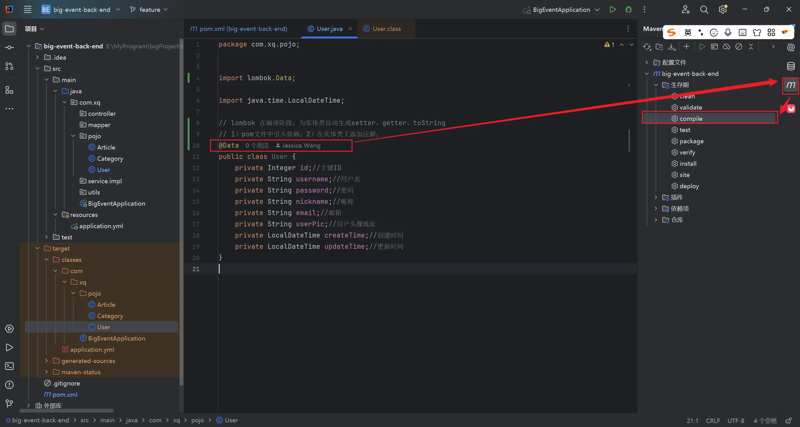

然后可以看到对应 target 中已有 getter 等。

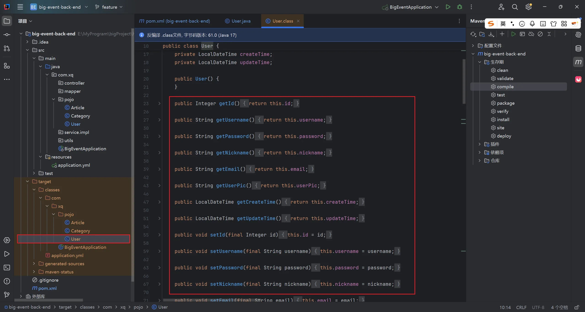

如法炮制，在其他实体类中同样添加 `@Data` 注解。

### 2.1.2 导入 Result 实体类

从资料中复制 Result 实体类到代码中，并加上注解。

```java title:'com/xq/pojo/Result.java'
package com.xq.pojo;  
  
import lombok.AllArgsConstructor;  
import lombok.NoArgsConstructor;  
  
//统一响应结果  
@NoArgsConstructor
@AllArgsConstructor  
@Data
public class Result<T> {  
    private Integer code;//业务状态码  0-成功  1-失败  
    private String message;//提示信息  
    private T data;//响应数据  
  
    //快速返回操作成功响应结果(带响应数据)  
    public static <E> Result<E> success(E data) {  
        return new Result<>(0, "操作成功", data);  
    }  
  
    //快速返回操作成功响应结果  
    public static Result success() {  
        return new Result(0, "操作成功", null);  
    }  
  
    public static Result error(String message) {  
        return new Result(1, message, null);  
    }  
}
```

### 2.1.3 实现注册逻辑

添加 `Md5` 加密密码工具类。

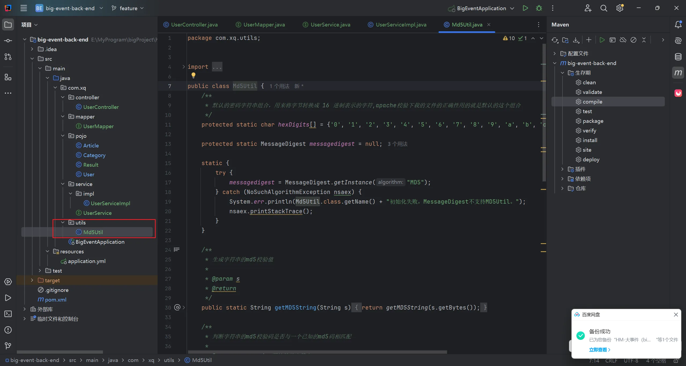

```java title:'com/xq/utils/Md5Util.java'
package com.xq.utils;

import java.security.MessageDigest;
import java.security.NoSuchAlgorithmException;

public class Md5Util {
    /**
     * 默认的密码字符串组合，用来将字节转换成 16 进制表示的字符,apache校验下载的文件的正确性用的就是默认的这个组合
     */
    protected static char hexDigits[] = {'0', '1', '2', '3', '4', '5', '6', '7', '8', '9', 'a', 'b', 'c', 'd', 'e', 'f'};

    protected static MessageDigest messagedigest = null;

    static {
        try {
            messagedigest = MessageDigest.getInstance("MD5");
        } catch (NoSuchAlgorithmException nsaex) {
            System.err.println(Md5Util.class.getName() + "初始化失败，MessageDigest不支持MD5Util。");
            nsaex.printStackTrace();
        }
    }

    /**
     * 生成字符串的md5校验值
     *
     * @param s
     * @return
     */
    public static String getMD5String(String s) {
        return getMD5String(s.getBytes());
    }

    /**
     * 判断字符串的md5校验码是否与一个已知的md5码相匹配
     *
     * @param password  要校验的字符串
     * @param md5PwdStr 已知的md5校验码
     * @return
     */
    public static boolean checkPassword(String password, String md5PwdStr) {
        String s = getMD5String(password);
        return s.equals(md5PwdStr);
    }


    public static String getMD5String(byte[] bytes) {
        messagedigest.update(bytes);
        return bufferToHex(messagedigest.digest());
    }

    private static String bufferToHex(byte bytes[]) {
        return bufferToHex(bytes, 0, bytes.length);
    }

    private static String bufferToHex(byte bytes[], int m, int n) {
        StringBuffer stringbuffer = new StringBuffer(2 * n);
        int k = m + n;
        for (int l = m; l < k; l++) {
            appendHexPair(bytes[l], stringbuffer);
        }
        return stringbuffer.toString();
    }

    private static void appendHexPair(byte bt, StringBuffer stringbuffer) {
        char c0 = hexDigits[(bt & 0xf0) >> 4];// 取字节中高 4 位的数字转换, >>>
        // 为逻辑右移，将符号位一起右移,此处未发现两种符号有何不同
        char c1 = hexDigits[bt & 0xf];// 取字节中低 4 位的数字转换
        stringbuffer.append(c0);
        stringbuffer.append(c1);
    }

}
```

依次新建功能所需文件。

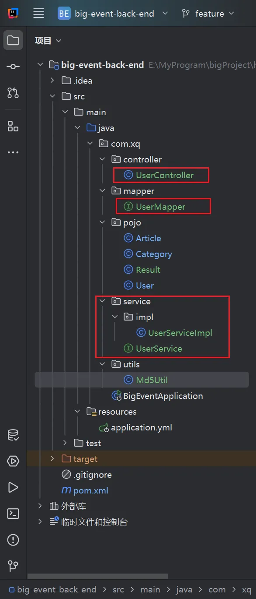

以下是代码。

```java title:'com/xq/controller/UserController.java'
package com.xq.controller;

import com.xq.pojo.Result;
import com.xq.pojo.User;
import com.xq.service.UserService;
import org.springframework.beans.factory.annotation.Autowired;
import org.springframework.web.bind.annotation.PostMapping;
import org.springframework.web.bind.annotation.RequestMapping;
import org.springframework.web.bind.annotation.RestController;

@RestController
@RequestMapping("/user")
public class UserController {

    @Autowired
    private UserService userService;

    @PostMapping("/register")
    public Result register(String username, String password) {
        // 查询用户（是否占用）
        User user = userService.findByUserName(username);
        if (user == null) {
            // 没有占用，进行注册
            userService.register(username, password);
            return Result.success();
        } else {
            // 占用
            return Result.error("用户名已被占用");
        }
    }
}
```

```java title:'com/xq/service/UserService.java'
package com.xq.service;  
  
import com.xq.pojo.User;  
  
public interface UserService {  
    // 根据用户名查询用户  
    User findByUserName(String username);  
  
    // 注册  
    void register(String username, String password);  
}
```

```java title:'com/xq/service/impl/UserServiceImpl.java'
package com.xq.service.impl;  
  
import com.xq.mapper.UserMapper;  
import com.xq.pojo.User;  
import com.xq.service.UserService;  
import com.xq.utils.Md5Util;  
import org.springframework.beans.factory.annotation.Autowired;  
import org.springframework.stereotype.Service;  
  
@Service  
public class UserServiceImpl implements UserService {  
  
    @Autowired  
    private UserMapper userMapper;  
  
    @Override  
    public User findByUserName(String username) {  
        User user = userMapper.findByUserName(username);  
        return user;  
    }  
  
    @Override  
    public void register(String username, String password) {  
        // 加密密码  
        String md5String = Md5Util.getMD5String(password);  
        // 注册  
        userMapper.add(username, md5String);  
    }  
}
```

参数 `create_time` 和 `update_time` 可以添加注解，使其在需要生成时自动添加。此处为手动添加。

```java title:'com/xq/mapper/UserMapper.java'
package com.xq.mapper;  
  
import com.xq.pojo.User;  
import org.apache.ibatis.annotations.Insert;  
import org.apache.ibatis.annotations.Mapper;  
import org.apache.ibatis.annotations.Select;  
  
@Mapper  
public interface UserMapper {  
    // 根据用户名查询用户  
    @Select("select * from user where username=#{username}")  
    User findByUserName(String username);  
  
    // 注册新用户  
    @Insert("insert into user(username, password, create_time, update_time)" +  
            " values(#{username}, #{password}, now(), now())")  
    void add(String username, String password);  
}
```

### 2.1.4 测试（后端自测）

老师选择的是 postman，因博主此前已下载过 Apifox，所以选择用 Apifox 进行测试。

这里不做详细说明。

### 2.1.5 使用 Spring Validation 对注册接口的参数进行合法性校验

Step 1）引入 Spring Validation 起步依赖

```xml title:'pom.xml'
<!--  Validation依赖  -->  
<dependency>  
  <groupId>org.springframework.boot</groupId>  
  <artifactId>spring-boot-starter-validation</artifactId>  
</dependency>
```

Step 2）在参数前面添加@Pattern 注解

Step 3）在 Controller 类上添加@Validated 注解

```java title:'com/xq/controller/UserController.java' hl:15,22
package com.xq.controller;  
  
import com.xq.pojo.Result;  
import com.xq.pojo.User;  
import com.xq.service.UserService;  
import jakarta.validation.constraints.Pattern;  
import org.springframework.beans.factory.annotation.Autowired;  
import org.springframework.validation.annotation.Validated;  
import org.springframework.web.bind.annotation.PostMapping;  
import org.springframework.web.bind.annotation.RequestMapping;  
import org.springframework.web.bind.annotation.RestController;  
  
@RestController  
@RequestMapping("/user")  
@Validated  
public class UserController {  
  
    @Autowired  
    private UserService userService;  
  
    @PostMapping("/register")  
    public Result register(@Pattern(regexp = "^\\S{5,16}$") String username, @Pattern(regexp = "^\\S{5,16}$") String password) {  
        // 查询用户（是否占用）  
        User user = userService.findByUserName(username);  
        if (user == null) {  
            // 没有占用，进行注册  
            userService.register(username, password);  
            return Result.success();  
        } else {  
            // 占用  
            return Result.error("用户名已被占用");  
        }  
    }  
}
```

### 2.1.6 参数校验失败异常处理

新建 exception/GlobalExceptionHandler.java 文件。（全局异常处理器）

```java title:'com/xq/exception/GlobalExceptionHandler.java' hl:4
package com.xq.exception;  
  
import com.xq.pojo.Result;  
import org.springframework.util.StringUtils;  
import org.springframework.web.bind.annotation.ExceptionHandler;  
import org.springframework.web.bind.annotation.RestControllerAdvice;  
  
@RestControllerAdvice  
public class GlobalExceptionHandler {  
  
    @ExceptionHandler(Exception.class)  
    public Result handleException(Exception e) {  
        e.printStackTrace();  
        return Result.error(StringUtils.hasLength(e.getMessage()) ? e.getMessage() : "操作失败");  
    }  
}
```

注意，`StringUtils` 引入的是 `org.springframework.util` 包中的。

## 2.2 登录

### 2.2.1 登录主逻辑

新增登录接口。

```java title:'com/xq/service/impl/UserServiceImpl.java'
@PostMapping("/login")  
public Result<String> login(@Pattern(regexp = "^\\S{5,16}$") String username, @Pattern(regexp = "^\\S{5,16}$") String password) {  
    // 根据用户名查询用户  
    User loginUser = userService.findByUserName(username);  
    // 判断该用户是否存在  
    if (loginUser == null) {  
        return Result.error("用户名错误！");  
    }  
    // 判断密码是否正确（loginUser对象中的password是密文）  
    if (Md5Util.getMD5String(password).equals(loginUser.getPassword())) {  
        // 登陆成功  
        return Result.success("jwt token令牌…");  
    }  
    return Result.error("密码错误！");  
}
```

### 2.2.2 JWT 令牌

简介。

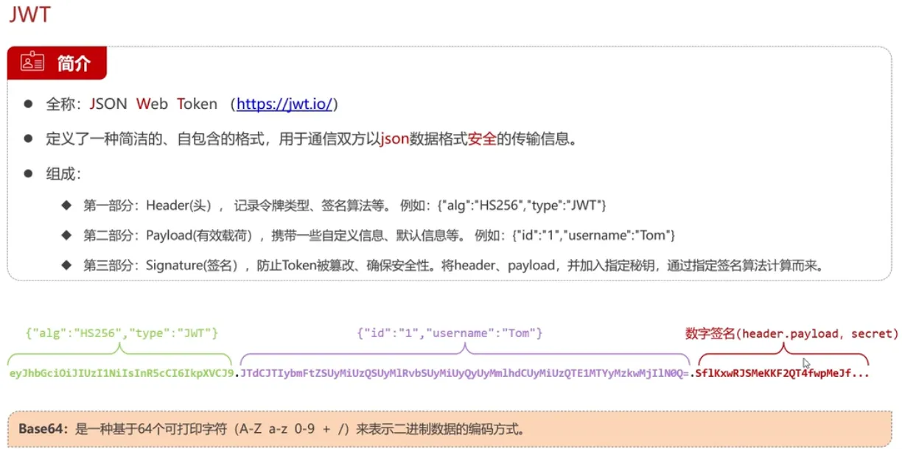

引入依赖，并刷新 Maven。

```xml title:'pom.xml'
<!--  JWT依赖  -->  
<dependency>  
  <groupId>com.auth0</groupId>  
  <artifactId>java-jwt</artifactId>  
  <version>4.4.0</version>  
</dependency>  
<!--  单元测试的坐标  -->  
<dependency>  
  <groupId>org.springframework.boot</groupId>  
  <artifactId>spring-boot-starter-test</artifactId>  
</dependency>
```

新增 `JwtTest` 文件，进行单元测试。若 JWT 无对应导入包，则“文件->清除缓存->勾选清除文件系统缓存和本地历史记录->失效并重启”。

```java title:'big-event-back-end/src/test/java/com/xq/JwtTest.java'
package com.xq;  
  
import com.auth0.jwt.JWT;  
import com.auth0.jwt.JWTVerifier;  
import com.auth0.jwt.algorithms.Algorithm;  
import com.auth0.jwt.interfaces.Claim;  
import com.auth0.jwt.interfaces.DecodedJWT;  
import org.junit.jupiter.api.Test;  
  
import java.util.Date;  
import java.util.HashMap;  
import java.util.Map;  
  
public class JwtTest {  
  
    @Test  
    public  void testGen() {  
        Map<String, Object> claims = new HashMap<>();  
        claims.put("id", 1);  
        claims.put("username", "test");  
        // 生成JWT的代码  
        String token = JWT.create()  
                .withClaim("user", claims) // 添加载荷  
                .withExpiresAt(new Date(System.currentTimeMillis() + 1000 * 60 * 60 * 24)) // 添加过期时间（24H）  
                .sign(Algorithm.HMAC256("itheima")); // 指定算法，配置秘钥  
  
        System.out.println(token);  
    }  
  
    @Test  
    public void testParse() {  
        // 定义字符串，模拟用户传递过来的token  
        String token = "eyJhbGciOiJIUzI1NiIsInR5cCI6IkpXVCJ9" +  
                ".eyJ1c2VyIjp7ImlkIjoxLCJ1c2VybmFtZSI6InRlc3QifSwiZXhwIjoxNzg4MTIyMTYyfQ" +  
                ".X2TfThPCLbYgUXzrhuvjqlAmWv9RxgMjfctgDe8kFfU";  
  
        JWTVerifier jwtVerifier = JWT.require(Algorithm.HMAC256("itheima")).build();  
  
        DecodedJWT decodedJWT = jwtVerifier.verify(token); // 验证token，生成一个解析后的JWT对象  
        Map<String, Claim> claims = decodedJWT.getClaims();  
        System.out.println(claims.get("user"));  
    }  
  
}
```

### 2.2.3 登录认证

引入资料中的 `JwtUtil.java` 到文件夹 `utils` 中。

修改登录逻辑。

```java title:'UserController.java（节选）'
@PostMapping("/login")  
public Result<String> login(@Pattern(regexp = "^\\S{5,16}$") String username, @Pattern(regexp = "^\\S{5,16}$") String password) {  
    // 根据用户名查询用户  
    User loginUser = userService.findByUserName(username);  
    // 判断该用户是否存在  
    if (loginUser == null) {  
        return Result.error("用户名错误！");  
    }  
    // 判断密码是否正确（loginUser对象中的password是密文）  
    if (Md5Util.getMD5String(password).equals(loginUser.getPassword())) {  
        // 登陆成功  
        Map<String, Object> claims = new HashMap<>();  
        claims.put("id", loginUser.getId());  
        claims.put("username", loginUser.getUsername());  
        String token = JwtUtil.genToken(claims);  
        return Result.success(token);  
    }  
    return Result.error("密码错误！");  
}
```

创建 `interceptors/LoginInterceptor.java` 拦截器文件。

```java title:'com/xq/interceptors/LoginInterceptor.java'
package com.xq.interceptors;  
  
import com.xq.utils.JwtUtil;  
import jakarta.servlet.http.HttpServletRequest;  
import jakarta.servlet.http.HttpServletResponse;  
import org.springframework.stereotype.Component;  
import org.springframework.web.servlet.HandlerInterceptor;  
  
import java.util.Map;  
  
@Component  
public class LoginInterceptor implements HandlerInterceptor {  
  
    public boolean preHandle(HttpServletRequest request, HttpServletResponse response, Object handler) throws Exception {  
        // 令牌验证  
        String token = request.getHeader("Authorization");  
        try {  
            Map<String, Object> claims = JwtUtil.parseToken(token);  
            return true; // 放行  
        } catch (Exception e) {  
            // http响应状态码为401  
            response.setStatus(401);  
            return false; // 拦截  
        }  
    }  
}
```

新建 `config/WebConfig.java` 文件

```java title:'com/xq/config/WebConfig.java'
package com.xq.config;  
  
import com.xq.interceptors.LoginInterceptor;  
import org.springframework.beans.factory.annotation.Autowired;  
import org.springframework.context.annotation.Configuration;  
import org.springframework.web.servlet.config.annotation.InterceptorRegistry;  
import org.springframework.web.servlet.config.annotation.WebMvcConfigurer;  
  
@Configuration  
public class WebConfig implements WebMvcConfigurer {  
  
    @Autowired  
    private LoginInterceptor loginInterceptor;  
  
    @Override  
    public void addInterceptors(InterceptorRegistry registry) {  
        // 登录和注册接口不拦截  
        registry.addInterceptor(loginInterceptor).excludePathPatterns("/user/login", "/user/register");  
    }  
}
```

## 2.3 获取用户详细信息

### 2.3.1 功能实现

添加接口。

```java title:'com/xq/controller/UserController.java'
@GetMapping("/userInfo")  
public Result<User> userInfo(@RequestHeader(name = "Authorization") String token) {  
    // 根据用户名查询用户  
    Map<String, Object> map = JwtUtil.parseToken(token);  
    String username = (String) map.get("username");  
  
    User user = userService.findByUserName(username);  
    return Result.success(user);  
}
```

注解 password，使返回参数中没有 password。（注意，`@JsonIgnore` 有两个对应包，请正确引入，否则功能不能正常实现。）

```java title:'com/xq/pojo/User.java' hl:3,14
package com.xq.pojo;  
  
import com.fasterxml.jackson.annotation.JsonIgnore;  
import lombok.Data;  
  
import java.time.LocalDateTime;  
  
// lombok 在编译阶段，为实体类自动生成setter、getter、toString  
// 1）pom文件中引入依赖；2）在实体类上添加注解；  
@Data  
public class User {  
    private Integer id;//主键ID  
    private String username;//用户名  
    @JsonIgnore // 让 SpringMVC 把当前对象转换成 json 字符串的时候，忽略 password，最终的 json 字符串中就没有 password 这个属性了  
    private String password;//密码  
    private String nickname;//昵称  
    private String email;//邮箱  
    private String userPic;//用户头像地址  
    private LocalDateTime createTime;//创建时间  
    private LocalDateTime updateTime;//更新时间  
}
```

开启驼峰命名和下划线命名的自动转换。

```yml title:'application.yml'
mybatis:  
  configuration:  
    map-underscore-to-camel-case: true # 开启驼峰命名和下划线命名的自动转换
```

### 2.3.2 `ThreadLocal` 优化

`ThreadLocal` 提供线程局部变量。以下代码用于测试 `ThreadLocal` 的作用。

```java title:'com/xq/ThreadLocalTest.java' group:ThreadLocalTest
package com.xq;  
  
import org.junit.jupiter.api.Test;  
  
public class ThreadLocalTest {  
  
    @Test  
    public void testThreadLocalSetAndGet() {  
        // 提供一个 ThreadLocal 对象  
        ThreadLocal tl = new ThreadLocal();  
        // 开启两个线程  
        new Thread(() -> {  
            tl.set("Yuki");  
            System.out.println(Thread.currentThread().getName() + "：" + tl.get());  
            System.out.println(Thread.currentThread().getName() + "：" + tl.get());  
            System.out.println(Thread.currentThread().getName() + "：" + tl.get());  
        }, "绿色").start();  
        new Thread(() -> {  
            tl.set("Momo");  
            System.out.println(Thread.currentThread().getName() + "：" + tl.get());  
            System.out.println(Thread.currentThread().getName() + "：" + tl.get());  
            System.out.println(Thread.currentThread().getName() + "：" + tl.get());  
        }, "粉色").start();  
    }  
}
```
```text title:'输出' group:ThreadLocalTest
绿色：Yuki
粉色：Momo
绿色：Yuki
粉色：Momo
粉色：Momo
绿色：Yuki
```

从资料中 copy `ThreadLocalUtil` 工具类放入项目的工具类文件夹中。

在登录拦截器中添加代码。

```java title:'com/xq/interceptors/LoginInterceptor.java' hl:20-21,30-34
package com.xq.interceptors;  
  
import com.xq.utils.JwtUtil;  
import com.xq.utils.ThreadLocalUtil;  
import jakarta.servlet.http.HttpServletRequest;  
import jakarta.servlet.http.HttpServletResponse;  
import org.springframework.stereotype.Component;  
import org.springframework.web.servlet.HandlerInterceptor;  
  
import java.util.Map;  
  
@Component  
public class LoginInterceptor implements HandlerInterceptor {  
  
    public boolean preHandle(HttpServletRequest request, HttpServletResponse response, Object handler) throws Exception {  
        // 令牌验证  
        String token = request.getHeader("Authorization");  
        try {  
            Map<String, Object> claims = JwtUtil.parseToken(token);  
            // 把业务数据存储到 ThreadLocal 中  
            ThreadLocalUtil.set(claims);  
            return true; // 放行  
        } catch (Exception e) {  
            // http响应状态码为401  
            response.setStatus(401);  
            return false; // 拦截  
        }  
    }  
  
    @Override  
    public void afterCompletion(HttpServletRequest request, HttpServletResponse response, Object handler, Exception ex) throws Exception {  
        // 清空 ThreadLocal 中的数据，防止内存泄漏  
        ThreadLocalUtil.remove();  
    }  
}
```

修改接口中的逻辑。

```java title:'com/xq/controller/UserController.java' hl:4
@GetMapping("/userInfo")  
public Result<User> userInfo(@RequestHeader(name = "Authorization") String token) {  
    // 根据用户名查询用户  
    Map<String, Object> map = ThreadLocalUtil.get();  
    String username = (String) map.get("username");  
  
    User user = userService.findByUserName(username);  
    return Result.success(user);  
}
```

## 2.4 更新用户基本信息

### 2.4.1 功能实现

```java title:'UserController.java'
@PutMapping("/update")  
public Result update(@RequestBody User user) {  
    userService.update(user);  
    return Result.success();  
}
```

```java title:'UserService.java'
// 更新  
void update(User user);
```

```java title:'UserServiceImpl.java'
@Override  
public void update(User user) {  
    user.setUpdateTime(LocalDateTime.now());  
    userMapper.update(user);  
}
```

```java title:'UserMapper.java'
// 更新  
@Update("update user set nickname=#{nickname}, email=#{email}, update_time=#{updateTime} where id=#{id}")  
void update(User user);
```

添加对应代码后，启动程序，使用 Postman / Apifox 进行测试。发送请求后，若数据库数据更新，则说明功能已实现。

### 2.4.2 参数校验

| 注解       | 作用               |
| -------- | ---------------- |
| NotNull  | 值不能为 null         |
| NotEmpty | 值不能为 null,并且内容不为空 |
| Email    | 满足邮箱格式           |

在实体类中的参数前添加注解。

```java title:'User.java' hl:19,36-37,43-44
package com.xq.pojo;

import com.fasterxml.jackson.annotation.JsonIgnore;
import jakarta.validation.constraints.Email;
import jakarta.validation.constraints.NotEmpty;
import jakarta.validation.constraints.NotNull;
import jakarta.validation.constraints.Pattern;
import lombok.Data;

import java.time.LocalDateTime;

// lombok 在编译阶段，为实体类自动生成setter、getter、toString
// 1）pom文件中引入依赖；2）在实体类上添加注解；
@Data
public class User {
    /*
    * 主键ID
    * */
    @NotNull
    private Integer id;

    /*
    * 用户名
    * */
    private String username;

    /*
    * 密码
    * */
    @JsonIgnore // 让 SpringMVC 把当前对象转换成 json 字符串的时候，忽略 password，最终的 json 字符串中就没有 password 这个属性了
    private String password;

    /*
    * 昵称
    * */
    @NotEmpty
    @Pattern(regexp = "^\\S{1,10}$")
    private String nickname;

    /*
    * 邮箱
    * */
    @NotEmpty
    @Email
    private String email;

    /*
    * 用户头像地址
    * */
    private String userPic;

    /*
    * 创建时间
    * */
    private LocalDateTime createTime;

    /*
    * 更新时间
    * */
    private LocalDateTime updateTime;
}
```

在接口的参数前添加 `@Validated` 注解。

```java title:'UserController.java' hl:2
@PutMapping("/update")  
public Result update(@RequestBody @Validated User user) {  
    userService.update(user);  
    return Result.success();  
}
```

## 2.5 更新用户头像

新增接口，并且在参数 `avatarUrl` 前添加 `@URL` 注解，确保传入的参数是一个 URL。

```java title:'UserController.java'
@PatchMapping("updateAvatar")  
public Result updateAvatar(@RequestParam @URL String avatarUrl) {  
    userService.updateAvatar(avatarUrl);  
    return Result.success();  
}
```

```java title:'UserService.java'
// 更新头像  
void updateAvatar(String avatarUrl);
```

```java title:'UserServiceImpl.java'
@Override  
public void updateAvatar(String avatarUrl) {  
    Map<String, Object> map = ThreadLocalUtil.get();  
    Integer id = (Integer) map.get("id");  
    userMapper.updateAvatar(avatarUrl, id);  
}
```

```java title:'UserMapper.java'
// 更新头像  
@Update("update user set user_pic=#{avatarUrl}, update_time=now() where id=#{id}")  
void updateAvatar(String avatarUrl, Integer id);
```

随后启动程序，并进行测试。

## 2.6 更新用户密码

```java title:'UserController.java'
@PatchMapping("/updatePwd")  
public Result updatePwd(@RequestBody Map<String, String> params) {  
    // 1.校验参数  
    String oldPwd = params.get("old_pwd");  
    String newPwd = params.get("new_pwd");  
    String rePwd = params.get("re_pwd");  
  
    // 1.1 检验是否为空  
    if (!StringUtils.hasLength(oldPwd) || !StringUtils.hasLength(newPwd) || !StringUtils.hasLength(rePwd)) {  
        return Result.error("缺少必要的参数！");  
    }  
  
    // 1.2 原密码是否正确  
    // 调用 userService 根据用户名拿到原密码，再和 oldPwd 比对  
    Map<String, Object> map = ThreadLocalUtil.get();  
    String username = (String) map.get("username");  
    User loginUser = userService.findByUserName(username);  
    if (!loginUser.getPassword().equals(Md5Util.getMD5String(oldPwd))) {  
        return Result.error("原密码填写不正确！");  
    }  
  
    // 1.3 newPwd 与 rePwd 是否一致  
    if (!rePwd.equals(newPwd)) {  
        return Result.error("两次填写的新密码不一样！");  
    }  
  
    // 2.调用 service 完成密码更新  
    userService.updatePwd(newPwd);  
  
    return Result.success();  
}
```

```java title:'UserService.java'
// 更新密码  
void updatePwd(String newPwd);
```

```java title:'UserServiceImpl.java'
@Override  
public void updatePwd(String newPwd) {  
    Map<String, Object> map = ThreadLocalUtil.get();  
    Integer id = (Integer) map.get("id");  
    userMapper.updatePwd(Md5Util.getMD5String(newPwd), id);  
}
```

```java title:'UserMapper.java'
// 更新密码  
@Update("update user set password=#{md5String}, update_time=now() where id=#{id}")  
void updatePwd(String md5String, Integer id);
```

# 3.文章分类

```text title:'项目目录结构' hl:5,12,16,20,23
com.xq
	config
		WebConfig.java
	controller
		CategoryController.java
		UserController.java
	exception
		GlobalExceptionHandler.java
	interceptors
		LoginInterceptor.java
	mapper
		CategoryMapper.java
		UserMapper.java
	pojo
		Artivle.java
		Category.java
		Result.java
		User.java
	service
		CategoryService.java
		UserService.java
		impl
			CategoryServiceImpl.java
			UserServiceImpl.java
	utils
		JwtUtil.java
		Md5Util.java
		ThreadLocalUtil.java
		UserContextUtil.java
```

## 3.1 新增文章分类

配合接口需求，添加非空注解。

```java title:'Category.java' hl:18,24
package com.xq.pojo;

import jakarta.validation.constraints.NotEmpty;
import lombok.Data;

import java.time.LocalDateTime;

@Data
public class Category {
    /*
    * 主键ID
    * */
    private Integer id;

    /*
    * 分类名称
    * */
    @NotEmpty
    private String categoryName;

    /*
    * 分类别名
    * */
    @NotEmpty
    private String categoryAlias;

    /*
    * 创建人ID
    * */
    private Integer createUser;

    /*
    * 创建时间
    * */
    private LocalDateTime createTime;

    /*
    * 更新时间
    * */
    private LocalDateTime updateTime;
}
```

实现功能。

```java title:'CategoryController.java'
package com.xq.controller;  
  
import com.xq.pojo.Category;  
import com.xq.pojo.Result;  
import com.xq.service.CategoryService;  
import org.springframework.beans.factory.annotation.Autowired;  
import org.springframework.validation.annotation.Validated;  
import org.springframework.web.bind.annotation.PostMapping;  
import org.springframework.web.bind.annotation.RequestBody;  
import org.springframework.web.bind.annotation.RequestMapping;  
import org.springframework.web.bind.annotation.RestController;  
  
@RestController  
@RequestMapping("/category")  
public class CategoryController {  
  
    @Autowired  
    private CategoryService categoryService;  
  
    @PostMapping  
    public Result add(@RequestBody @Validated Category category) {  
        categoryService.add(category);  
        return Result.success();  
    }  
}
```

```java title:'CategoryService.java'
package com.xq.service;  
  
import com.xq.pojo.Category;  
  
public interface CategoryService {  
    // 新增分类  
    void add(Category category);  
}
```

```java title:'CategoryServiceImpl.java'
package com.xq.service.impl;  
  
import com.xq.mapper.CategoryMapper;  
import com.xq.pojo.Category;  
import com.xq.service.CategoryService;  
import com.xq.utils.ThreadLocalUtil;  
import org.springframework.beans.factory.annotation.Autowired;  
import org.springframework.stereotype.Service;  
  
import java.time.LocalDateTime;  
import java.util.Map;  
  
@Service  
public class CategoryServiceImpl implements CategoryService {  
  
    @Autowired  
    private CategoryMapper categoryMapper;  
  
    @Override  
    public void add(Category category) {  
        // 补充属性值  
        category.setCreateTime(LocalDateTime.now());  
        category.setUpdateTime(LocalDateTime.now());  
  
        Map<String, Object> map = ThreadLocalUtil.get();  
        Integer userId = (Integer) map.get("id");  
        category.setCreateUser(userId);  
  
        categoryMapper.add(category);  
    }  
}
```

```java title:'CategoryMapper.java'
package com.xq.mapper;  
  
import com.xq.pojo.Category;  
import org.apache.ibatis.annotations.Insert;  
import org.apache.ibatis.annotations.Mapper;  
  
@Mapper  
public interface CategoryMapper {  
    // 新增分类  
    @Insert("insert into category(category_name, category_alias, create_user, create_time, update_time) " +  
            "values(#{categoryName}, #{categoryAlias}, #{createUser}, #{createTime}, #{updateTime})")  
    void add(Category category);  
}
```

运行并测试。

## 3.2 文章分类列表

配合接口需求，添加时间戳转固定格式的注解。

```java title:'Category.java' hl:36,42
package com.xq.pojo;

import com.fasterxml.jackson.annotation.JsonFormat;
import jakarta.validation.constraints.NotEmpty;
import lombok.Data;

import java.time.LocalDateTime;

@Data
public class Category {
    /*
    * 主键ID
    * */
    private Integer id;

    /*
    * 分类名称
    * */
    @NotEmpty
    private String categoryName;

    /*
    * 分类别名
    * */
    @NotEmpty
    private String categoryAlias;

    /*
    * 创建人ID
    * */
    private Integer createUser;

    /*
    * 创建时间
    * */
    @JsonFormat(pattern = "yyyy-MM-dd HH:mm:ss")
    private LocalDateTime createTime;

    /*
    * 更新时间
    * */
    @JsonFormat(pattern = "yyyy-MM-dd HH:mm:ss")
    private LocalDateTime updateTime;
}
```

实现功能。

```java title:'CategoryController.java'
@GetMapping  
public Result<List<Category>> list() {  
    List<Category> categories = categoryService.list();  
    return Result.success(categories);  
}
```

```java title:'CategoryService.java'
// 列表查询  
List<Category> list();
```

```java title:'CategoryServiceImpl.java'
@Override  
public List<Category> list() {  
    Map<String, Object> map = ThreadLocalUtil.get();  
    Integer userId = (Integer) map.get("id");  
    return categoryMapper.list(userId);  
}
```

```java title:'CategoryMapper.java'
// 列表查询  
@Select("select * from category where create_user = #{userId}")  
List<Category> list(Integer userId);
```

运行并测试。

## 3.3 获取文章分类详情

实现功能。

```java title:'CategoryController.java'
@GetMapping("/detail")  
public Result<Category> detail(Integer id) {  
    Category category = categoryService.findById(id);  
    return Result.success(category);  
}
```

```java title:'CategoryService.java'
// 根据 id 查询分类信息  
Category findById(Integer id);
```

```java title:'CategoryServiceImpl.java'
@Override  
public Category findById(Integer id) {  
    Category category = categoryMapper.findById(id);  
    return category;  
}
```

```java title:'CategoryMapper.java'
// 根据 id 查询分类信息  
@Select("select * from category where id = #{id}")  
Category findById(Integer id);
```

运行并测试。

## 3.4 更新文章分类

### 3.4.1 功能实现

新增 id 非空注解。

```java title:'Category.java' hl:4
/*  
* 主键ID  
* */  
@NotNull
private Integer id;
```

实现功能。

```java title:'CategoryController.java'
@PutMapping  
public Result update(@RequestBody @Validated Category category) {  
    categoryService.update(category);  
    return Result.success();  
}
```

```java title:'CategoryService.java'
// 更新分类  
void update(Category category);
```

```java title:'CategoryServiceImpl.java'
@Override  
public void update(Category category) {  
    category.setUpdateTime(LocalDateTime.now());  
    categoryMapper.update(category);  
}
```

```java title:'CategoryMapper.java'
// 更新分类  
@Update("update category set category_name=#{categoryName}, category_alias=#{categoryAlias}, " +  
        "update_time=#{updateTime} where id=#{id}")  
void update(Category category);
```

运行并测试。

### 3.4.2 分组校验

把校验项进行归类分组，在完成不同的功能的时候，校验指定组中的校验项。

1. 定义分组；
2. 定义校验项时指定归属的分组；
3. 校验时指定要校验的分组；

P.s. 定义校验项时如果没有指定分组，则属于 Default 分组，分组可以继承

```java title:'Category.java' hl:16,22,28,48-57
package com.xq.pojo;

import com.fasterxml.jackson.annotation.JsonFormat;
import jakarta.validation.constraints.NotEmpty;
import jakarta.validation.constraints.NotNull;
import jakarta.validation.groups.Default;
import lombok.Data;

import java.time.LocalDateTime;

@Data
public class Category {
    /*
    * 主键ID
    * */
    @NotNull(groups = Update.class)
    private Integer id;

    /*
    * 分类名称
    * */
    @NotEmpty
    private String categoryName;

    /*
    * 分类别名
    * */
    @NotEmpty
    private String categoryAlias;

    /*
    * 创建人ID
    * */
    private Integer createUser;

    /*
    * 创建时间
    * */
    @JsonFormat(pattern = "yyyy-MM-dd HH:mm:ss")
    private LocalDateTime createTime;

    /*
    * 更新时间
    * */
    @JsonFormat(pattern = "yyyy-MM-dd HH:mm:ss")
    private LocalDateTime updateTime;

    // 如果说某个校验项没有指定分组，则默认属于 Default 分组
    // 分组之间可以继承，A extends B，则 A 中拥有 B 中所有的校验项

    public interface Add extends Default {

    }

    public interface Update extends Default {

    }
}
```

在接口参数注解前添加分组校验。

```java title:'CategoryController.java' hl:20,38
package com.xq.controller;  
  
import com.xq.pojo.Category;  
import com.xq.pojo.Result;  
import com.xq.service.CategoryService;  
import org.springframework.beans.factory.annotation.Autowired;  
import org.springframework.validation.annotation.Validated;  
import org.springframework.web.bind.annotation.*;  
  
import java.util.List;  
  
@RestController  
@RequestMapping("/category")  
public class CategoryController {  
  
    @Autowired  
    private CategoryService categoryService;  
  
    @PostMapping  
    public Result add(@RequestBody @Validated(Category.Add.class) Category category) {  
        categoryService.add(category);  
        return Result.success();  
    }  
  
    @GetMapping  
    public Result<List<Category>> list() {  
        List<Category> categories = categoryService.list();  
        return Result.success(categories);  
    }  
  
    @GetMapping("/detail")  
    public Result<Category> detail(Integer id) {  
        Category category = categoryService.findById(id);  
        return Result.success(category);  
    }  
  
    @PutMapping  
    public Result update(@RequestBody @Validated(Category.Update.class) Category category) {  
        categoryService.update(category);  
        return Result.success();  
    }  
}
```

## 3.5 删除文章分类【课后练习】

抽取了获取当前用户 id 的逻辑，封装到 `com/xq/utils/UserContextUtil.java` 文件中。

```java title:'UserContextUtil.java'
package com.xq.utils;  
  
import java.util.Map;  
  
public class UserContextUtil {  
  
    /**  
     * 获取当前登录用户的 ID  
     * @return 用户ID  
     * @throws RuntimeException 如果上下文不存在或用户未登录  
     */  
    public static Integer getCurrentUserId() {  
        Map<String, Object> map = ThreadLocalUtil.get();  
        if (map == null) {  
            throw new RuntimeException("未获取到用户上下文，请检查登录拦截器");  
        }  
        Object userId = map.get("id");  
        if (userId == null) {  
            throw new RuntimeException("用户未登录或登录信息已失效");  
        }  
        return (Integer) userId;  
    }  
}
```

实现功能，同时添加 SQL 语句中对当前用户的验证，确保操作分类是属于当前用户，否则无法进行操作。

```java title:'CategoryController.java'
@DeleteMapping  
public Result delete(Integer id) {  
    categoryService.delete(id);  
    return Result.success();  
}
```

```java title:'CategoryService.java'
// 删除分类  
void delete(Integer id);
```

```java title:'CategoryServiceImpl.java'
@Override  
public void delete(Integer id) {  
    Integer userId = UserContextUtil.getCurrentUserId();  
    int rows = categoryMapper.delete(id, userId);  
    if (rows == 0) {  
        throw new RuntimeException("分类不存在或无权删除");  
    }  
}
```

```java title:'CategoryMapper.java'
// 删除分类  
@Delete("delete from category where id = #{id} and create_user = #{userId}")  
int delete(Integer id, Integer userId);
```

# 4.文章管理

```text title:'项目目录结构' hl:4,8,16,22,26,30,39,43
java
	com.xq
		anno
			State.java
		config
			WebConfig.java
		controller
			ArticleController.java
			CategoryController.java
			UserController.java
		exception
			GlobalExceptionHandler.java
		interceptors
			LoginInterceptor.java
		mapper
			ArticleMapper.java
			CategoryMapper.java
			UserMapper.java
		pojo
			Artivle.java
			Category.java
			PageBean.java
			Result.java
			User.java
		service
			ArticleService.java
			CategoryService.java
			UserService.java
			impl
				ArticleServiceImpl.java
				CategoryServiceImpl.java
				UserServiceImpl.java
		utils
			JwtUtil.java
			Md5Util.java
			ThreadLocalUtil.java
			UserContextUtil.java
		validation
			StateValidation.java
resource
	com.xq
		mapper
			ArticleMapper.xml
```

## 4.1 新增文章

### 4.1.1 功能实现

实现功能。

```java title:'ArticleController.java'
package com.xq.controller;  
  
import com.xq.pojo.Article;  
import com.xq.pojo.Result;  
import com.xq.service.ArticleService;  
import org.springframework.beans.factory.annotation.Autowired;  
import org.springframework.validation.annotation.Validated;  
import org.springframework.web.bind.annotation.PostMapping;  
import org.springframework.web.bind.annotation.RequestBody;  
import org.springframework.web.bind.annotation.RequestMapping;  
import org.springframework.web.bind.annotation.RestController;  
  
@RestController  
@RequestMapping("/article")  
@Validated  
public class ArticleController {  
  
    @Autowired  
    private ArticleService articleService;  
  
    @PostMapping  
    public Result add(@RequestBody Article article) {  
        articleService.add(article);  
        return Result.success();  
    }  
}
```

```java title:'ArticleService.java'
package com.xq.service;  
  
import com.xq.pojo.Article;  
  
public interface ArticleService {  
    // 新增文章  
    void add(Article article);  
}
```

```java title:'ArticleServiceImpl.java'
package com.xq.service.impl;  
  
import com.xq.mapper.ArticleMapper;  
import com.xq.pojo.Article;  
import com.xq.service.ArticleService;  
import com.xq.utils.UserContextUtil;  
import org.springframework.beans.factory.annotation.Autowired;  
import org.springframework.stereotype.Service;  
  
import java.time.LocalDateTime;  
  
@Service  
public class ArticleServiceImpl implements ArticleService {  
  
    @Autowired  
    private ArticleMapper articleMapper;  
  
    @Override  
    public void add(Article article) {  
        Integer userId = UserContextUtil.getCurrentUserId();  
        article.setCreateUser(userId);  
        article.setCreateTime(LocalDateTime.now());  
        article.setUpdateTime(LocalDateTime.now());  
        articleMapper.add(article);  
    }  
}
```

```java title:'ArticleMapper.java'
package com.xq.mapper;  
  
import com.xq.pojo.Article;  
import org.apache.ibatis.annotations.Insert;  
import org.apache.ibatis.annotations.Mapper;  
  
@Mapper  
public interface ArticleMapper {  
    // 新增文章  
    @Insert("insert into article(title, content, cover_img, state, category_id, create_user, create_time, update_time) " +  
            "values(#{title}, #{content}, #{coverImg}, #{state}, #{categoryId}, #{createUser}, #{createTime}, #{updateTime})")  
    void add(Article article);  
}
```

运行并测试。

### 4.1.2 自定义参数校验

已有的注解不能满足所有的校验需求，特殊的情况需要自定义校验（自定义校验注解）

1. 自定义注解 State
2. 自定义校验数据的类 StateValidation，实现 ConstraintValidator 接口
3. 在需要校验的地方使用自定义注解

新建 `com/xq/anno/State.java` 文件，参考官方注解实现代码。

```java title:'State.java'
package com.xq.anno;  
  
import com.xq.validation.StateValidation;  
import jakarta.validation.Constraint;  
import jakarta.validation.Payload;  
  
import java.lang.annotation.*;  
  
@Documented // 元注解  
@Target({ ElementType.FIELD }) // 元注解  
@Retention(RetentionPolicy.RUNTIME) // 元注解  
@Constraint(  
        validatedBy = { StateValidation.class } // 指定提供校验规则的类  
)  
public @interface State {  
    // 提供校验失败后的提示信息  
    String message() default "state 参数的值只能是已发布或者草稿";  
    // 制定分组  
    Class<?>[] groups() default {};  
    // 负载，获取到 State 注解的附加信息  
    Class<? extends Payload>[] payload() default {};  
}
```

新建 `com/xq/validation/StateValidation.java` 文件。

```java title:'StateValidation.java'
package com.xq.validation;  
  
import com.xq.anno.State;  
import jakarta.validation.ConstraintValidator;  
import jakarta.validation.ConstraintValidatorContext;  
  
// ConstraintValidator<给哪个注解提供校验规则, 校验的数据类型>  
public class StateValidation implements ConstraintValidator<State, String> {  
    /**  
     *     
     * @param string 将来要校验的数据  
     * @param constraintValidatorContext  
     * @return 如果返回 false，则校验不通过；如果返回 true，则校验通过；  
     */  
    @Override  
    public boolean isValid(String string, ConstraintValidatorContext constraintValidatorContext) {  
        // 提供校验规则  
        if (string == null) {  
            return false;  
        }  
        return string.equals("已发布") || string.equals("草稿");  
    }  
}
```

在实体类中添加官方注解和自定义注解。

```java title:'Article.java' hl:23-24,30,36-37,43,49
package com.xq.pojo;

import com.fasterxml.jackson.annotation.JsonFormat;
import com.xq.anno.State;
import jakarta.validation.constraints.NotEmpty;
import jakarta.validation.constraints.NotNull;
import jakarta.validation.constraints.Pattern;
import lombok.Data;
import org.hibernate.validator.constraints.URL;

import java.time.LocalDateTime;

@Data
public class Article {
    /*
    * 主键ID
    * */
    private Integer id;

    /*
    * 文章标题
    * */
    @NotEmpty
    @Pattern(regexp = "^\\S{1,10}$")
    private String title;

    /*
    * 文章内容
    * */
    @NotEmpty
    private String content;

    /*
    * 封面图像
    * */
    @NotEmpty
    @URL
    private String coverImg;

    /*
    * 发布状态 已发布|草稿
    * */
    @State
    private String state;

    /*
    * 文章分类id
    * */
    @NotNull
    private Integer categoryId;

    /*
    * 创建人ID
    * */
    private Integer createUser;

    /*
    * 创建时间
    * */
    @JsonFormat(pattern = "yyyy-MM-dd HH:mm:ss")
    private LocalDateTime createTime;

    /*
    * 更新时间
    * */
    @JsonFormat(pattern = "yyyy-MM-dd HH:mm:ss")
    private LocalDateTime updateTime;
}
```

## 4.2 文章列表（条件分页）

引入 pageHelper 的坐标。

```xml title:'pom.xml'
<!--  pageHelper 的坐标  -->  
<dependency>  
  <groupId>com.github.pagehelper</groupId>  
  <artifactId>pagehelper-spring-boot-starter</artifactId>  
  <version>1.4.6</version>  
</dependency>
```

实现功能。

```java title:'ArticleController.java' hl:5-6
@GetMapping
public Result<PageBean<Article>> list(
	Integer pageNum,
    Integer pageSize,
	@RequestParam(required = false) Integer categoryId,
	@RequestParam(required = false) String state
) {
    PageBean<Article> pb = articleService.list(pageNum, pageSize, categoryId, state);
    return Result.success(pb);
}
```

```java title:'ArticleService.java'
// 条件分页列表查询  
PageBean<Article> list(Integer pageNum, Integer pageSize, Integer categoryId, String state);
```

注意 List 的引入包是正确的。（有多个）

```java title:'ArticleServiceImpl.java'
@Override  
public PageBean<Article> list(Integer pageNum, Integer pageSize, Integer categoryId, String state) {  
    // 1.创建 PageBean 对象  
    PageBean<Article> pageBean = new PageBean<>();  
  
    // 2.开启分页查询  
    PageHelper.startPage(pageNum, pageSize);  
  
    // 3.调用 mapper 完成查询  
    Integer userId = UserContextUtil.getCurrentUserId();  
    List<Article> as = articleMapper.list(userId, categoryId, state);  
    // Page 中提供了方法，可以获取 PageHelper 分页查询后，得到的总记录条数和当前页数据  
    Page<Article> p = (Page<Article>) as;  
  
    // 4.把数据填充到 PageBean 对象中  
    pageBean.setTotal(p.getTotal());  
    pageBean.setItems(p.getResult());  
  
    return pageBean;  
}
```

```java title:'ArticleMapper.java'
// 条件分页列表查询  
List<Article> list(Integer userId, Integer categoryId, String state);
```

新建 mapper 的配置文件。

P.s. 该映射配置文件需要与接口处在同一目录下，且文件名必须相同。

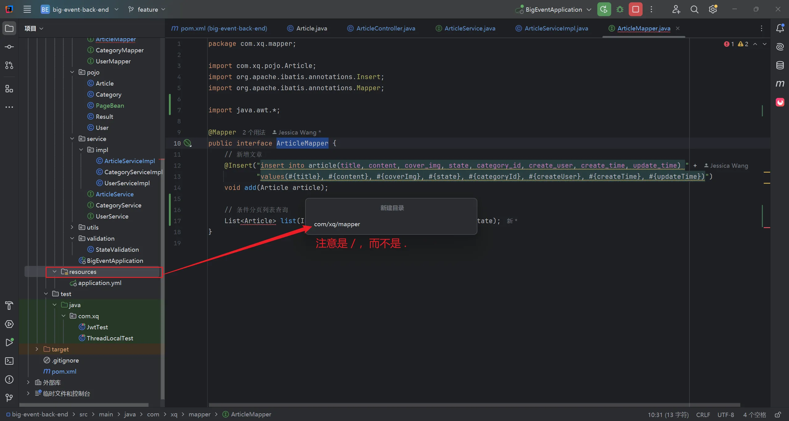

复制 `ArticleMapper.xml` 文件到该目录下，并实现 SQL 逻辑。

```xml title:'ArticleMapper.xml' hl:5,7
<?xml version="1.0" encoding="UTF-8" ?>
<!DOCTYPE mapper
        PUBLIC "-//mybatis.org//DTD Mapper 3.0//EN"
        "http://mybatis.org/dtd/mybatis-3-mapper.dtd">
<mapper namespace="com.xq.mapper.ArticleMapper">
  <!-- 动态 SQL -->
  <select id="list" resultType="com.xq.pojo.Article">
    select * from article
    <where>
      <if test="categoryId != null">
        category_id = #{categoryId}
      </if>

      <if test="state != null">
        and state = #{state}
      </if>

      and create_user = #{userId}
    </where>
  </select>
</mapper>
```

运行并测试。

## 4.3 获取文章详情

实现功能。

```java title:'ArticleController.java'
@GetMapping("/detail")  
public Result<Article> detail(@RequestParam Integer id) {  
    Article article = articleService.findById(id);  
    return Result.success(article);  
}
```

```java title:'ArticleService.java'
// 根据 id 查询文章信息  
Article findById(Integer id);
```

```java title:'ArticleServiceImpl.java'
@Override  
public Article findById(Integer id) {  
    Integer userId = UserContextUtil.getCurrentUserId();  
    Article article = articleMapper.findById(id, userId);  
    if (article == null) {  
        throw new RuntimeException("文章不存在或无权查看");  
    }  
    return article;  
}
```

```java title:'ArticleMapper.java'
// 根据 id 查询文章信息  
@Select("select * from article where id = #{id} and create_user = #{userId};")  
Article findById(Integer id, Integer userId);
```

运行并测试。

## 4.4 更新文章

实现功能。

```java title:'ArticleController.java'
@PutMapping  
public Result update(@RequestBody @Validated Article article) {  
    articleService.update(article);  
    return Result.success();  
}
```

```java title:'ArticleService.java'
// 更新文章  
void update(Article article);
```

```java title:'ArticleServiceImpl.java'
@Override  
public void update(Article article) {  
    Integer userId = UserContextUtil.getCurrentUserId();  
    article.setCreateUser(userId);  
    article.setUpdateTime(LocalDateTime.now());  
    int rows = articleMapper.update(article);  
    if (rows == 0) {  
        throw new RuntimeException("文章不存在或无权修改");  
    }  
}
```

```java title:'ArticleMapper.java'
// 更新文章  
@Update("update article set title = #{title}, content = #{content}, cover_img = #{coverImg}, state = #{state}, " +  
        "category_id = #{categoryId}, update_time = #{updateTime} where id = #{id} and create_user = #{createUser}")  
int update(Article article);
```

运行并测试。

## 4.5 删除文章

实现功能。

```java title:'ArticleController.java'
@DeleteMapping  
public Result delete(@RequestParam Integer id) {  
    articleService.delete(id);  
    return Result.success();  
}
```

```java title:'ArticleService.java'
// 删除文章  
void delete(Integer id);
```

```java title:'ArticleServiceImpl.java'
@Override  
public void delete(Integer id) {  
    Integer userId = UserContextUtil.getCurrentUserId();  
    int rows = articleMapper.delete(id, userId);  
    if (rows == 0) {  
        throw new RuntimeException("文章不存在或无权删除");  
    }  
}
```

```java title:'ArticleMapper.java'
// 删除文章  
@Delete("delete from article where id = #{id} and create_user = #{userId}")  
int delete(Integer id, Integer userId);
```

运行并测试。

# 5.文件上传

```text title:'项目目录结构' hl:10,35
java
	com.xq
		anno
			State.java
		config
			WebConfig.java
		controller
			ArticleController.java
			CategoryController.java
			FileUploadController.java
			UserController.java
		exception
			GlobalExceptionHandler.java
		interceptors
			LoginInterceptor.java
		mapper
			ArticleMapper.java
			CategoryMapper.java
			UserMapper.java
		pojo
			Artivle.java
			Category.java
			PageBean.java
			Result.java
			User.java
		service
			ArticleService.java
			CategoryService.java
			UserService.java
			impl
				ArticleServiceImpl.java
				CategoryServiceImpl.java
				UserServiceImpl.java
		utils
			AliOssUtil.java
			JwtUtil.java
			Md5Util.java
			ThreadLocalUtil.java
			UserContextUtil.java
		validation
			StateValidation.java
resource
	com.xq
		mapper
			ArticleMapper.xml
```

## 5.1 本地存储

新建文件 `com/xq/controller/FileUploadController.java`，并实现本地文件存储的逻辑。

```java title:'FileUploadController.java'
package com.xq.controller;  
  
import com.xq.pojo.Result;  
import org.springframework.web.bind.annotation.PostMapping;  
import org.springframework.web.bind.annotation.RestController;  
import org.springframework.web.multipart.MultipartFile;  
  
import java.io.File;  
import java.io.IOException;  
import java.util.UUID;  
  
@RestController  
public class FileUploadController {  
  
    @PostMapping("/upload")  
    public Result<String> upload(MultipartFile file) throws IOException {  
        // 把文件的内容存储到本地磁盘上  
        String originalFilename = file.getOriginalFilename();  
        // 保证文件的名字是唯一的，从而防止文件覆盖  
        String filename = UUID.randomUUID().toString() + originalFilename.substring(originalFilename.lastIndexOf("."));  
        file.transferTo(new File("E:\\MyProgram\\Files\\" + filename));  
        return Result.success("url 访问地址...");  
    }  
}
```

## 5.2 阿里云 OSS

阿里云对象存储 OSS（Object Storage Service），是一款海量、安全、低成本、高可靠的云存储服务。使用 OSS，您可以通过网络随时存储和调用包括文本、图片、音频和视频等在内的各种文件。

### 5.2.1 第三方服务-通用思路

1. 准备工作
2. 参照官方 SDK 编写入门程序
3. 集成使用

### 5.2.2 阿里云 OSS-使用步骤

1. 注册登录（实名认证）
2. 充值
3. 开通对象存储服务（OSS）
4. 创建 bucket
5. 获取 AccessKey（秘钥）
6. 参考官方 SDK 编写入门程序
7. 案例继承 OSS

> Bucket：存储空间是用户用于存储对象（Object，就是文件）的容器，所有的对象都必须隶属于某个存储空间。
> 
> SDK：Software Development Kit 的缩写，软件开发工具包，包括辅助软件开发的依赖（jar 包）、代码示例等，都可以叫做 SDK。

### 5.2.3 引入阿里云 OSS（入门程序）

前置操作见资料文档，在配置环境变量后，以下是测试代码。

```java title:'big-event-back-end/src/test/java/com/xq/Demo.java' hl:20
package com.xq;  
  
import com.aliyun.oss.*;  
import com.aliyun.oss.common.auth.*;  
import com.aliyun.oss.common.comm.SignVersion;  
import com.aliyun.oss.model.*;  
  
import java.io.FileInputStream;  
  
public class Demo {  
  
    public static void main(String[] args) throws Exception {  
        // Endpoint以华东1（杭州）为例，其它Region请按实际情况填写。  
        String endpoint = "https://oss-cn-hangzhou.aliyuncs.com";  
        // 从环境变量中获取访问凭证。运行本代码示例之前，请确保已设置环境变量OSS_ACCESS_KEY_ID和OSS_ACCESS_KEY_SECRET。  
        EnvironmentVariableCredentialsProvider credentialsProvider = CredentialsProviderFactory.newEnvironmentVariableCredentialsProvider();  
        // 填写Bucket名称，例如examplebucket。  
        String bucketName = "web-hm-event";  
        // 填写Object完整路径，完整路径中不能包含Bucket名称，例如exampledir/exampleobject.txt。  
        String objectName = "001.jpg";  
        // 填写Bucket所在地域。以华东1（杭州）为例，Region填写为cn-hangzhou。  
        String region = "cn-hangzhou";  
  
        // 创建OSSClient实例。  
        // 当OSSClient实例不再使用时，调用shutdown方法以释放资源。  
        ClientBuilderConfiguration clientBuilderConfiguration = new ClientBuilderConfiguration();  
        clientBuilderConfiguration.setSignatureVersion(SignVersion.V4);  
        OSS ossClient = OSSClientBuilder.create()  
                .endpoint(endpoint)  
                .credentialsProvider(credentialsProvider)  
                .clientConfiguration(clientBuilderConfiguration)  
                .region(region)  
                .build();  
  
        try {  
            // 填写字符串。  
            String content = "Hello OSS，你好世界";  
  
            // 创建PutObjectRequest对象。  
            PutObjectRequest putObjectRequest = new PutObjectRequest(bucketName, objectName, new FileInputStream("E:\\MyProgram\\Files\\001.jpg"));  
  
            // 如果需要上传时设置存储类型和访问权限，请参考以下示例代码。  
            // ObjectMetadata metadata = new ObjectMetadata();  
            // metadata.setHeader(OSSHeaders.OSS_STORAGE_CLASS, StorageClass.Standard.toString());            // metadata.setObjectAcl(CannedAccessControlList.Private);            // putObjectRequest.setMetadata(metadata);  
            // 上传字符串。  
            PutObjectResult result = ossClient.putObject(putObjectRequest);  
        } catch (OSSException oe) {  
            System.out.println("Caught an OSSException, which means your request made it to OSS, "  
                    + "but was rejected with an error response for some reason.");  
            System.out.println("Error Message:" + oe.getErrorMessage());  
            System.out.println("Error Code:" + oe.getErrorCode());  
            System.out.println("Request ID:" + oe.getRequestId());  
            System.out.println("Host ID:" + oe.getHostId());  
        } catch (ClientException ce) {  
            System.out.println("Caught an ClientException, which means the client encountered "  
                    + "a serious internal problem while trying to communicate with OSS, "  
                    + "such as not being able to access the network.");  
            System.out.println("Error Message:" + ce.getMessage());  
        } finally {  
            if (ossClient != null) {  
                ossClient.shutdown();  
            }  
        }  
    }  
}
```

### 5.2.4 程序集成

添加依赖。

```xml title:'pom.xml'
<!--  阿里云OSS 依赖坐标  -->  
<dependency>  
  <groupId>com.aliyun.oss</groupId>  
  <artifactId>aliyun-sdk-oss</artifactId>  
  <version>3.18.4</version>  
</dependency>  
<dependency>  
  <groupId>javax.xml.bind</groupId>  
  <artifactId>jaxb-api</artifactId>  
  <version>2.3.1</version>  
</dependency>  
<dependency>  
  <groupId>javax.activation</groupId>  
  <artifactId>activation</artifactId>  
  <version>1.1.1</version>  
</dependency>  
<!-- no more than 2.3.3-->  
<dependency>  
  <groupId>org.glassfish.jaxb</groupId>  
  <artifactId>jaxb-runtime</artifactId>  
  <version>2.3.3</version>  
</dependency>
```

新建工具类文件 `com/xq/utils/AliOssUtil.java`，是 5.2.3 中 `Demo` 文件的抽象工具。

```java title:'AliOssUtil.java'
package com.xq.utils;  
  
import com.aliyun.oss.*;  
import com.aliyun.oss.common.auth.CredentialsProviderFactory;  
import com.aliyun.oss.common.auth.EnvironmentVariableCredentialsProvider;  
import com.aliyun.oss.common.comm.SignVersion;  
import com.aliyun.oss.model.PutObjectRequest;  
import com.aliyun.oss.model.PutObjectResult;  
  
import java.io.InputStream;  
  
public class AliOssUtil {  
  
    // Endpoint以华东1（杭州）为例，其它Region请按实际情况填写。  
    private static final String ENDPOINT = "https://oss-cn-hangzhou.aliyuncs.com";  
    // 填写Bucket名称，例如examplebucket。  
    private static final String BUCKET_NAME = "web-hm-event";  
    // 填写Bucket所在地域。以华东1（杭州）为例，Region填写为cn-hangzhou。  
    private static final String REGION = "cn-hangzhou";  
  
    public static String uploadFile(String objectName, InputStream inputStream) throws Exception {  
        // 从环境变量中获取访问凭证。运行本代码示例之前，请确保已设置环境变量OSS_ACCESS_KEY_ID和OSS_ACCESS_KEY_SECRET。  
        EnvironmentVariableCredentialsProvider credentialsProvider = CredentialsProviderFactory.newEnvironmentVariableCredentialsProvider();  
  
        // 创建OSSClient实例。  
        // 当OSSClient实例不再使用时，调用shutdown方法以释放资源。  
        ClientBuilderConfiguration clientBuilderConfiguration = new ClientBuilderConfiguration();  
        clientBuilderConfiguration.setSignatureVersion(SignVersion.V4);  
        OSS ossClient = OSSClientBuilder.create()  
                .endpoint(ENDPOINT)  
                .credentialsProvider(credentialsProvider)  
                .clientConfiguration(clientBuilderConfiguration)  
                .region(REGION)  
                .build();  
  
        String url = "";  
  
        try {  
            // 填写字符串。  
            String content = "Hello OSS，你好世界";  
  
            // 创建PutObjectRequest对象。  
            PutObjectRequest putObjectRequest = new PutObjectRequest(BUCKET_NAME, objectName, inputStream);  
  
            // 如果需要上传时设置存储类型和访问权限，请参考以下示例代码。  
            // ObjectMetadata metadata = new ObjectMetadata();  
            // metadata.setHeader(OSSHeaders.OSS_STORAGE_CLASS, StorageClass.Standard.toString());            // metadata.setObjectAcl(CannedAccessControlList.Private);            // putObjectRequest.setMetadata(metadata);  
            // 上传字符串。  
            PutObjectResult result = ossClient.putObject(putObjectRequest);  
  
            url = "https://" + BUCKET_NAME + "." + ENDPOINT.substring(ENDPOINT.lastIndexOf("/") + 1) + "/" + objectName;  
        } catch (OSSException oe) {  
            System.out.println("Caught an OSSException, which means your request made it to OSS, "  
                    + "but was rejected with an error response for some reason.");  
            System.out.println("Error Message:" + oe.getErrorMessage());  
            System.out.println("Error Code:" + oe.getErrorCode());  
            System.out.println("Request ID:" + oe.getRequestId());  
            System.out.println("Host ID:" + oe.getHostId());  
        } catch (ClientException ce) {  
            System.out.println("Caught an ClientException, which means the client encountered "  
                    + "a serious internal problem while trying to communicate with OSS, "  
                    + "such as not being able to access the network.");  
            System.out.println("Error Message:" + ce.getMessage());  
        } finally {  
            if (ossClient != null) {  
                ossClient.shutdown();  
            }  
        }  
  
        return url;  
    }  
}
```

修改文件上传接口。

```java title:'FileUploadController.java' hl:15,20-22
package com.xq.controller;  
  
import com.xq.pojo.Result;  
import com.xq.utils.AliOssUtil;  
import org.springframework.web.bind.annotation.PostMapping;  
import org.springframework.web.bind.annotation.RestController;  
import org.springframework.web.multipart.MultipartFile;  
  
import java.util.UUID;  
  
@RestController  
public class FileUploadController {  
  
    @PostMapping("/upload")  
    public Result<String> upload(MultipartFile file) throws Exception {  
        // 把文件的内容存储到本地磁盘上  
        String originalFilename = file.getOriginalFilename();  
        // 保证文件的名字是唯一的，从而防止文件覆盖  
        String filename = UUID.randomUUID().toString() + originalFilename.substring(originalFilename.lastIndexOf("."));  
        // file.transferTo(new File("E:\\MyProgram\\Files\\" + filename));  
        String url = AliOssUtil.uploadFile(filename, file.getInputStream());  
        return Result.success(url);  
    }  
}
```

老师是把 `OSS_ACCESS_KEY_ID` 和 `OSS_ACCESS_KEY_SECRET` 放在工具类中，但上传 github 时会报错，所以此处按照官方文档的要求把其放在环境变量中，具体步骤如下：

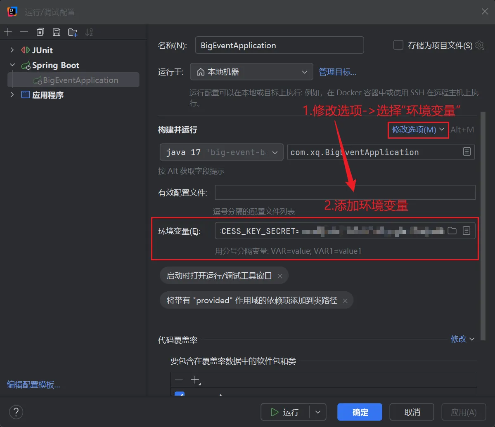

```text title:'环境变量格式'
OSS_ACCESS_KEY_ID=你的AccessKeyId;OSS_ACCESS_KEY_SECRET=你的AccessKeySecret
```

还有其他添加环境变量的方式，但此处不做详细介绍。

# 6.登录优化-redis

```text title:'项目目录结构' hl:
java
	com.xq
		anno
			State.java
		config
			WebConfig.java
		controller
			ArticleController.java
			CategoryController.java
			FileUploadController.java
			UserController.java
		exception
			GlobalExceptionHandler.java
		interceptors
			LoginInterceptor.java
		mapper
			ArticleMapper.java
			CategoryMapper.java
			UserMapper.java
		pojo
			Artivle.java
			Category.java
			PageBean.java
			Result.java
			User.java
		service
			ArticleService.java
			CategoryService.java
			UserService.java
			impl
				ArticleServiceImpl.java
				CategoryServiceImpl.java
				UserServiceImpl.java
		utils
			AliOssUtil.java
			JwtUtil.java
			Md5Util.java
			ThreadLocalUtil.java
			UserContextUtil.java
		validation
			StateValidation.java
resource
	com.xq
		mapper
			ArticleMapper.xml
```

## 6.1 SpringBoot 继承 redis

导入依赖。

```xml title:'pom.xml'
<!-- redis 坐标 -->  
<dependency>  
  <groupId>org.springframework.boot</groupId>  
  <artifactId>spring-boot-starter-data-redis</artifactId>  
</dependency>
```

修改配置。

```yml title:'application.yml' hl:7-10
spring:  
  datasource:  
    driver-class-name: com.mysql.cj.jdbc.Driver  
    url: jdbc:mysql://localhost:3306/big_event  
    username: root  
    password: 123456  
  data:  
    redis:  
      host: localhost  
      port: 6379
```

新增测试。

```java title:'RedisTest.java'
package com.xq;  
  
import org.junit.jupiter.api.Test;  
import org.springframework.beans.factory.annotation.Autowired;  
import org.springframework.boot.test.context.SpringBootTest;  
import org.springframework.data.redis.core.StringRedisTemplate;  
import org.springframework.data.redis.core.ValueOperations;  
  
@SpringBootTest // 如果在测试类上添加了这个注解，那么将来在单元测试方式执行之前，会先初始化 Spring 容器  
public class RedisTest {  
  
    @Autowired  
    private StringRedisTemplate template;  
  
    @Test  
    public void testSet() {  
        // 往 redis 中存储一个键值对 SpringRedisTemplate
        ValueOperations<String, String> operations = template.opsForValue();  
  
        operations.set("username", "zhangsan");  
    }  
}
```

找到资料中的 redis 文件夹，点击 `redis-server.exe` 运行 redis。接着运行测试用例，若出现绿钩，则证明测试成功。最后点击 `redis-cli.exe`，在程序运行框中输入 `get username`，若得到 `zhangsan`，则证明功能实现。

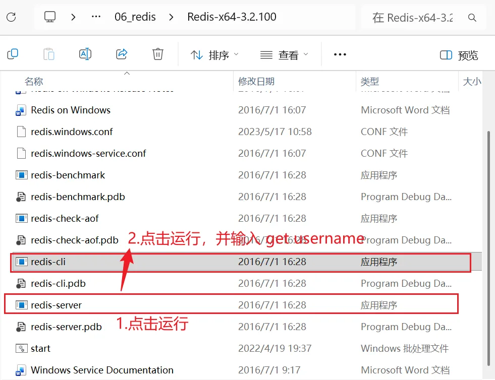

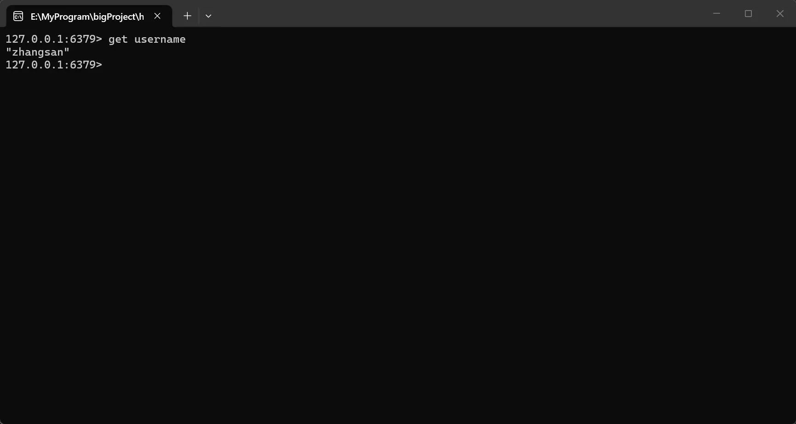

测试获取。

```java title:'RedisTest.java'
@Test  
public void testGet() {  
    // 从 redis 中获取一个键值对  
    ValueOperations<String, String> operations = template.opsForValue();  
    System.out.println(operations.get("username"));  
}
```

运行，得到输出结果如图所示，即为成功。

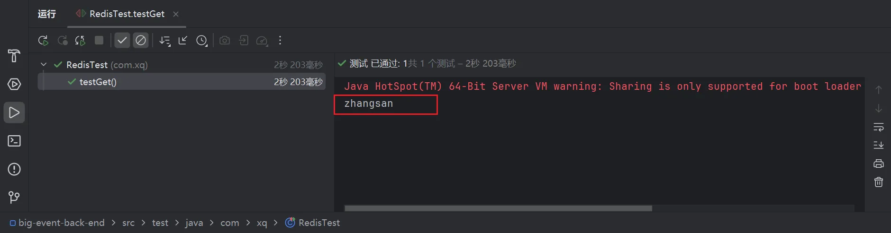

在 redis 中，存储键值对时可以给它一个过期时间，等时间一到，redis 会自动删除该键值对。

添加测试代码。

```java title:'RedisTest.java' hl:21
package com.xq;  
  
import org.junit.jupiter.api.Test;  
import org.springframework.beans.factory.annotation.Autowired;  
import org.springframework.boot.test.context.SpringBootTest;  
import org.springframework.data.redis.core.StringRedisTemplate;  
import org.springframework.data.redis.core.ValueOperations;  
  
@SpringBootTest // 如果在测试类上添加了这个注解，那么将来在单元测试方式执行之前，会先初始化 Spring 容器  
public class RedisTest {  
  
    @Autowired  
    private StringRedisTemplate template;  
  
    @Test  
    public void testSet() {  
        // 往 redis 中存储一个键值对 SpringRedisTemplate
        ValueOperations<String, String> operations = template.opsForValue();  
  
        operations.set("username", "zhangsan"); 
        operations.set("id", "001", 15, TimeUnit.SECONDS); 
    }  
}
```

立即在输入框中输入 `get id`，并在 15 s 之后再次输入，可以发现，第一次能获取到 id 的结果，第二次不行。

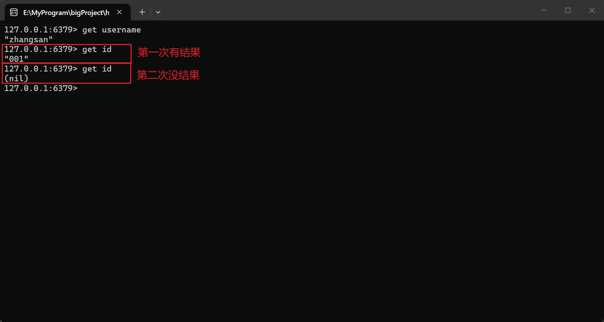

## 6.2 令牌主动失效

令牌主动失效机制：

- 登录成功后，给浏览器响应令牌的同时，把该令牌存储到 redis 中
- `LoginInterceptor` 拦截器中，需要验证浏览器携带的令牌，并同时需要获取到 redis 中存储的与之相同的令牌
- 当用户修改密码成功后，删除 redis 中存储的旧令牌

Step 1）在登录接口添加 redis 的 token 存储，并且注意，过期时间应与 token 过期时间一致。老师上课是 1 h，此处是 7 天。

```java title:'UserController.java' hl:1-2,19-20
@Autowired  
private StringRedisTemplate stringRedisTemplate;

@PostMapping("/login")  
public Result<String> login(@Pattern(regexp = "^\\S{5,16}$") String username, @Pattern(regexp = "^\\S{5,16}$") String password) {  
    // 根据用户名查询用户  
    User loginUser = userService.findByUserName(username);  
    // 判断该用户是否存在  
    if (loginUser == null) {  
        return Result.error("用户名错误！");  
    }  
    // 判断密码是否正确（loginUser对象中的password是密文）  
    if (Md5Util.getMD5String(password).equals(loginUser.getPassword())) {  
        // 登陆成功  
        Map<String, Object> claims = new HashMap<>();  
        claims.put("id", loginUser.getId());  
        claims.put("username", loginUser.getUsername());  
        String token = JwtUtil.genToken(claims);  
        // 把 token 存储到 redis 中  
        stringRedisTemplate.opsForValue().set(token, token, 7, TimeUnit.DAYS); // 过期时间：7 天  
        return Result.success(token);  
    }  
    return Result.error("密码错误！");  
}
```

Step 2）修改拦截器。

```java title:'LoginInterceptor.java' hl:1-2,8-14
@Autowired  
private StringRedisTemplate stringRedisTemplate;  
  
public boolean preHandle(HttpServletRequest request, HttpServletResponse response, Object handler) throws Exception {  
    // 令牌验证  
    String token = request.getHeader("Authorization");  
    try {  
        // 从 redies 中获取相同的token  
        ValueOperations<String, String> operations = stringRedisTemplate.opsForValue();  
        String redisToken = operations.get(token);  
        if (redisToken == null) {  
            // 证明 token 已经失效  
            throw new RuntimeException();  
        }  
  
        Map<String, Object> claims = JwtUtil.parseToken(token);  
        // 把业务数据存储到 ThreadLocal 中  
        ThreadLocalUtil.set(claims);  
        return true; // 放行  
    } catch (Exception e) {  
        // http 响应状态码为401  
        response.setStatus(401);  
        return false; // 拦截  
    }  
}
```

Step 3）修改“修改密码接口”

```java title:'UserController.java' hl:4,33-35
@PatchMapping("/updatePwd")  
public Result updatePwd(
	@RequestBody Map<String, String> params,
	@RequestHeader("Authorization") String token
) {  
    // 1.校验参数  
    String oldPwd = params.get("old_pwd");  
    String newPwd = params.get("new_pwd");  
    String rePwd = params.get("re_pwd");  
  
    // 1.1 检验是否为空  
    if (!StringUtils.hasLength(oldPwd) || !StringUtils.hasLength(newPwd) || !StringUtils.hasLength(rePwd)) {  
        return Result.error("缺少必要的参数！");  
    }  
  
    // 1.2 原密码是否正确  
    // 调用 userService 根据用户名拿到原密码，再和 oldPwd 比对  
    Map<String, Object> map = ThreadLocalUtil.get();  
    String username = (String) map.get("username");  
    User loginUser = userService.findByUserName(username);  
    if (!loginUser.getPassword().equals(Md5Util.getMD5String(oldPwd))) {  
        return Result.error("原密码填写不正确！");  
    }  
  
    // 1.3 newPwd 与 rePwd 是否一致  
    if (!rePwd.equals(newPwd)) {  
        return Result.error("两次填写的新密码不一样！");  
    }  
  
    // 2.调用 service 完成密码更新  
    userService.updatePwd(newPwd);  
  
    // 3.删除 redis 中对应的 token    
    ValueOperations<String, String> operations = stringRedisTemplate.opsForValue();  
    operations.getOperations().delete(token);  
  
    return Result.success();  
}
```

运行并测试。

# 7.SpringBoot 项目部署

引入打包插件，注意，版本号需要与 SpringBoot 版本一致。

```xml title:'pom.xml'
<build>
  <plugins>
    <!-- 打包插件 -->
    <plugin>
      <groupId>org.springframework.boot</groupId>
      <artifactId>spring-boot-maven-plugin</artifactId>
      <version>3.1.3</version>
    </plugin>
  </plugins>
</build>
```

进行打包。注意，需要先注释掉 JwtTest 文件中的 testParse 方法，因为其中使用的 token 已经过期，不注释会报错。

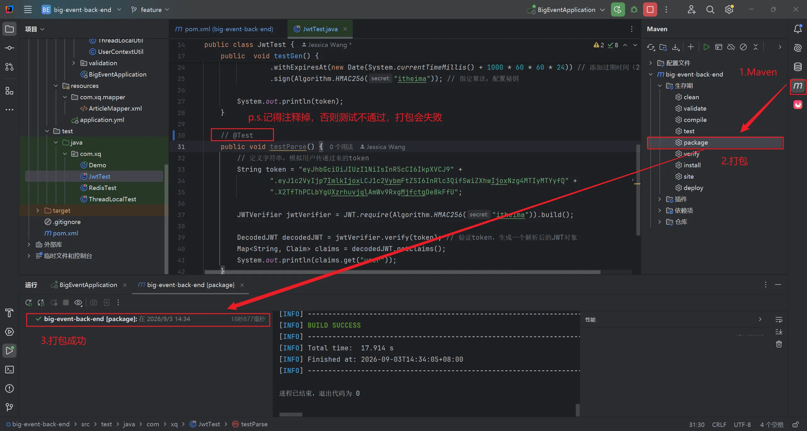

在资源管理器中打开 jar 包文件夹。

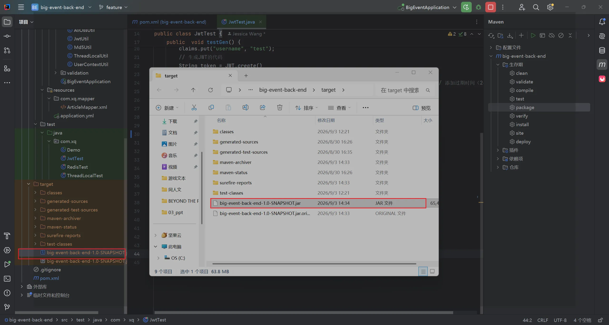

如果 ideal 中，程序正在运行，先关闭程序。再运行 jar 包。

```shell title:'jar包的运行命令'
java -jar big-event-back-end-1.0-SNAPSHOT.jar
```

运行成功后，测试登录接口，若成功，则部署成功。

P.s. jar 包部署，要求服务器必须有 jre 环境

# 8.属性配置方式

配置优先级（从低到高）：

1. 项目中 resources 目录下的 `application.yml`
2. Jar 包所在目录下的 `application.yml`
3. 操作系统环境变量
4. 命令行参数

具体如下：

- 项目配置文件方式：`application.yml` 和 `application.yml`

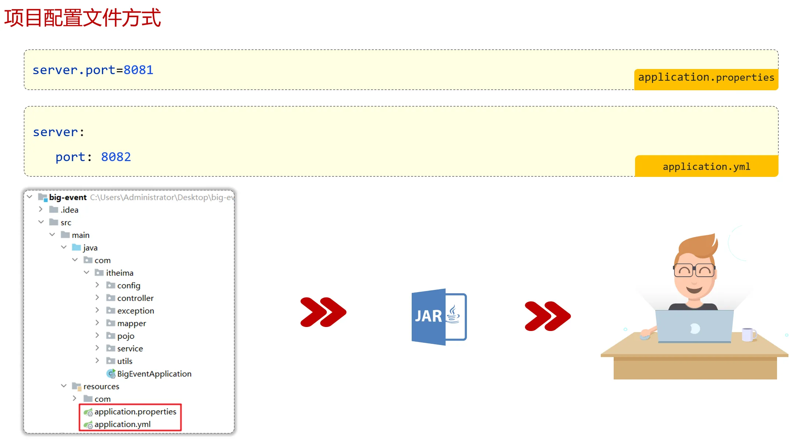

- 命令行参数方式

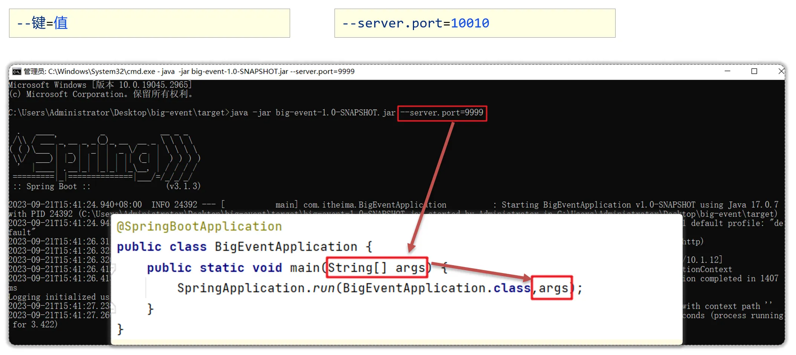

- 环境变量方式

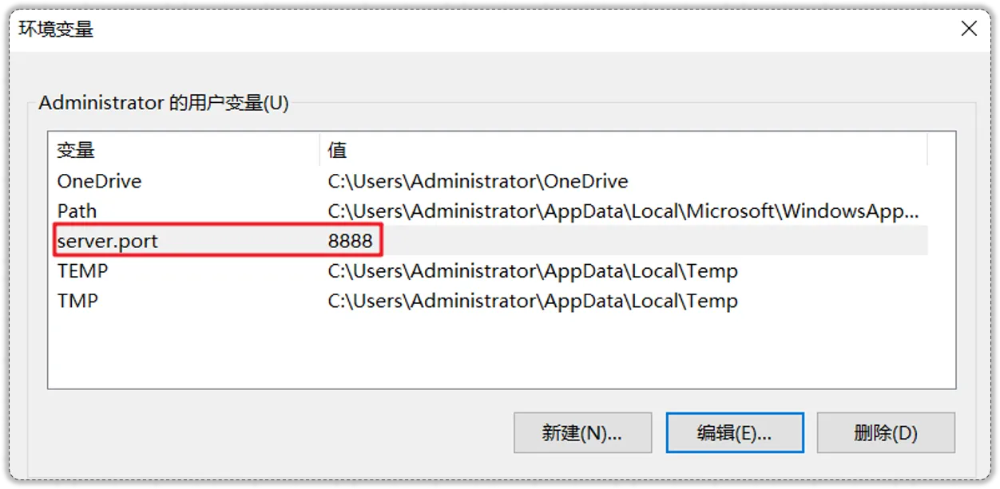

- 外部配置文件方式

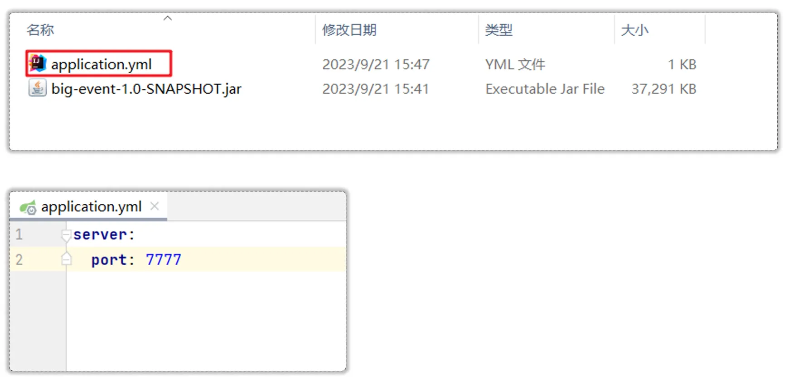

# 9.多环境开发-Profiles

## 9.1 介绍

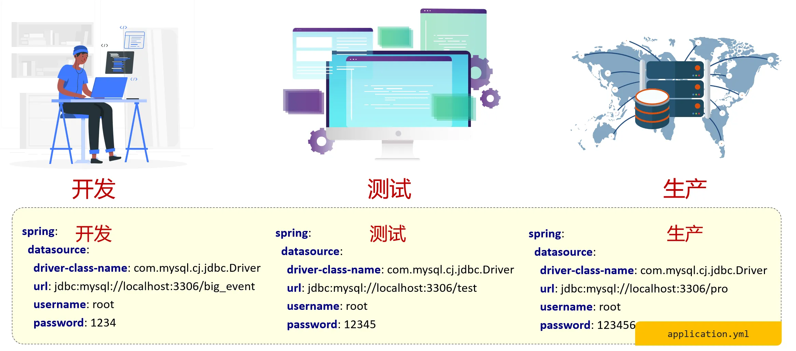

## 9.2 Profiles

### 9.2.1 单文件配置

- ---  分隔不同环境的配置
- spring.config.activate.on-profile 配置所属的环境
- spring.profiles.active 激活环境

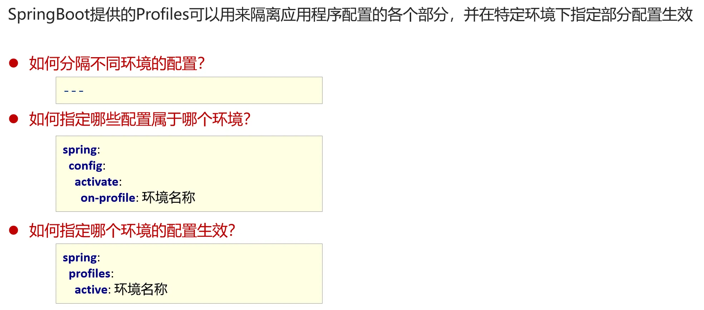

```yml title:'application.yml'
# 通用信息，指定生效的环境  
# 多环境下共性的属性  
# 如果特定环境中的配置和通用信息冲突了，特定环境中的配置生效  
spring:  
  profiles:  
    active: dev  
server:  
  servlet:  
    context-path: /aaa  
  
---  
  
# 开发环境  
spring:  
  config:  
    activate:  
      on-profile: dev  
server:  
  port: 8081  
  servlet:  
    context-path: /bbb  
  
---  
  
# 测试环境  
spring:  
  config:  
    activate:  
      on-profile: test  
server:  
  port: 8082  
  
---  
  
# 生产环境  
spring:  
  config:  
    activate:  
      on-profile: pro  
server:  
  port: 8083
```

### 9.2.2 多文件配置

- 通过多个文件分别配置不同环境的属性
- 文件的名字为 application-环境名称.yml
- 在 application.yml 中激活环境

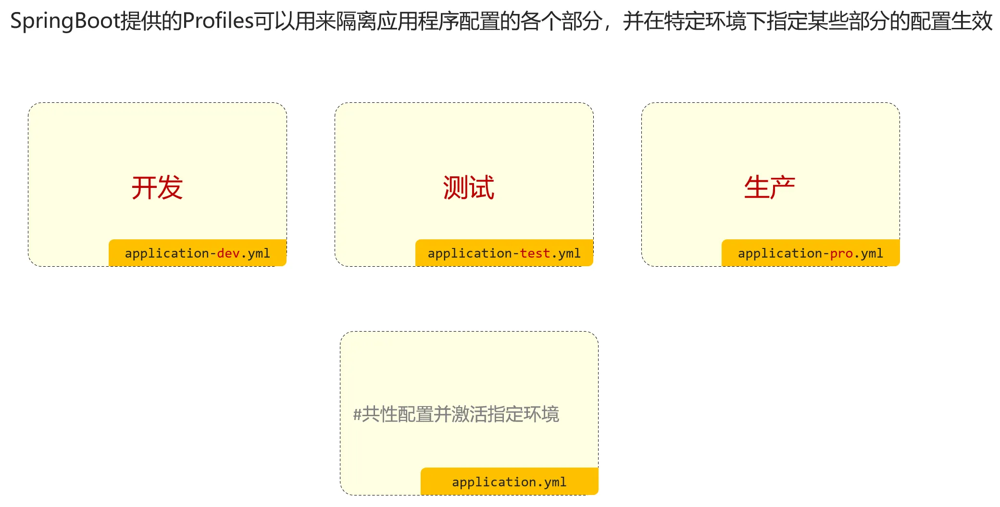

### 9.2.3 分组

- 按照配置的类别，把配置信息配置到不同的配置文件中 `application-分类名.yml`
- 在 `application.yml` 中定义分组 `spring.profiles.group`
- 在 application.yml 中激活分组 `spring.profiles.active`

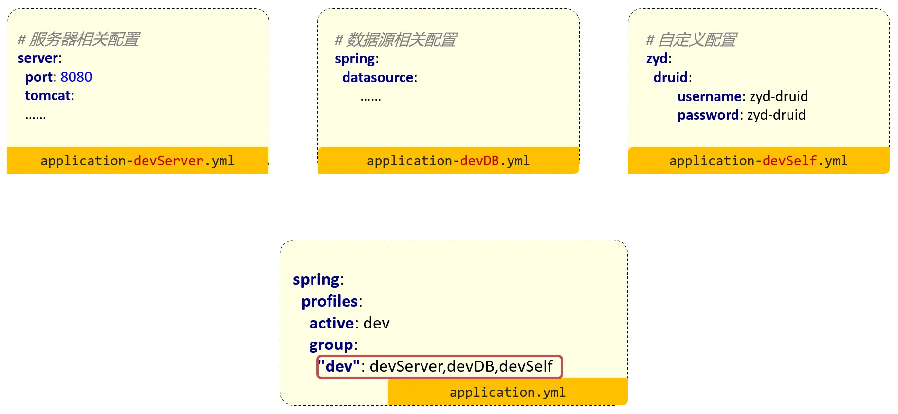

# 10.新特性-原生镜像

# 11.Vue 相关的基础知识

跳过实战篇 34~56。

（博主已学习过 Vue 相关知识，直接跳过。有需要看老师提供的 PPT 和视频即可。）

# 12.环境准备

Step 1）创建 Vue 工程

```shell
npm init vue@latest
```

Step 2）安装依赖

```shell
# Element-Plus
npm install element-plus --save
# Axios
npm install axios
# Sass
npm install sass -D
```

Step 3）调整目录

- 删除 components 下面自动生成的内容
- 新建目录 api、utils、views
- 将资料中的静态资源拷贝到 assets 目录下
- 删除 App.uve 中自动生成的内容

除了老师下载的依赖，博主还注册所有图标，命令：

```shell
npm install @element-plus/icons-vue
```

以及为了学习，博主使用的是 `ts` 语言，而非 `js`。（在创建项目时也是选择的 `TypeScript`）

以下是需要写入的代码。

```ts title:'src\main.ts'
import './assets/main.scss'

import { createApp } from 'vue'
import App from './App.vue'
import ElementPlus from 'element-plus'
import 'element-plus/dist/index.css'
import * as ElementPlusIconsVue from '@element-plus/icons-vue'

const app = createApp(App)
app.use(ElementPlus)
app.mount('#app')
for (const [key, component] of Object.entries(ElementPlusIconsVue)) {
  app.component(key, component)
}
```

```ts title:'src\utils\request.ts'
// 定制请求的实例

// 导入axios  npm install axios
import axios from 'axios'
// 定义一个变量，记录公共的前缀，baseURL
const baseURL = 'http://localhost:8080'
const instance = axios.create({ baseURL })

// 添加响应拦截器
instance.interceptors.response.use(
  (result) => {
    return result.data
  },
  (err) => {
    alert('服务异常')
    return Promise.reject(err) // 异步的状态转化成失败的状态
  },
)

export default instance
```

```vue title:'src\App.vue'
<template>
  <div>Hello World!</div>
</template>

<script setup></script>

<style>
#app {
  width: 100%;
  height: 100%;
  overflow: hidden;
}
</style>
```

在终端输入 `npm run dev` 后，打开前端界面，看到出现 `Hello World!` 后，即为成功。

另外，博主为了写代码方便，使用了 Prettier 插件对代码进行格式化，以下是配置文件。

```json title:'.prettierrc.json'

{
  "printWidth": 100,
  "bracketSameLine": false,
  "semi": false,
  "singleQuote": true,
  "jsxSingleQuote": false,
  "bracketSpacing": true,
  "jsxBracketSameLine": false,
  "vueIndentScriptAndStyle": false,
  "htmlWhitespaceSensitivity": "ignore"
}
```

# 13.登录与注册

```text title:'项目结构'
src
	api
		user.ts
	assets
	utils
		request.ts
	views
		Login.vue
	App.vue
	main.ts
```

## 13.1 注册

### 13.1.1 页面搭建

博主使用的 ts，会和老师的代码有区别。

```vue title:'src\views\Login.vue'
<template>
  <el-row class="login-page">
    <!-- 左侧 -->
    <el-col :span="12" class="bg"></el-col>
    <!-- 右侧 -->
    <el-col :span="6" :offset="3" class="form">
      <!-- 注册 -->
      <el-form v-if="isRegister" ref="form" size="large" :model="registerData" :rules="rules">
        <el-form-item>
          <h1>注册</h1>
        </el-form-item>
        <el-form-item prop="username">
          <el-input
            :prefix-icon="User"
            placeholder="请输入用户名"
            v-model="registerData.username"
          />
        </el-form-item>
        <el-form-item prop="password">
          <el-input
            :prefix-icon="Lock"
            placeholder="请输入密码"
            type="password"
            show-password
            v-model="registerData.password"
          />
        </el-form-item>
        <el-form-item prop="rePassword">
          <el-input
            :prefix-icon="Lock"
            placeholder="请再次输入密码"
            type="password"
            show-password
            v-model="registerData.rePassword"
          />
        </el-form-item>
        <el-form-item>
          <el-button class="button" type="primary" auto-insert-space>注册</el-button>
        </el-form-item>
        <el-form-item class="flex">
          <el-link type="info" :underline="false" @click="isRegister = false">← 返回</el-link>
        </el-form-item>
      </el-form>
      <!-- 登录 -->
      <el-form v-if="!isRegister" ref="form" size="large">
        <el-form-item>
          <h1>登录</h1>
        </el-form-item>
        <el-form-item>
          <el-input :prefix-icon="User" placeholder="请输入用户名" />
        </el-form-item>
        <el-form-item>
          <el-input :prefix-icon="Lock" placeholder="请输入密码" type="password" show-password />
        </el-form-item>
        <el-form-item class="flex">
          <div class="flex">
            <el-checkbox>记住我</el-checkbox>
            <el-link type="primary" :underline="false">忘记密码？</el-link>
          </div>
        </el-form-item>
        <el-form-item>
          <el-button class="button" type="primary" auto-insert-space>登录</el-button>
        </el-form-item>
        <el-form-item class="flex">
          <el-link type="info" :underline="false" @click="isRegister = true">注册 →</el-link>
        </el-form-item>
      </el-form>
    </el-col>
  </el-row>
</template>

<script lang="ts" setup>
import { reactive, ref } from 'vue'
import type { FormRules } from 'element-plus'
import { User, Lock } from '@element-plus/icons-vue'

interface RegisterData {
  username: string
  password: string
  rePassword: string
}

// 控制注册与登录表单的显示，默认显示登录
const isRegister = ref(false)
const registerData = reactive<RegisterData>({
  username: '',
  password: '',
  rePassword: '',
})

function checkRePassword(rule: any, value: any, callback: any) {
  if (value === '') {
    callback(new Error('请再次确认密码'))
  } else if (value !== registerData.password) {
    callback(new Error('请确保两次输入的密码一致'))
  } else {
    callback()
  }
}

// 定义表单校验规则
const rules = reactive<FormRules<RegisterData>>({
  username: [
    { required: true, message: '请输入用户名', trigger: 'blur' },
    { min: 5, max: 16, message: '长度为5~16位非空字符', trigger: 'blur' },
  ],
  password: [
    { required: true, message: '请输入密码', trigger: 'blur' },
    { min: 5, max: 16, message: '长度为5~16位非空字符', trigger: 'blur' },
  ],
  rePassword: [{ validator: checkRePassword, trigger: 'blur' }],
})
</script>

<style lang="scss" scoped>
/* 样式 */
.login-page {
  height: 100vh;
  background-color: #fff;

  .bg {
    background:
      url('@/assets/logo2.png') no-repeat 60% center / 240px auto,
      url('@/assets/login_bg.jpg') no-repeat center / cover;
    border-radius: 0 20px 20px 0;
  }

  .form {
    display: flex;
    flex-direction: column;
    justify-content: center;
    user-select: none;

    .title {
      margin: 0 auto;
    }

    .button {
      width: 100%;
    }

    .flex {
      width: 100%;
      display: flex;
      justify-content: space-between;
    }
  }
}
</style>
```

### 13.1.2 接口调用

```vue title:'src\views\Login.vue'
<template>
  <el-row class="login-page">
    <!-- 左侧 -->
    <el-col :span="12" class="bg"></el-col>
    <!-- 右侧 -->
    <el-col :span="6" :offset="3" class="form">
      <!-- 注册 -->
      <el-form v-if="isRegister" ref="form" size="large" :model="registerData" :rules="rules">
        <el-form-item>
          <h1>注册</h1>
        </el-form-item>
        <el-form-item prop="username">
          <el-input
            :prefix-icon="User"
            placeholder="请输入用户名"
            v-model="registerData.username"
          />
        </el-form-item>
        <el-form-item prop="password">
          <el-input
            :prefix-icon="Lock"
            placeholder="请输入密码"
            type="password"
            show-password
            v-model="registerData.password"
          />
        </el-form-item>
        <el-form-item prop="rePassword">
          <el-input
            :prefix-icon="Lock"
            placeholder="请再次输入密码"
            type="password"
            show-password
            v-model="registerData.rePassword"
          />
        </el-form-item>
        <el-form-item>
          <el-button class="button" type="primary" auto-insert-space @click="register">
            注册
          </el-button>
        </el-form-item>
        <el-form-item class="flex">
          <el-link type="info" :underline="false" @click="isRegister = false">← 返回</el-link>
        </el-form-item>
      </el-form>
      <!-- 登录 -->
      <el-form v-if="!isRegister" ref="form" size="large">
        <el-form-item>
          <h1>登录</h1>
        </el-form-item>
        <el-form-item>
          <el-input :prefix-icon="User" placeholder="请输入用户名" />
        </el-form-item>
        <el-form-item>
          <el-input :prefix-icon="Lock" placeholder="请输入密码" type="password" show-password />
        </el-form-item>
        <el-form-item class="flex">
          <div class="flex">
            <el-checkbox>记住我</el-checkbox>
            <el-link type="primary" :underline="false">忘记密码？</el-link>
          </div>
        </el-form-item>
        <el-form-item>
          <el-button class="button" type="primary" auto-insert-space>登录</el-button>
        </el-form-item>
        <el-form-item class="flex">
          <el-link type="info" :underline="false" @click="isRegister = true">注册 →</el-link>
        </el-form-item>
      </el-form>
    </el-col>
  </el-row>
</template>

<script lang="ts" setup>
import { reactive, ref } from 'vue'
import type { FormRules } from 'element-plus'
import { User, Lock } from '@element-plus/icons-vue'
import { userRegisterService } from '@/api/user'

interface RegisterData {
  username: string
  password: string
  rePassword: string
}

// 控制注册与登录表单的显示，默认显示登录
const isRegister = ref(false)
const registerData = reactive<RegisterData>({
  username: '',
  password: '',
  rePassword: '',
})

function checkRePassword(rule: any, value: any, callback: any) {
  if (value === '') {
    callback(new Error('请再次确认密码'))
  } else if (value !== registerData.password) {
    callback(new Error('请确保两次输入的密码一致'))
  } else {
    callback()
  }
}

// 定义表单校验规则
const rules = reactive<FormRules<RegisterData>>({
  username: [
    { required: true, message: '请输入用户名', trigger: 'blur' },
    { min: 5, max: 16, message: '长度为5~16位非空字符', trigger: 'blur' },
  ],
  password: [
    { required: true, message: '请输入密码', trigger: 'blur' },
    { min: 5, max: 16, message: '长度为5~16位非空字符', trigger: 'blur' },
  ],
  rePassword: [{ validator: checkRePassword, trigger: 'blur' }],
})

// 调用后台接口，完成注册
async function register() {
  const result = await userRegisterService(registerData)
  if (result.code === 0) {
    alert(result.message ? result.message : '注册成功')
  } else {
    alert('注册失败')
  }
}
</script>

<style lang="scss" scoped>
/* 样式 */
.login-page {
  height: 100vh;
  background-color: #fff;

  .bg {
    background:
      url('@/assets/logo2.png') no-repeat 60% center / 240px auto,
      url('@/assets/login_bg.jpg') no-repeat center / cover;
    border-radius: 0 20px 20px 0;
  }

  .form {
    display: flex;
    flex-direction: column;
    justify-content: center;
    user-select: none;

    .title {
      margin: 0 auto;
    }

    .button {
      width: 100%;
    }

    .flex {
      width: 100%;
      display: flex;
      justify-content: space-between;
    }
  }
}
</style>
```

```ts title:'src\api\user.ts'
// 导入 request.ts 请求工具
import request from '@/utils/request'
import type { ApiResponse } from '@/utils/request'

export const userRegisterService = (registerData: any): Promise<ApiResponse> => {
  const params = new URLSearchParams()
  for (let key in registerData) {
    params.append(key, registerData[key])
  }
  // 显式取出 response.data，类型自动推导为 ApiResponse
  return request.post('/user/register', params)
}
```

### 13.1.3 跨域解决

修改 `baseURL`。

```ts title:'src\utils\request.ts'
const baseURL = '/api'
```

添加跨域配置。

```ts title:'vite.config.ts'
import { fileURLToPath, URL } from 'node:url'

import { defineConfig } from 'vite'
import vue from '@vitejs/plugin-vue'
import vueDevTools from 'vite-plugin-vue-devtools'

// https://vite.dev/config/
export default defineConfig({
  plugins: [vue(), vueDevTools()],
  resolve: {
    alias: {
      '@': fileURLToPath(new URL('./src', import.meta.url)),
    },
  },
  server: {
    proxy: {
      '/api': {
        target: 'http://localhost:8080',
        changeOrigin: true,
        rewrite: (path) => path.replace('/^\/api/', ''),
      },
    },
  },
})
```

## 13.2 登录

### 13.2.1 功能实现

老师此处复用了注册和登录的数据，并做了清空处理。博主则是分开了数据，不做复用。

```vue title:'src\views\Login.vue'
<template>
  <el-row class="login-page">
    <!-- 左侧 -->
    <el-col :span="12" class="bg"></el-col>
    <!-- 右侧 -->
    <el-col :span="6" :offset="3" class="form">
      <!-- 注册 -->
      <el-form v-if="isRegister" ref="form" size="large" :model="registerData" :rules="rules">
        <el-form-item>
          <h1>注册</h1>
        </el-form-item>
        <el-form-item prop="username">
          <el-input
            :prefix-icon="User"
            placeholder="请输入用户名"
            v-model="registerData.username"
          />
        </el-form-item>
        <el-form-item prop="password">
          <el-input
            :prefix-icon="Lock"
            placeholder="请输入密码"
            type="password"
            show-password
            v-model="registerData.password"
          />
        </el-form-item>
        <el-form-item prop="rePassword">
          <el-input
            :prefix-icon="Lock"
            placeholder="请再次输入密码"
            type="password"
            show-password
            v-model="registerData.rePassword"
          />
        </el-form-item>
        <el-form-item>
          <el-button class="button" type="primary" auto-insert-space @click="register">
            注册
          </el-button>
        </el-form-item>
        <el-form-item class="flex">
          <el-link type="info" :underline="false" @click="isRegister = false">← 返回</el-link>
        </el-form-item>
      </el-form>
      <!-- 登录 -->
      <el-form v-if="!isRegister" ref="form" size="large" :model="loginData" :rules="rules">
        <el-form-item>
          <h1>登录</h1>
        </el-form-item>
        <el-form-item prop="username">
          <el-input :prefix-icon="User" placeholder="请输入用户名" v-model="loginData.username" />
        </el-form-item>
        <el-form-item prop="password">
          <el-input
            :prefix-icon="Lock"
            placeholder="请输入密码"
            type="password"
            show-password
            v-model="loginData.password"
          />
        </el-form-item>
        <el-form-item class="flex">
          <div class="flex">
            <el-checkbox>记住我</el-checkbox>
            <el-link type="primary" :underline="false">忘记密码？</el-link>
          </div>
        </el-form-item>
        <el-form-item>
          <el-button class="button" type="primary" auto-insert-space @click="login">登录</el-button>
        </el-form-item>
        <el-form-item class="flex">
          <el-link type="info" :underline="false" @click="isRegister = true">注册 →</el-link>
        </el-form-item>
      </el-form>
    </el-col>
  </el-row>
</template>

<script lang="ts" setup>
import { reactive, ref } from 'vue'
import type { FormRules } from 'element-plus'
import { User, Lock } from '@element-plus/icons-vue'
import { userRegisterService, userLoginService } from '@/api/user'

interface RegisterData {
  username: string
  password: string
  rePassword: string
}
interface LoginData {
  username: string
  password: string
}

// 控制注册与登录表单的显示，默认显示登录
const isRegister = ref(false)
const registerData = reactive<RegisterData>({
  username: '',
  password: '',
  rePassword: '',
})
const loginData = reactive<LoginData>({
  username: '',
  password: '',
})

function checkRePassword(rule: any, value: any, callback: any) {
  if (value === '') {
    callback(new Error('请再次确认密码'))
  } else if (value !== registerData.password) {
    callback(new Error('请确保两次输入的密码一致'))
  } else {
    callback()
  }
}

// 定义表单校验规则
const rules = reactive<FormRules<RegisterData>>({
  username: [
    { required: true, message: '请输入用户名', trigger: 'blur' },
    { min: 5, max: 16, message: '长度为5~16位非空字符', trigger: 'blur' },
  ],
  password: [
    { required: true, message: '请输入密码', trigger: 'blur' },
    { min: 5, max: 16, message: '长度为5~16位非空字符', trigger: 'blur' },
  ],
  rePassword: [{ validator: checkRePassword, trigger: 'blur' }],
})

// 调用后台接口，完成注册
async function register() {
  const result = await userRegisterService(registerData)
  if (result.code === 0) {
    alert(result.message ? result.message : '注册成功')
  } else {
    alert('注册失败')
  }
}

// 调用后台接口，完成登录
async function login() {
  const result = await userLoginService(loginData)
  if (result.code === 0) {
    alert(result.message ? result.message : '登录成功')
  } else {
    alert('登录失败')
  }
}
</script>

<style lang="scss" scoped>
/* 样式 */
.login-page {
  height: 100vh;
  background-color: #fff;

  .bg {
    background:
      url('@/assets/logo2.png') no-repeat 60% center / 240px auto,
      url('@/assets/login_bg.jpg') no-repeat center / cover;
    border-radius: 0 20px 20px 0;
  }

  .form {
    display: flex;
    flex-direction: column;
    justify-content: center;
    user-select: none;

    .title {
      margin: 0 auto;
    }

    .button {
      width: 100%;
    }

    .flex {
      width: 100%;
      display: flex;
      justify-content: space-between;
    }
  }
}
</style>
```

```ts title:'src\api\user.ts'
// 导入 request.ts 请求工具
import request from '@/utils/request'
import type { ApiResponse } from '@/utils/request'

export const userRegisterService = (registerData: any): Promise<ApiResponse> => {
  const params = new URLSearchParams()
  for (let key in registerData) {
    params.append(key, registerData[key])
  }
  // 显式取出 response.data，类型自动推导为 ApiResponse
  return request.post('/user/register', params)
}

export const userLoginService = (registerData: any): Promise<ApiResponse> => {
  const params = new URLSearchParams()
  for (let key in registerData) {
    params.append(key, registerData[key])
  }
  // 显式取出 response.data，类型自动推导为 ApiResponse
  return request.post('/user/login', params)
}
```

### 13.2.2 axio 响应拦截器优化

```ts title:'src\utils\request.ts' hl:6,22-29,32
// 定制请求的实例

// 导入axios  npm install axios
import axios from 'axios'
import type { AxiosResponse } from 'axios'
import { ElMessage } from 'element-plus'

// 定义统一响应结构（导出供外部使用）
export interface ApiResponse<T = any> {
  code: number
  message: string
  data: T
}

// 定义一个变量，记录公共的前缀，baseURL
const baseURL = '/api'
const instance = axios.create({ baseURL })

// 添加响应拦截器
instance.interceptors.response.use(
  (result: AxiosResponse) => {
    const { data } = result
    if (data.code === 0) {
      return data
    }
    // 操作失败
    ElMessage.error(data.message ? data.message : '服务异常')
    // 异步操作的状态转换为失败
    return Promise.reject(data)
  },
  (err) => {
    ElMessage.error('服务异常')
    return Promise.reject(err) // 异步的状态转化成失败的状态
  },
)

export default instance
```

# 14.页面与功能

```text title:'项目结构'
src
	api
		user.ts
	assets
	layout
		Index.vue
	route
		index.ts
	utils
		request.ts
	views
		article
			ArticleCategory.vue
			ArticleManage.vue
		user
			UserAvatar.vue
			UserInfo.vue
			UserInfo.vue
		Login.vue
	App.vue
	main.ts
```

## 14.1 主页面搭建

```vue title:'src\layout\index.vue'
<template>
  <el-container class="layout-container">
    <!-- 左侧菜单 -->
    <el-aside width="200px">
      <div class="el-aside__logo"></div>
      <el-menu active-text-color="#ffd04b" background-color="#232323" text-color="#fff" router>
        <el-menu-item>
          <el-icon>
            <Management />
          </el-icon>
          <span>文章分类</span>
        </el-menu-item>
        <el-menu-item>
          <el-icon>
            <Promotion />
          </el-icon>
          <span>文章管理</span>
        </el-menu-item>
        <el-sub-menu>
          <template #title>
            <el-icon>
              <UserFilled />
            </el-icon>
            <span>个人中心</span>
          </template>
          <el-menu-item>
            <el-icon>
              <User />
            </el-icon>
            <span>基本资料</span>
          </el-menu-item>
          <el-menu-item>
            <el-icon>
              <Crop />
            </el-icon>
            <span>更换头像</span>
          </el-menu-item>
          <el-menu-item>
            <el-icon>
              <EditPen />
            </el-icon>
            <span>重置密码</span>
          </el-menu-item>
        </el-sub-menu>
      </el-menu>
    </el-aside>
    <!-- 右侧主区域 -->
    <el-container>
      <!-- 头部区域 -->
      <el-header>
        <div>
          黑马程序员：
          <strong>东哥</strong>
        </div>
        <el-dropdown placement="bottom-end">
          <span class="el-dropdown__box">
            <el-avatar :src="avatar" />
            <el-icon>
              <CaretBottom />
            </el-icon>
          </span>
          <template #dropdown>
            <el-dropdown-menu>
              <el-dropdown-item command="profile" :icon="User">基本资料</el-dropdown-item>
              <el-dropdown-item command="avatar" :icon="Crop">更换头像</el-dropdown-item>
              <el-dropdown-item command="password" :icon="EditPen">重置密码</el-dropdown-item>
              <el-dropdown-item command="logout" :icon="SwitchButton">退出登录</el-dropdown-item>
            </el-dropdown-menu>
          </template>
        </el-dropdown>
      </el-header>
      <!-- 中间区域 -->
      <el-main>
        <div style="width: 1290px; height: 570px; border: 1px solid red">内容展示区</div>
      </el-main>
      <!-- 底部区域 -->
      <el-footer>大事件 ©2023 Created by 黑马程序员</el-footer>
    </el-container>
  </el-container>
</template>

<script lang="ts" setup>
import {
  Management,
  Promotion,
  UserFilled,
  User,
  Crop,
  EditPen,
  SwitchButton,
  CaretBottom,
} from '@element-plus/icons-vue'
import avatar from '@/assets/default.png'
</script>

<style lang="scss" scoped>
.layout {
  height: 100%;

  .el-aside {
    background-color: #232323;

    &__logo {
      height: 120px;
      background: url('@/assets/logo.png') no-repeat center / 120px auto;
    }

    .el-menu {
      border-right: none;
    }
  }

  .el-header {
    background-color: #fff;
    display: flex;
    align-items: center;
    justify-content: space-between;

    .el-dropdown__box {
      display: flex;
      align-items: center;

      .el-icon {
        color: #999;
        margin-left: 10px;
      }

      &:active,
      &:focus {
        outline: none;
      }
    }
  }

  .el-footer {
    display: flex;
    align-items: center;
    justify-content: center;
    font-size: 14px;
    color: #666;
  }
}
</style>
```

## 14.2 路由

### 14.2.1 基本使用

- 安装 vue-router    `npm install vue-router@4`
- 在 `src/router/index.js` 中创建路由器，并导出
- 在 vue 应用实例中使用 vue-router
- 声明 router-view 标签，展示组件内容

```ts title:'src\utils'
import { createRouter, createWebHistory } from 'vue-router'
import Login from '@/views/Login.vue'
import Layout from '@/layout/index.vue'

// 定义路由关系
const routes = [
  {
    path: '/login',
    component: Login,
  },
  {
    path: '/',
    component: Layout,
  },
]

// 创建路由器
const router = createRouter({
  history: createWebHistory(),
  routes: routes,
})

// 导出路由
export default router
```

修改 `src\main.ts` 文件，添加路由相关配置。

```ts title:'src\main.ts'
import './assets/main.scss'
import { createApp } from 'vue'
import App from './App.vue'
import ElementPlus from 'element-plus'
import 'element-plus/dist/index.css'
import * as ElementPlusIconsVue from '@element-plus/icons-vue'
import router from '@/router'

const app = createApp(App)
app.use(router)
app.use(ElementPlus)
app.mount('#app')
for (const [key, component] of Object.entries(ElementPlusIconsVue)) {
  app.component(key, component)
}
```

修改 `src\App.vue` 文件。

```vue title:'src\App.vue'
<template>
  <router-view />
</template>

<script setup></script>

<style>
#app {
  width: 100%;
  height: 100%;
  overflow: hidden;
}
</style>
```

### 14.2.2 子路由

- 复制资料中提供好的五个组件
- 配置子路由
- 声明 router-view 标签
- 为菜单项 el-menu-item 设置 index 属性，设置点击后的路由路径

修改 `src\router\index.ts` 文件，添加子路由。

```ts title:'src\router\index.ts'
import { createRouter, createWebHistory } from 'vue-router'
import Login from '@/views/Login.vue'
import Layout from '@/layout/index.vue'
import ArticleCategory from '@/views/article/ArticleCategory.vue'
import ArticleManage from '@/views/article/ArticleManage.vue'
import UserAvatar from '@/views/user/UserAvatar.vue'
import UserInfo from '@/views/user/UserInfo.vue'
import UserResetPassword from '@/views/user/UserResetPassword.vue'

// 定义路由关系
const routes = [
  {
    path: '/login',
    component: Login,
  },
  {
    path: '/',
    component: Layout,
    redirect: '/article/manage',
    children: [
      {
        path: '/article/category',
        component: ArticleCategory,
      },
      {
        path: '/article/manage',
        component: ArticleManage,
      },
      {
        path: '/user/avatar',
        component: UserAvatar,
      },
      {
        path: '/user/info',
        component: UserInfo,
      },
      {
        path: '/user/resetPassword',
        component: UserResetPassword,
      },
    ],
  },
]

// 创建路由器
const router = createRouter({
  history: createWebHistory(),
  routes: routes,
})

// 导出路由
export default router
```

## 14.3 文章分类列表查询

### 14.3.1 功能实现

```vue title:'src\views\article\ArticleCategory.vue'
<template>
  <el-card class="page-container">
    <template #header>
      <div class="header">
        <span>文章分类</span>
        <div class="extra">
          <el-button type="primary">添加分类</el-button>
        </div>
      </div>
    </template>
    <el-table :data="categories" style="width: 100%">
      <el-table-column label="序号" width="100" type="index" />
      <el-table-column label="分类名称" prop="categoryName" />
      <el-table-column label="分类别名" prop="categoryAlias" />
      <el-table-column label="操作" width="100">
        <template #default="{ row }">
          <el-button :icon="Edit" circle plain type="primary" />
          <el-button :icon="Delete" circle plain type="danger" />
        </template>
      </el-table-column>
      <template #empty>
        <el-empty description="暂无数据" />
      </template>
    </el-table>
  </el-card>
</template>

<script lang="ts" setup>
import { Edit, Delete } from '@element-plus/icons-vue'
import { onMounted, ref } from 'vue'
import { articleCategoryListService, type articleDTO } from '@/api/article'

const categories = ref<articleDTO[]>([])

const getArticleCategoryList = async () => {
  const result = await articleCategoryListService()
  categories.value = result.data
}

onMounted(() => {
  getArticleCategoryList()
})
</script>

<style lang="scss" scoped>
.page-container {
  min-height: 100%;
  box-sizing: border-box;

  .header {
    display: flex;
    align-items: center;
    justify-content: space-between;
  }
}
</style>
```

```ts title:'src\api\article.ts'
import request from '@/utils/request'
import type { ApiResponse } from '@/utils/request'

export interface articleDTO {
  id: number
  categoryName: string
  categoryAlias: string
  createTime: string
  updateTime: string
}

// 文章分类列表查询
export const articleCategoryListService = (): Promise<ApiResponse<articleDTO[]>> => {
  return request.get('/category')
}
```

### 14.3.2 Pinia 状态管理库

Pinia是Vue的专属状态管理库，它允许你跨组件或页面共享状态。

- 安装pinia    `npm install pinia`
- 在vue应用实例中使用pinia
- 在src/stores/token.js中定义store
- 在组件中使用store

```ts title:'src\main.ts' hl:8,11-12
import './assets/main.scss'
import { createApp } from 'vue'
import App from './App.vue'
import ElementPlus from 'element-plus'
import 'element-plus/dist/index.css'
import * as ElementPlusIconsVue from '@element-plus/icons-vue'
import router from '@/router'
import { createPinia } from 'pinia'

const app = createApp(App)
const pinia = createPinia()
app.use(pinia)
app.use(router)
app.use(ElementPlus)
app.mount('#app')
for (const [key, component] of Object.entries(ElementPlusIconsVue)) {
  app.component(key, component)
}
```

```ts title:'src\stores\token.ts'
// 定义 store
import { defineStore } from 'pinia'
import { ref } from 'vue'

export const useTokenStore = defineStore('token', () => {
  // 1.响应式变量
  const token = ref<string>('')

  // 2.定义一个函数，修改 token 的值
  const setToken = (newToken: string) => {
    token.value = newToken
  }

  // 3.定义一个函数，移除 token 的值
  const removeToken = () => {
    token.value = ''
  }

  return {
    token,
    setToken,
    removeToken,
  }
})
```

```ts title:'src\api\article.ts'
import request from '@/utils/request'
import type { ApiResponse } from '@/utils/request'
import { useTokenStore } from '@/stores/token'

export interface articleDTO {
  id: number
  categoryName: string
  categoryAlias: string
  createTime: string
  updateTime: string
}

// 文章分类列表查询
export const articleCategoryListService = (): Promise<ApiResponse<articleDTO[]>> => {
  const tokenStore = useTokenStore()
  return request.get('/category', {
    headers: {
      Authorization: tokenStore.token,
    },
  })
}
```

```ts title:'src\views\Login.vue'
import { useTokenStore } from '@/stores/token'

const tokenStore = useTokenStore()
// 调用后台接口，完成登录
async function login() {
  const result = await userLoginService(loginData)
  tokenStore.setToken(result.data)
  ElMessage.success(result.message ? result.message : '登录成功')
  // 借助路由跳转到首页
  router.push('/')
}
```

### 14.3.3 


