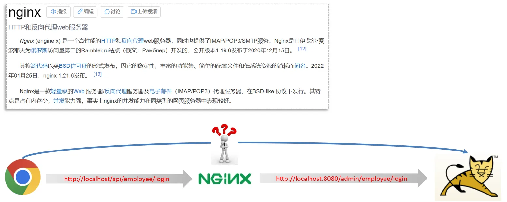
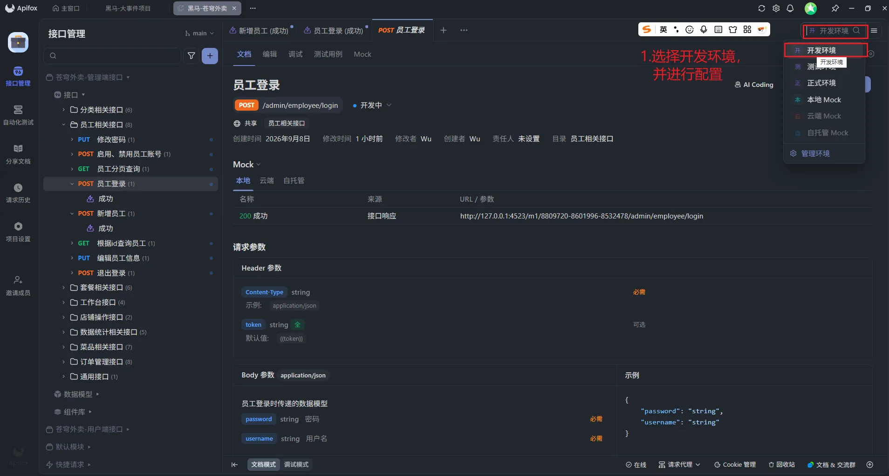
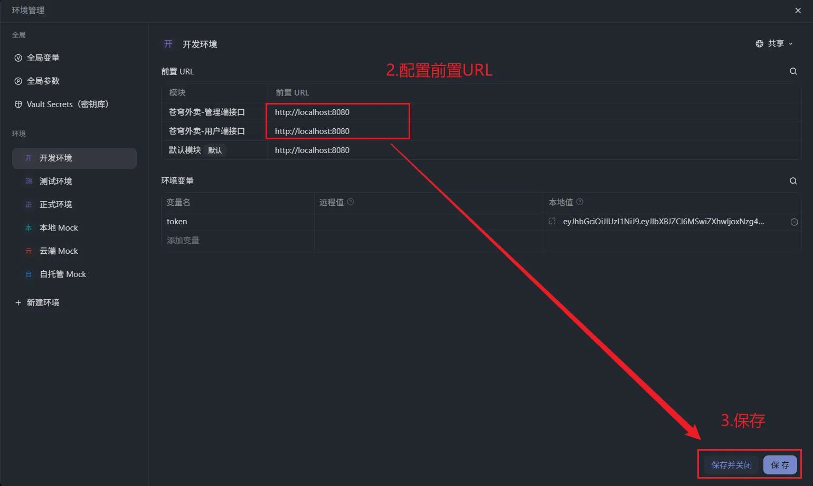
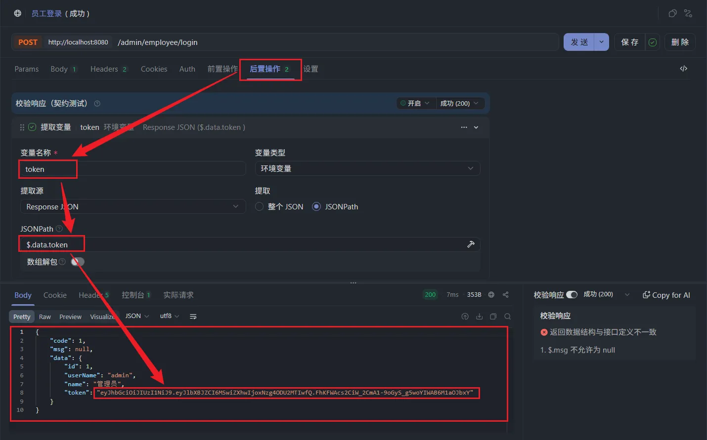
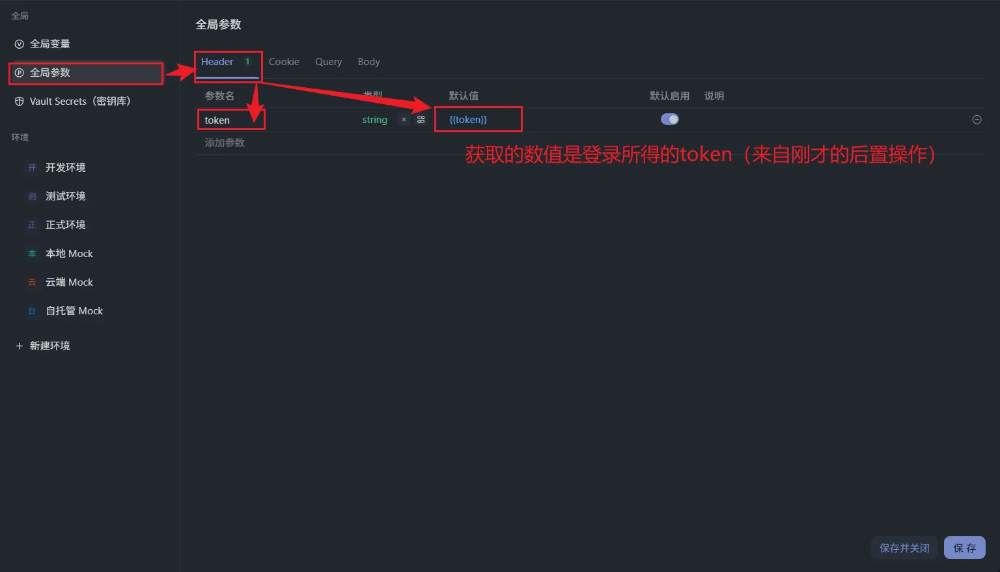
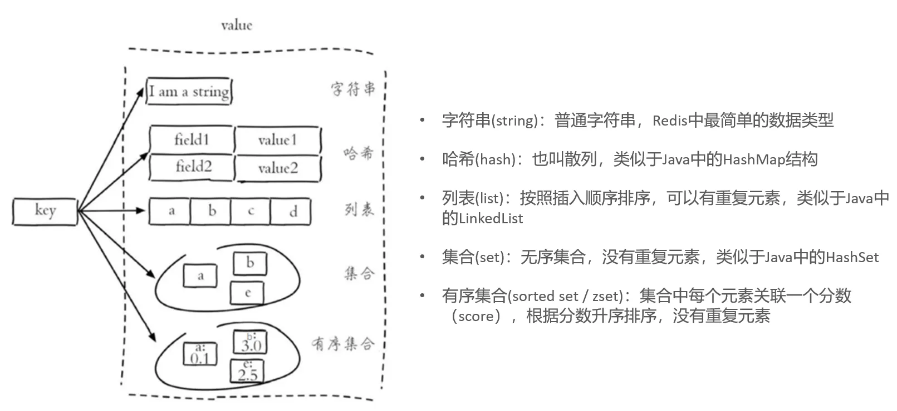

---
tags:
  - 项目
  - SpringBoot
  - VUE3
beginDate: 2026-09-07
endDate:
---
# 0.参考视频

【黑马程序员 Java 项目实战《苍穹外卖》，最适合新手的 SpringBoot+SSM 的企业级 Java 项目实战】https://www.bilibili.com/video/BV1TP411v7v6?vd_source=4e42d3c23020c1c6dc6a9aac2d11ab9c

个人学习仓库：[Jessica250706/hm-takeout: 黑马苍穹外卖](https://github.com/Jessica250706/hm-takeout)

面试话术：[史上最强苍穹外卖话术_牛客网](https://www.nowcoder.com/discuss/634840490742972416?)


# 1.开发环境搭建

## 1.1 前端

启动 nginx：双击 nginx.exe 即可启动 nginx 服务，访问端口号为 80。

注意，必须要在全英文的目录下启动，否则无法运行。且，nginx.exe 在 `hm-takeout\Documents\front-end-environment\nginx-1.20.2` 中。

## 1.2 后端

### 1.2.1 项目结构

sky-common 子模块中存放的是一些公共类，可以供其他模块使用

sky-pojo 子模块中存放的是一些 entity、DTO、VO

| 名称     | 说明                                  |
| ------ | ----------------------------------- |
| POJO   | 普通 Java 对象，只有属性和对应的 getter 和 setter |
| Entity | 实体，通常和数据库中的表对应                      |
| DTO    | 数据传输对象，通常用于程序中各层之间传递数据              |
| VO     | 视图对象，为前端展示数据提供的对象                   |

sky-server 子模块中存放的是 配置文件、配置类、拦截器、controller、service、mapper、启动类等

### 1.2.2 数据库环境

导入数据库。

### 1.2.3 前后端联调

先确保 `application-dev.yml` 中的数据库的用户名和密码与本地数据库一致。随后启动程序，测试登录功能是否正常。

#### 1.2.3.1 Nginx 反向代理

nginx 反向代理，就是将前端发送的动态请求由 nginx 转发到后端服务器



好处：

- 提高访问速度
- 进行负载均衡
- 保证后端服务安全

P.s. 所谓负载均衡,就是把大量的请求按照我们指定的方式均衡的分配给集群中的每台服务器

### 1.2.4 完善登录功能

1. 修改数据库中的密码。

```text title:'123456的MD5加密后的密文'
e10adc3949ba59abbe56e057f20f883e
```

2. 添加后端中加密密码的逻辑。

```java title:'EmployeeServiceImpl.java'
password = DigestUtils.md5DigestAsHex(password.getBytes());
```

## 1.3 接口文档

使用了 Apifox，集成了 Yapi 和 Swagger 的功能。

通过 Apifox 导入接口文档即可。

# 2.员工

## 2.1 新增员工

### 2.1.1 代码开发

详见代码仓库。

注意 mapper 文件中的注入 SQL 不要输入错误，必须与 Employee 实体类中的字段保持一致。

### 2.1.2 功能测试

如果使用的是 Apifox，先选择环境。



点击管理环境，输入模块的前置 URL。（一般默认是 `http://localhost:8080`）



调试员工登录接口，添加后置操作。



随后，添加全局参数。注意，在苍穹外卖项目中，参数名是 token，但在一般项目中，参数名是请求头（Authorization）。



然后再测试新增员工接口，若返回数据中 code 为 1，且数据库中出现新数据，则证明测试成功。

## 2.2 员工分页查询

## 2.3 启用禁用员工账号

## 2.4 编辑员工

## 2.5 更新密码

注意，接口文档中传入参数有误。`empId` 不是前端传递的数据，而是需要通过 `BaseContext.getCurrentId()` 获取。

```text title:'实际上前端传的数据结构'
newPassword: "456789"
oldPassword: "123456"
```

```java title:'修改后的PasswordEditDTO'
@Data
public class PasswordEditDTO implements Serializable {

    /**
     * 旧密码
     */
    private String oldPassword;

    /**
     * 新密码
     */
    private String newPassword;

}
```

# 3.分类管理

# 4.菜品管理

## 4.1 公共字段自动填充【AOP】

问题：代码冗余，不利于后期维护

```java title:'com/sky/annotation/AutoFill.java'
package com.sky.annotation;

import com.sky.enumeration.OperationType;

import java.lang.annotation.ElementType;
import java.lang.annotation.Retention;
import java.lang.annotation.RetentionPolicy;
import java.lang.annotation.Target;

/**
 * 自定义注解：用于标识某个方法需要进行功能字段自动填充处理
 */
@Target(ElementType.METHOD)
@Retention(RetentionPolicy.RUNTIME)
public @interface AutoFill {

    /**
     * 数据库操作类型：UPDATE、INSERT
     *
     * @return
     */
    OperationType value();
}
```

```java title:'com/sky/aspect/AutoFillAspect.java'
package com.sky.aspect;

import com.sky.annotation.AutoFill;
import com.sky.constant.AutoFillConstant;
import com.sky.context.BaseContext;
import com.sky.enumeration.OperationType;
import lombok.extern.slf4j.Slf4j;
import org.aspectj.lang.JoinPoint;
import org.aspectj.lang.annotation.Aspect;
import org.aspectj.lang.annotation.Before;
import org.aspectj.lang.annotation.Pointcut;
import org.aspectj.lang.reflect.MethodSignature;
import org.springframework.stereotype.Component;

import java.lang.reflect.InvocationTargetException;
import java.lang.reflect.Method;
import java.time.LocalDateTime;

/**
 * 自定义切面：实现公共字段自动填充处理逻辑
 */
@Aspect
@Component
@Slf4j
public class AutoFillAspect {

    /**
     * 切入点
     */
    @Pointcut("execution(* com.sky.mapper.*.*(..)) && @annotation(com.sky.annotation.AutoFill)")
    public void autoFillPointCut() {
    }

    /**
     * 前置通知，在通知中进行公共字段的赋值
     *
     * @param joinPoint
     */
    @Before("autoFillPointCut()")
    public void autoFill(JoinPoint joinPoint) throws NoSuchMethodException, InvocationTargetException, IllegalAccessException {
        log.info("开始进行公共字段自动填充");

        // 获取当前被拦截的方法上的数据库操作类型
        MethodSignature signature = (MethodSignature) joinPoint.getSignature(); // 方法签名对象
        AutoFill autoFill = signature.getMethod().getAnnotation(AutoFill.class); // 获得方法上的注解对象
        OperationType operationType = autoFill.value(); // 获得数据库操作类型

        // 获取当前被拦截的方法的参数——实体对象
        Object[] args = joinPoint.getArgs();
        if (args == null || args.length == 0) {
            return;
        }
        Object entity = args[0];

        // 准备赋值的数据
        LocalDateTime now = LocalDateTime.now();
        Long currentId = BaseContext.getCurrentId();

        // 根据当前不同的操作类型，通过反射为对应的属性赋值
        if (operationType == OperationType.INSERT) {
            Method setCreateTime = entity.getClass().getDeclaredMethod(AutoFillConstant.SET_CREATE_TIME, LocalDateTime.class);
            Method setCreateUser = entity.getClass().getDeclaredMethod(AutoFillConstant.SET_CREATE_USER, Long.class);

            setCreateTime.invoke(entity, now);
            setCreateUser.invoke(entity, currentId);
        }
        Method setUpdateTime = entity.getClass().getDeclaredMethod(AutoFillConstant.SET_UPDATE_TIME, LocalDateTime.class);
        Method setUpdateUser = entity.getClass().getDeclaredMethod(AutoFillConstant.SET_UPDATE_USER, Long.class);

        setUpdateTime.invoke(entity, now);
        setUpdateUser.invoke(entity, currentId);
    }
}
```

然后在 Mapper 文件添加注解，比如：

```java title:'com/sky/mapper/CategoryMapper.java' hl:9,18
/**
 * 新增分类
 *
 * @param category
 * @return
 */
@Insert("insert into category (type, name, sort, status, create_time, update_time, create_user, update_user) VALUES " +
        "(#{type}, #{name}, #{sort}, #{status}, #{createTime}, #{updateTime}, #{createUser}, #{updateUser})")
@AutoFill(value = OperationType.INSERT)
void addCategory(Category category);

/**
 * 修改分类
 *
 * @param category
 * @return
 */
@AutoFill(value = OperationType.UPDATE)
void updateCategory(Category category);
```

## 4.2 接口实现

略过，详情见仓库代码。

# 5.套餐管理

略过，详情见仓库代码。

# 6.Redis

## 6.1 简介

Redis 是一个基于内存的 key-value 结构数据库。

官网：https://redis.io

```shell title:'命令行启动redis'
redis-server.exe redis.windows.conf
```

```shell title:'连接'
redis-cli.exe -h localhost -p 6379
```

资料中含有图形化界面的下载包。

## 6.2 常用数据类型

Redis 存储的是 key-value 结构的数据，其中 key 是字符串类型，value 有 5 种常用的数据类型：

- 字符串 string
- 哈希 hash
- 列表 list
- 集合 set
- 有序集合 sorted set / zset



## 6.3 常用命令

### 6.3.1 字符串

| 命令                        | 说明                                 |
| ------------------------- | ---------------------------------- |
| `SET key value`           | 设置指定 key 的值                          |
| `GET key`                 | 获取指定 key 的值                          |
| `SETEX key seconds value` | 设置指定 key 的值，并将 key 的过期时间设为 seconds 秒 |
| `SETNX key value`         | 只有在 key 不存在时设置 key 的值              |

### 6.3.2 哈希

Redis hash 是一个 string 类型的 field 和 value 的映射表，hash 特别适合用于存储对象。

| 命令                     | 说明                             |
| ---------------------- | ------------------------------ |
| `HSET key field value` | 将哈希表 key 中的字段 field 的值设为 value |
| `HGET key field`       | 获取存储在哈希表中指定字段的值                |
| `HDEL key field`       | 删除存储在哈希表中的指定字段                 |
| `HKEYS key`            | 获取哈希表中所有字段                     |
| `HVALS key`            | 获取哈希表中所有值                      |

### 6.3.3 列表

Redis 列表是简单的字符串列表，按照插入顺序排序。

| 命令                          | 说明                 |
| --------------------------- | ------------------ |
| `LPUSH key value1 [value2]` | 将一个或多个值插入到列表头部（左边） |
| `LRANGE key start stop`     | 获取列表指定范围内的元素       |
| `RPOP key`                  | 移除并获取列表最后一个元素（右边）  |
| `LLEN key`                  | 获取列表长度             |

### 6.3.4 集合

Redis set 是 string 类型的无序集合。集合成员是唯一的，集合中不能出现重复的数据。

| 命令                           | 说明           |
| ---------------------------- | ------------ |
| `SADD key member1 [member2]` | 向集合添加一个或多个成员 |
| `SMEMBERS key`               | 返回集合中的所有成员   |
| `SCARD key`                  | 获取集合的成员数     |
| `SINTER key1 [key2]`         | 返回给定所有集合的交集  |
| `SUNION key1 [key2]`         | 返回所有给定集合的并集  |
| `SREM key member1 [member2]` | 删除集合中一个或多个成员 |

### 6.3.5 有序集合

Redis 有序集合是 string 类型元素的集合，且不允许有重复成员。每个元素都会关联一个 double 类型的分数。

| 命令                                         | 说明                          |
| ------------------------------------------ | --------------------------- |
| `ZADD key score1 member1 [score2 member2]` | 向有序集合添加一个或多个成员              |
| `ZRANGE key start stop [WITHSCORES]`       | 通过索引区间返回有序集合中指定区间内的成员       |
| `ZINCRBY key increment member`             | 有序集合中对指定成员的分数加上增量 increment |
| `ZREM key member [member ...]`             | 移除有序集合中的一个或多个成员             |

### 6.3.6 通用命令

Redis 的通用命令是不分数据类型的，都可以使用的命令。

| 命令             | 说明                       |
| -------------- | ------------------------ |
| `KEYS pattern` | 查找所有符合给定模式（pattern）的 key |
| `EXISTS key`   | 检查给定 key 是否存在            |
| `TYPE key`     | 返回 key 所储存的值的类型          |
| `DEL key`      | 该命令用于在 key 存在是删除 key     |

## 6.4 在 Java 中操作 Redis

### 6.4.1 Redis 的 Java 客户端

Redis 的 Java 客户端很多，常用的几种：

- Jedis
- Lettuce
- Spring Data Redis

Spring Data Redis 是 Spring 的一部分，对 Redis 底层开发包进行了高度封装。在 Spring 项目中，可以使用 Spring Data Redis 来简化操作。

### 6.4.2 Spring Data Redis 使用方式

操作步骤：

1. 导入 Spring Data Redis 的 maven 坐标
2. 配置 Redis 数据源
3. 编写配置类，创建 RedisTemplate 对象
4. 通过 RedisTemplate 对象操作 Redis

RedisTemplate 针对大量 api 进行了归类封装,将同一数据类型的操作封装为对应的 Operation 接口，具体分类如下。

| 分类                | 说明          |
| ----------------- | ----------- |
| `ValueOperations` | string 数据操作  |
| `SetOperations`   | set 类型数据操作   |
| `ZSetOperations`  | zset 类型数据操作  |
| `HashOperations`  | hash 类型的数据操作 |
| `ListOperations`  | list 类型的数据操作 |

# 7.微信登录、商品浏览

## 7.1 HttpClient

HttpClient 是 Apache Jakarta Common 下的子项目，可以用来提供高效的、最新的、功能丰富的支持 HTTP 协议的客户端编程工具包，并且它支持 HTTP 协议最新的版本和建议。

核心 API：

- HttpClient
- HttpClients
- CloseableHttpClient
- HttpGet
- HttpPost

发送请求步骤：

- 创建 HttpClient 对象
- 创建 Http 请求对象
- 调用 HttpClient 的 execute 方法发送请求

```java title:'com/sky/test/HttpClientTest.java'
package com.sky.test;

import com.google.gson.JsonObject;
import org.apache.http.HttpEntity;
import org.apache.http.client.methods.CloseableHttpResponse;
import org.apache.http.client.methods.HttpGet;
import org.apache.http.client.methods.HttpPost;
import org.apache.http.entity.StringEntity;
import org.apache.http.impl.client.CloseableHttpClient;
import org.apache.http.impl.client.HttpClients;
import org.apache.http.util.EntityUtils;
import org.junit.jupiter.api.Test;
import org.springframework.boot.test.context.SpringBootTest;

import java.io.IOException;

@SpringBootTest
public class HttpClientTest {

    /**
     * 测试通过 HttpClient 发送 GET 方式的请求
     */
    @Test
    public void testGet() throws IOException {
        // 创建 HttpClient 对象
        CloseableHttpClient httpclient = HttpClients.createDefault();

        // 创建请求对象
        HttpGet httpGet = new HttpGet("http://localhost:8080/user/shop/status");

        // 发送请求，接受响应结果
        CloseableHttpResponse response = httpclient.execute(httpGet);

        // 获取服务端返回的状态码
        int statusCode = response.getStatusLine().getStatusCode();
        System.out.println("服务端返回的状态码为：" + statusCode);

        HttpEntity entity = response.getEntity();
        String body = EntityUtils.toString(entity);
        System.out.println("服务端返回的数据为：" + body);

        // 关闭资源
        response.close();
        httpclient.close();
    }

    /**
     * 测试通过 HttpClient 发送 POST 方式的请求
     */
    @Test
    public void testPost() throws IOException {
        // 创建 HttpClient 对象
        CloseableHttpClient httpclient = HttpClients.createDefault();

        // 创建请求对象
        HttpPost httpPost = new HttpPost("http://localhost:8080/admin/employee/login");

        JsonObject jsonObject = new JsonObject();
        jsonObject.addProperty("username", "admin");
        jsonObject.addProperty("password", "123456");

        StringEntity stringEntity = new StringEntity(jsonObject.toString());
        // 指定请求的编码方式
        stringEntity.setContentEncoding("UTF-8");
        // 指定请求的数据格式
        stringEntity.setContentType("application/json");
        httpPost.setEntity(stringEntity);

        // 发送请求，接受响应结果
        CloseableHttpResponse response = httpclient.execute(httpPost);

        // 解析返回结果
        int statusCode = response.getStatusLine().getStatusCode();
        System.out.println("服务端返回的状态码为：" + statusCode);

        HttpEntity entity = response.getEntity();
        String body = EntityUtils.toString(entity);
        System.out.println("服务端返回的数据为：" + body);

        // 关闭资源
        response.close();
        httpclient.close();
    }

}
```

## 7.2 微信小程序开发

## 7.3 微信登录

详情-基础库-

## 7.4 导入商品浏览功能代码