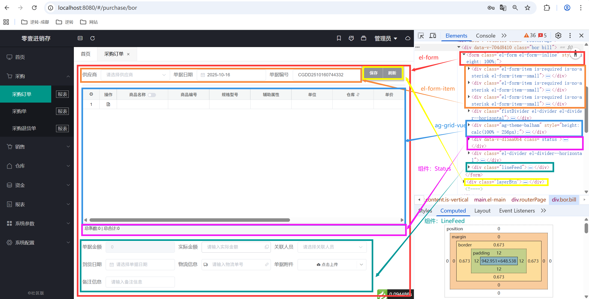
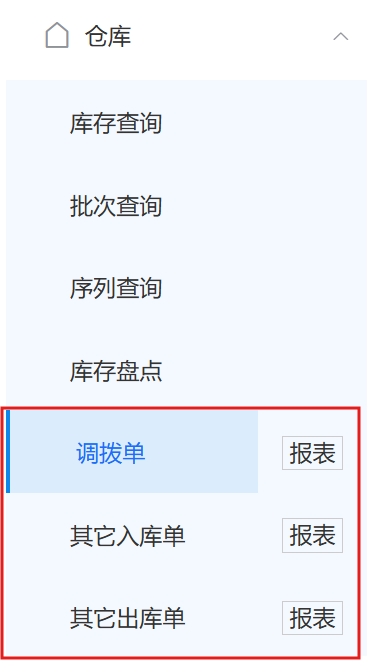
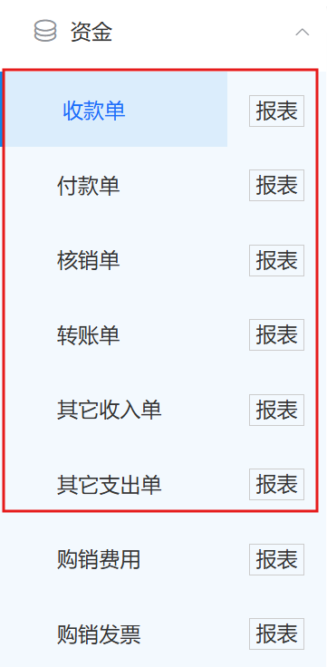
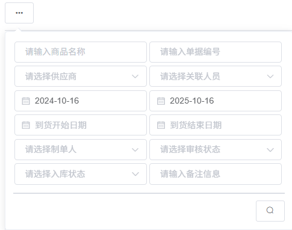

# 1.首页

基本上均不可复用，跳过。

# 2.含可编辑表格的表单页

结构如下。



## 2.1.各部分的构成

```
Status：数据状态统计组件，用于根据配置动态显示数据的汇总信息。
LineFeed：自动换行组件，该页面在使用它时，内部仍为el-form-item
```

## 2.2.相似页面

### 2.2.1.采购（all）


### 2.2.2.销售（all）


### 2.2.3.仓库



### 2.2.4.资金



# 3.自定义表格相关

## 3.1.封装组件

```
NodTree：树形选择器组件，封装了 Element UI 的 el-tree 并提供更友好的交互体验。
StockDetail：点击详情打开，是库存详情弹窗组件，用于展示特定商品的库存流水记录。
PageStatus：页面状态统计组件，用于动态显示数据的汇总信息。
```

## 3.2.相似页面

### 3.2.1.仓库


### 3.2.2.资金


### 3.2.3.报表

#### 3.2.3.1.采购报表（all）

# 4.自定义弹出框-表格搜索



在 `el-popover` 内嵌套 `el-form`

# 5.自定义对话框

报表详情：全屏对话框，内嵌套含可编辑表格的表单页（同 2）


非报表的表格详情：非全屏对话框，内嵌套自定义表格相关（同 3）


## 5.1.新增功能

1. 支持自动全屏
2. 支持点击右上角×或者 Esc 关闭
3. 支持移动后保持位置，不随对话框的关闭而修改

# 6.自定义简易表单项（可选）

reference-project 中没有进行封装，但介于代码重复度过高，以及确实存在多次使用，可选择进行封装。


其代码如下。

