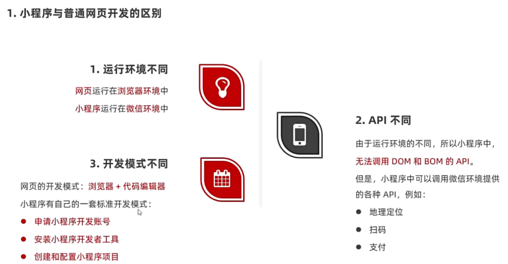
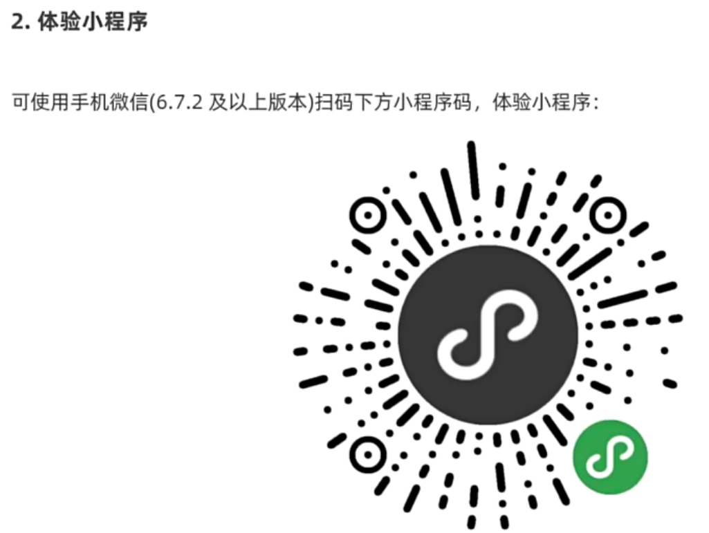
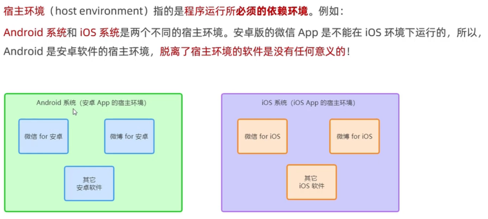

# 简介及注册

# 基础知识：组成

## 总体

### 项目

### 页面

## 局部

### JSON配置文件

1. app.json文件

1. project.config.json文件

1. sitemap.json文件

action：是否允许索引

page：允许范围（*指代全部）

1. 页面的.json文件

# 代码

## WXML模板

[[WXML模板语法]]

### WXML与HTML的区别

1. 标签名称不同
    - HTML：div、span、img、a
    - WXML：view、text、image、navigator
2. 属性节点不同
    - <a href=”\#”>超链接</a>
    - <navigator url=”/pages/home/home”></navigator>
3. 提供了类似于VUE中的模板语法
    - 数据绑定
    - 列表渲染
    - 条件渲染

## WXSS样式

### 定义

WXSS（WeiXin Style Sheets）是一套**样式语言**，用于描述WXML的组件样式，类似于网页开发中的CSS。

### WXSS和CSS的区别

1. 新增了rpx尺寸单位
    - CSS中需要手动进行像素单位转算，如rem
    - WXSS在底层支持新的尺寸单位rpx，在不同大小的屏幕上小程序会自动进行换算
2. 提供了全局的样式和局部样式
    - 项目根目录中的app.wxss会作用于所有小程序页面
    - 局部页面的.wxss样式仅对当前页面生效
3. WXSS仅支持部分CSS选择器
    - .class和\#id
    - element
    - 并集选择器、后代选择器
    - ::after 和 ::before 等伪类选择器

## .js文件

### 作用

处理用户的操作，如相应用户的点击、获取用户的位置等。

### 分类

1. app.js
    
    是整个小程序项目的入口文件，通过调用App()函数来启动整个小程序
    
2. 页面的 .js 文件
    
    是页面的入口文件，通过调用Page()函数来创建并运行页面
    
3. 普通的 .js 文件
    
    是普通的功能模块文件，用来封装公共的函数或属性供页面使用
    

# 宿主环境

## 定义

## 具体

### 内容

1. 通信模型
2. 运行机制
3. 组件
4. API

## 通信模型

### 通信的主体

### 小程序

## 运行机制

### 启动过程

1. 把小程序的代码包下载到本地
2. 解析 app.json 全局配置文件
3. 执行 app.js 小程序入口文件，调用App()创建小程序实例
4. 渲染小程序首页
5. 小程序启动完成

### 页面渲染过程

1. 加载解析页面的.json配置文件
2. 加载页面的.wxml模板和.wxss样式
3. 执行页面的.js文件，调用Page()创建页面实例
4. 页面渲染完成

## 组件

[[组件]]

## API

[[API]]